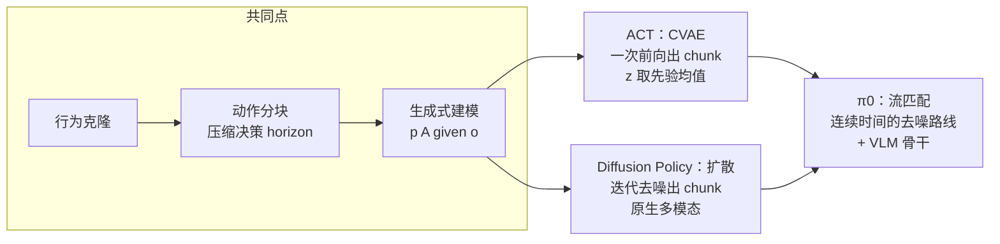

在 [π 系列 VLA 原理解析](/posts/Pi系列VLA原理解析/) 里，π0 用流匹配动作专家表示动作分布。这个设计不是凭空出现的——它是模仿学习社区两条技术路线收敛的结果：**ACT**（Action Chunking with Transformers，ALOHA 团队，2023）和 **Diffusion Policy**（Columbia & TRI，2023）。这两个工作把"用生成式模型建模动作分布"变成了模仿学习的默认答案，至今仍是单任务真机数据采集后的首选基线。

本文先把行为克隆的两个根本困难说清楚，再分别推导两个方法如何应对，最后给出选型建议。

## 1. 行为克隆的两个根本困难

模仿学习最朴素的形式是行为克隆（Behavior Cloning，BC）：收集专家演示 $\mathcal D = \{(\mathbf o_t, \mathbf a_t)\}$，监督学习一个映射 $\pi_\theta(\mathbf o_t) \to \mathbf a_t$，损失用 MSE。这个配方在真机上有两个系统性的失败模式。

### 复合误差（compounding error）

BC 的训练分布是**专家的状态分布**，但执行时策略自己的误差会把机器人带到专家没去过的状态，那里的预测更差，误差滚雪球。理论上（DAgger 论文的分析），单步误差 $\epsilon$ 在 $T$ 步序列决策里最坏会累积成 $O(\epsilon T^2)$ 的性能损失，而不是监督学习直觉的 $O(\epsilon T)$。

50 Hz 控制、一个任务几千步，逐步预测的 BC 在精细操作上几乎必然漂出分布。

### 多模态（multimodality）

专家演示天然多模态：绕开障碍可以走左也可以走右；抓杯子可以先抓这个也可以先抓那个；同一个人两次演示的速度节奏都不一样。若用 MSE 训练确定性策略，模型学到的是**各模态的均值**——左绕和右绕的平均是径直撞上去。

$$
\hat{\mathbf a} = \arg\min_a \mathbb E\left[\|\mathbf a - a\|^2\right] = \mathbb E[\mathbf a]
\quad\text{——均值可能根本不在任何一个模态上}
$$

所以出路只有一条：**别再回归单个动作，去建模完整的条件分布 $p(\mathbf a \mid \mathbf o)$**。ACT 和 Diffusion Policy 是这个思想的两种实例化，恰好也代表了生成式模型的两大家族（VAE 与扩散模型）。

## 2. ACT：动作分块 + CVAE

ACT 为 ALOHA 双臂遥操作平台设计，目标是用 50 条人类演示学会穿扎带、开半透明调料杯盖这类毫米级精度任务。它对两个困难各开了一味药。

### 2.1 动作分块对付复合误差

策略不再每步预测一个动作，而是**一次预测未来 $k$ 步的动作序列**（chunk，ACT 取 $k = 100$，即 2 秒）：

$$
\pi_\theta(\mathbf a_{t:t+k} \mid \mathbf o_t)
$$

有效决策horizon直接除以 $k$——原来 2000 步的任务变成 20 次决策，复合误差的累积基数骤减。同时，chunk 内部的动作是联合预测的，天然能表达"先停顿再发力"这类非马尔可夫的人类演示节奏。

开环执行整个 chunk 会牺牲反应速度，ACT 再加一层**时序集成**（temporal ensembling）：每步都推理一次，于是任意时刻 $t$ 手上有多个历史 chunk 对当前动作的预测，按指数权重平均：

$$
\mathbf a_t = \frac{\sum_i w_i\, \hat{\mathbf a}_t^{(i)}}{\sum_i w_i}, \qquad w_i = e^{-m \cdot i}
$$

$i$ 是预测产生的先后（$i=0$ 最旧），$m$ 控制新旧权衡。这一步让动作平滑且每步都吸收新观测，代价是每步都要推理。

### 2.2 CVAE 对付多模态

把动作 chunk 的分布建成条件 VAE：训练时一个编码器 $q_\phi(\mathbf z \mid \mathbf a_{t:t+k}, \mathbf q_t)$ 把**真实动作序列**压缩成风格变量 $\mathbf z$，解码器（策略本体）从 $[\mathbf z, \mathbf o_t]$ 重建动作序列。优化标准 ELBO：

$$
\mathcal L = \underbrace{\left\|\mathbf a_{t:t+k} - \hat{\mathbf a}_{t:t+k}\right\|_1}_{\text{重建（L1）}} + \beta\, \underbrace{D_{KL}\!\left(q_\phi(\mathbf z \mid \cdot)\,\|\,\mathcal N(\mathbf 0, \mathbf I)\right)}_{\text{正则}}
$$

直觉：$\mathbf z$ 吸收"这条演示是快还是慢、走左还是走右"的模态信息，解码器在给定 $\mathbf z$ 后只需拟合单模态，MSE/L1 的均值坍缩问题就消失了。**推理时直接取先验均值 $\mathbf z = \mathbf 0$**，得到确定性的"平均风格"策略——ACT 用 CVAE 的目的不是采样多样性，而是让训练目标在多模态数据上成立。

架构上，解码器是标准 transformer encoder-decoder：ResNet18 提取 4 路相机特征成 token 序列，与关节状态、$\mathbf z$ 一起进 encoder，decoder 用 $k$ 个位置查询一次性输出整个 chunk。全模型约 80M 参数，单卡数小时训完，真机推理 10 ms 量级。

ACT 论文里各组件的消融很说明问题：去掉 chunking 成功率从 44% 掉到 1%，去掉 CVAE 在人类数据上从 35% 掉到 2%——**两味药都是主药**。

## 3. Diffusion Policy:把动作生成变成去噪

Diffusion Policy 走的是另一条路：不引入隐变量，直接用扩散模型表示 $p(\mathbf A_t \mid \mathbf o_t)$，多模态由生成式模型的表达能力原生解决。

### 3.1 训练：学习去噪

对专家动作序列 $\mathbf A_t^0$（同样是 chunk，预测 horizon $T_p = 16$），前向过程逐步加噪 $K$ 步直至接近纯高斯噪声。网络 $\epsilon_\theta$ 学习在任意噪声水平 $k$ 下预测所加的噪声：

$$
\mathcal L = \mathbb E_{k,\, \mathbf A_t^0,\, \boldsymbol\epsilon}
\left\| \boldsymbol\epsilon - \epsilon_\theta\!\left(\mathbf A_t^k,\, k,\, \mathbf o_t\right) \right\|^2,
\qquad
\mathbf A_t^k = \sqrt{\bar\alpha_k}\, \mathbf A_t^0 + \sqrt{1 - \bar\alpha_k}\, \boldsymbol\epsilon
$$

观测 $\mathbf o_t$（近两帧图像特征 + 本体状态）只作为条件进入网络，**不参与加噪**。

### 3.2 推理:从噪声迭代还原动作

执行时从 $\mathbf A_t^K \sim \mathcal N(\mathbf 0, \mathbf I)$ 出发，逐步去噪：

$$
\mathbf A_t^{k-1} = \alpha\left(\mathbf A_t^k - \gamma\, \epsilon_\theta(\mathbf A_t^k, k, \mathbf o_t)\right) + \sigma_k \mathbf z
$$

这个迭代在做的事情等价于**在动作分布的能量面上做带噪梯度下降**（$\epsilon_\theta$ 正比于分数函数 $-\nabla \log p$）：初始噪声落在哪个模态的引力盆里，就收敛到哪个模态——多模态因此被原生表达，不需要 CVAE 那样的辅助结构。训练用 $K=100$ 步，推理用 DDIM 采样 10 步即可，1 亿参数级模型在桌面 GPU 上约 10 Hz。

去噪出 16 步动作后只执行前 $T_a = 8$ 步就重新推理（receding horizon），在"长开环保动作一致性"和"快反馈保闭环鲁棒"之间折中。Diffusion Policy 论文在 15 个任务上平均比此前最优方法高 46.9%,尤其在演示高度多模态的任务（推 T 形块）上优势明显。

网络骨干两种皆可：1D 时序 U-Net（对超参不敏感的稳妥默认）或 transformer（高频动作任务更好）。观测条件用 FiLM 注入而不是拼接，是效果关键之一。

## 4. 两条路线对照

| 维度 | ACT | Diffusion Policy |
| --- | --- | --- |
| 生成模型 | CVAE（推理取均值，事实上确定性） | DDPM/DDIM（真采样，保留多模态） |
| 推理代价 | 一次前向，~10 ms | 10 次去噪迭代，~100 ms |
| 多模态表达 | 靠 $\mathbf z$ 吸收，推理时坍缩到均值风格 | 原生，采样落入某一模态 |
| 动作平滑手段 | 时序集成 | receding horizon + chunk 内一致性 |
| 参数量级 | ~80M | ~100M（U-Net 版） |
| 长于 | 高频精细双臂操作，数据极少（50 条） | 演示多模态强、需要动作分布本身的任务 |

选型的经验规则：

1. **控制频率是硬约束时选 ACT**：双臂 50 Hz 精细操作，扩散的迭代去噪延迟吃不消（后续的 Consistency Policy 等蒸馏工作就是在补这个短板）；
2. **演示多模态明显、或要在动作分布上做进一步处理（如引导采样、避障约束）时选 Diffusion Policy**：去噪过程可以叠加额外梯度引导，这是 CVAE 没有的钩子；
3. 两者都吃**动作空间选择**：绝对关节位置通常优于增量动作（增量会累积漂移，且和 chunking 相性差）；
4. 数据规模超出单任务几百条、要跨任务泛化时，就该换到 VLA 路线了——π0 的流匹配动作专家本质上是把 Diffusion Policy 的去噪思想换成连续时间形式，再嫁接到 VLM 骨干上，详见 [π 系列 VLA 原理解析](/posts/Pi系列VLA原理解析/)。

## 5. 小结

ACT 和 Diffusion Policy 对模仿学习的共同贡献可以压缩成两句话：**用动作分块把序列决策的复合误差压下去，用生成式模型把多模态演示的分布接住**。它们分别用 VAE 家族和扩散家族实现了第二句，而后续的机器人基础模型（π0 的流匹配、RDT 的扩散 transformer）都是在这两块基石上做规模化。理解了这两个方法，读任何现代操作策略的论文都会快很多——变化的只是骨干网络和数据配方，问题设定和解法骨架没有变过。

## 参考

- T. Zhao, V. Kumar, S. Levine, C. Finn. *Learning Fine-Grained Bimanual Manipulation with Low-Cost Hardware* (ACT / ALOHA). RSS 2023.
- C. Chi, S. Feng, Y. Du, Z. Xu, E. Cousineau, B. Burchfiel, S. Song. *Diffusion Policy: Visuomotor Policy Learning via Action Diffusion*. RSS 2023.
- S. Ross, G. Gordon, D. Bagnell. *A Reduction of Imitation Learning and Structured Prediction to No-Regret Online Learning* (DAgger). AISTATS 2011.（复合误差的理论分析）
- J. Ho, A. Jain, P. Abbeel. *Denoising Diffusion Probabilistic Models*. NeurIPS 2020.
