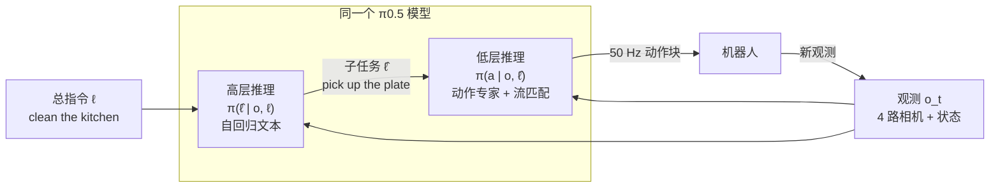
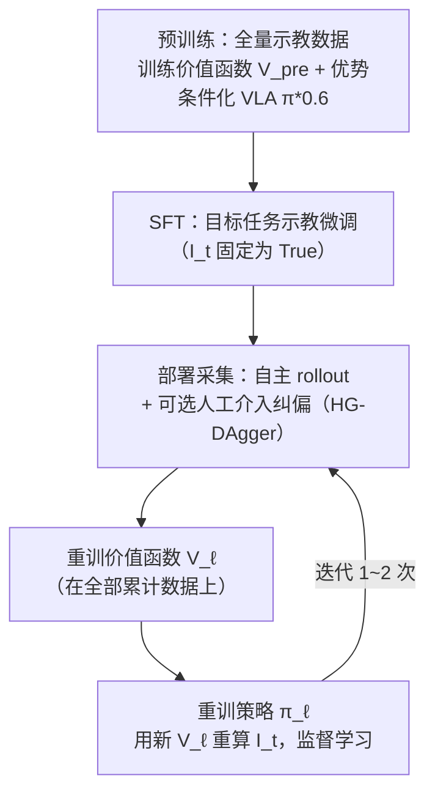
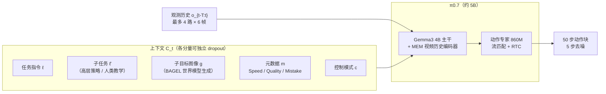

大语言模型的成功路线大家已经很熟悉：先在海量数据上预训练一个基座，再用后训练对齐行为，然后用 RLHF 从反馈中继续改进，最后靠提示工程把一个通用模型"驱使"到各种具体任务上。

Physical Intelligence（PI）的 π 系列，本质上是把这条路线在**真实机器人**上完整走了一遍：

- **π0**（2024.10）：造出基座——VLM + 流匹配动作专家，第一次让一个模型在 10000 小时真机数据上学会叠衣服、装箱子这类高灵巧任务；
- **π0.5**（2025.04）：解决开放世界泛化——异构数据联合训练 + 分层推理，让移动机器人进从没见过的家庭打扫厨房；
- **π*0.6 / RECAP**（2025.11）：从经验中学习——用优势条件化的离线 RL 吃下自主执行数据和人类纠偏，把吞吐量翻倍、失败率减半；
- **π0.7**（2026.04）：可提示的通用模型——用元数据、子目标图像等多模态上下文"扩写提示词"，让一个通用模型开箱即用地追平各任务的 RL 专家模型，并涌现出跨本体迁移和组合泛化。

这四篇论文一脉相承，公式符号也是连续的。本文按时间顺序推导每一代的核心机制，并解释每一步分别解决了上一代的什么问题。

## 1. 统一的问题设定

四代模型建模的都是同一个条件分布：给定观测，预测未来一小段动作序列（action chunk）：

$$
\pi_\theta(\mathbf A_t \mid \mathbf o_t), \qquad
\mathbf A_t = [\mathbf a_t, \mathbf a_{t+1}, \dots, \mathbf a_{t+H-1}]
$$

其中观测由多路相机图像、语言指令和本体状态组成：

$$
\mathbf o_t = [\mathbf I_t^1, \dots, \mathbf I_t^n,\ \boldsymbol\ell_t,\ \mathbf q_t]
$$

- $\mathbf I_t^i$：第 $i$ 路 RGB 图像（腕部相机、基座相机等，2~4 路）；
- $\boldsymbol\ell_t$：语言任务指令（如 "fold the shirt"）；
- $\mathbf q_t$：关节角、夹爪等本体感知向量；
- $H=50$：动作块长度，控制频率最高 50 Hz。

一次推理产生 1 秒的动作，开环执行其中一部分后再推理下一块。这个"块式"输出是 VLA 能做高频灵巧控制的前提——如果像早期 VLA（RT-2、OpenVLA）那样逐步自回归输出离散动作 token，50 Hz 根本跑不动。

而动作是**连续、高维、多模态**的（同一个场景可以先拿左边的杯子也可以先拿右边的），这就引出 π0 的第一个关键设计。

## 2. π0：VLM 骨干 + 流匹配动作专家

### 2.1 为什么用流匹配

π0 用条件流匹配（conditional flow matching，扩散模型的一个变体）来表示 $p(\mathbf A_t\mid\mathbf o_t)$。构造一条从噪声到数据的线性高斯概率路径：

$$
q(\mathbf A_t^\tau \mid \mathbf A_t) = \mathcal N\!\big(\tau \mathbf A_t,\ (1-\tau)\mathbf I\big),
\qquad \tau \in [0,1]
$$

训练时采样噪声 $\boldsymbol\epsilon \sim \mathcal N(0,\mathbf I)$，构造"带噪动作"

$$
\mathbf A_t^\tau = \tau \mathbf A_t + (1-\tau)\boldsymbol\epsilon,
$$

让网络输出 $\mathbf v_\theta(\mathbf A_t^\tau, \mathbf o_t)$ 去回归去噪向量场 $\mathbf u(\mathbf A_t^\tau\mid\mathbf A_t) = \boldsymbol\epsilon - \mathbf A_t$：

$$
L^\tau(\theta) = \mathbb E_{p(\mathbf A_t\mid\mathbf o_t),\, q(\mathbf A_t^\tau\mid \mathbf A_t)}
\big\| \mathbf v_\theta(\mathbf A_t^\tau, \mathbf o_t) - \mathbf u(\mathbf A_t^\tau\mid\mathbf A_t) \big\|^2
$$

推理时从纯噪声 $\mathbf A_t^0 \sim \mathcal N(0,\mathbf I)$ 出发，沿学到的向量场做 10 步前向欧拉积分（$\delta = 0.1$）：

$$
\mathbf A_t^{\tau+\delta} = \mathbf A_t^\tau + \delta\, \mathbf v_\theta(\mathbf A_t^\tau, \mathbf o_t)
$$


_左：线性高斯路径把噪声样本沿直线"流"向动作分布（可以是多峰的）；右：π0 定制的时间步采样分布偏向低 τ（高噪声）区域_

这里有一个 π0 特有的细节：**时间步 $\tau$ 不是均匀采样的**。图像生成领域（如 SD3）偏好中段时间步，理由是高噪声端只需学数据均值、低噪声端只需学恒等映射。但 π0 论文指出动作预测不同——观测 $\mathbf o_t$ 的信息量远大于一句图像描述，条件均值 $\mathbb E[\mathbf A_t\mid\mathbf o_t]$ 本身就很难学。所以 π0 用

$$
p(\tau) = \mathrm{Beta}\!\left(\frac{s-\tau}{s};\ 1.5,\ 1\right),\qquad s = 0.999
$$

把采样权重压向高噪声端，且 $\tau > s$ 完全不采（只要积分步长 $\delta > 1-s$ 就用不到）。

### 2.2 动作专家：一个 Transformer，两套权重

π0 的骨干是开源的 PaliGemma 3B VLM，但直接让 VLM 输出流匹配向量场会破坏它的预训练分布。π0 的方案借鉴 Transfusion 和 MoE：**同一个 Transformer 里放两套权重，只在自注意力层交互**——

- 图像 patch 和语言 token 走 3B 的 VLM 主干（继承互联网语义知识）；
- 本体状态 $\mathbf q_t$ 和带噪动作 token $\mathbf A_t^\tau$ 走一套从头初始化的小权重（width 1024、约 300M 参数），称为**动作专家（action expert）**。

注意力掩码是三段式块因果结构：

$$
\underbrace{[\mathbf I_t^1,\dots,\mathbf I_t^n,\boldsymbol\ell_t]}_{\text{块 1：VLM 前缀}}
\ \to\
\underbrace{[\mathbf q_t]}_{\text{块 2：状态}}
\ \to\
\underbrace{[\mathbf a_t^\tau,\dots,\mathbf a_{t+H-1}^\tau]}_{\text{块 3：动作}}
$$

块内双向注意力，块间只能向前看。这个设计有两个工程上的好处：块 1、块 2 在 10 步积分中不变，KV 可以缓存，每步积分只需重算 50 个动作 token 的前向；块 1 不回看新增输入，尽量不破坏 VLM 预训练分布。实测在 RTX 4090 上一次完整推理 73 ms，足够 50 Hz 实时控制。

### 2.3 预训练/后训练配方

π0 论文反复强调：架构只是一半，**配方（recipe）才是关键**，而且刻意对齐 LLM 的两阶段训练：

- **预训练**：约 10000 小时自采数据（7 种机器人构型、68 个任务）+ OXE/Bridge/DROID 开源数据。目的是覆盖面和纠错能力——低质量但多样的数据教会模型"犯错后怎么恢复"；
- **后训练**：用较小的高质量数据（5~100+ 小时）专精下游任务，教会模型"流畅高效地把事做好"。

两个值得记的细节：任务-机器人组合按 $n^{0.43}$ 加权，压制过采样任务；跨本体训练时把所有机器人的状态/动作向量零填充到最大维度（18 维），缺失的相机位直接 mask。

结论：预训练版 π0 零样本就能叠 T 恤、收拾桌子；微调后能完成 5~20 分钟的长程任务（从烘干机取衣、折叠、码放）。对比实验里 OpenVLA（自回归离散动作、无动作块）在这些高频任务上几乎全军覆没，而没有 VLM 初始化的 π0-small 语言跟随能力明显掉队——**动作块 + 流匹配、VLM 预训练，两者缺一不可**。

## 3. π0.5：异构联合训练与分层推理

π0 的问题是评测都在与训练数据相近的环境里。π0.5 直面那个更难的问题：**机器人能不能进一个从没见过的家？**

暴力答案是把移动机器人开进几千个家里采数据，但这不现实。π0.5 只有约 400 小时、来自约 100 个家庭的移动机器人数据（在第一阶段训练里只占 **2.4%**），其余 97.6% 全是"别的"：

| 数据源 | 缩写 | 内容 |
| --- | --- | --- |
| 移动机器人家庭数据 | MM | 400 小时，约 100 个家庭，目标平台 |
| 多环境静态机械臂 | ME | 轻便单/双臂固定在更多家庭中采集 |
| 实验室跨本体数据 | CE | 各种平台的桌面任务 + OXE |
| 高层子任务预测 | HL | 人工标注的语义子任务标签 + 边界框 |
| 网络多模态数据 | WD | 图像描述、VQA、目标定位 |
| 口头指令示教 | VI | 人用语言"遥操作"机器人留下的高层示范 |

### 3.1 分层推理：同一个模型既当规划器又当执行器

π0.5 把策略分解为

$$
\pi_\theta(\mathbf a_{t:t+H}, \hat\ell \mid \mathbf o_t, \ell)
= \underbrace{\pi_\theta(\mathbf a_{t:t+H} \mid \mathbf o_t, \hat\ell)}_{\text{低层：动作}}
\cdot \underbrace{\pi_\theta(\hat\ell \mid \mathbf o_t, \ell)}_{\text{高层：子任务}}
$$

推理时先由高层根据总指令 $\ell$（"clean the kitchen"）输出文本子任务 $\hat\ell$（"pick up the plate"），再由低层在 $\hat\ell$ 条件下生成动作块——注意动作分布只依赖 $\hat\ell$ 不依赖 $\ell$，这类似 chain-of-thought：把长程语义推理显式写出来，再执行。关键是**高低两层是同一个模型**，只是两次推理，高层跑得更慢。



### 3.2 离散 token 预训练，流匹配后训练

π0.5 的另一大改动是训练流程。FAST 动作分词器的工作已经表明：**用离散 token 自回归地训练动作，比直接训扩散/流匹配收敛快得多**；但离散 token 推理时要昂贵的自回归解码，做不了实时控制。π0.5 两头都要：

1. **预训练（280k 步）**：整个模型就是一个标准自回归 Transformer，动作用 FAST 编码成离散 token，与文本、边界框、子任务标签一起做 next-token prediction；
2. **后训练（80k 步）**：挂上随机初始化的动作专家，联合优化

$$
\mathbb E_{\mathcal D,\tau,\omega}\Big[
\underbrace{\mathcal H\big(x_{1:M},\, f^\ell_\theta(\mathbf o_t,\ell)\big)}_{\text{文本+FAST 交叉熵}}
+ \alpha \underbrace{\big\|\,\omega - \mathbf a_{t:t+H} - f^a_\theta(\mathbf a^{\tau,\omega}_{t:t+H},\mathbf o_t,\ell)\big\|^2}_{\text{流匹配}}
\Big],\quad \alpha=10
$$

注意力掩码保证两种动作表征互不attend（动作专家可以看前缀，但不看 FAST token，信息从 VLM 单向流入动作专家）。推理时先自回归解码文本 $\hat\ell$，再用 10 步去噪产生连续动作。

### 3.3 实验说明了什么

π0.5 的消融实验相当系统，几个结论值得单独记：

- **环境数量 scaling**：训练家庭数从 3 → 104，泛化性能单调上升；104 个家庭训练出的模型，与直接在测试家庭采数据训练的模型打平——**联合训练配方把泛化缺口基本填掉了**；
- **去掉 ME 或 CE（其他机器人的数据）性能大跌**：跨本体迁移是真实存在的，而且是主要收益来源；
- **去掉 WD（网络数据）**：分布内任务影响不大，但对**未见类别物体**的语言跟随大幅下降——网络数据买的是开放词表的语义泛化；
- **高层推理的消融**：完整 π0.5 甚至超过人类专家给子任务的 oracle 基线；有趣的是"训练时带 HL 数据但推理时不显式分层"（implicit HL）是第二名，说明**联合训练本身就把子任务结构学进去了**；GPT-4 零样本当高层规划器效果最差——通用 VLM 不懂机器人当前能做什么。

## 4. π*0.6 与 RECAP：从经验中强化学习

模仿学习有天花板：策略最多和示教者一样好，而且错误会复合（compounding errors）。π0.5 进了新家能干活，但速度、稳健性离实用还有差距。π*0.6 要解决的问题是：**模型部署后产生的大量自主执行数据（有成有败），能不能用来继续变强？** 这正是 RL 的领地，但要把 RL 做在 5B 级流匹配 VLA 和真机上，有三个具体障碍：

1. 流匹配模型**没有可计算的对数似然**，策略梯度（PPO 类）方法很难直接用；
2. 数据是彻底离策略的：人类示教 + 各代旧策略的 rollout + 人工介入纠偏混在一起；
3. 真实世界只有稀疏、模糊的成败反馈。

RECAP（RL with Experience and Corrections via Advantage-conditioned Policies）的回答是一套迭代式离线 RL 配方。

### 4.1 奖励与分布式价值函数

奖励定义得非常朴素——每个 episode 只标注成功/失败：

$$
r_t =
\begin{cases}
0 & t = T \text{ 且成功}\\
-C_{\text{fail}} & t = T \text{ 且失败}\\
-1 & \text{其余每一步}
\end{cases}
$$

于是回报 $R_t = \sum_{t' \ge t} r_{t'}$ 恰好是**（负的）距离成功还剩多少步**——价值函数同时编码了"能不能成"和"还要多久"，天然把成功率和速度统一成一个信号。

价值函数用分布式形式训练：把按任务最大长度归一化到 $(-1,0)$ 的回报离散成 $B=201$ 个 bin，最小化交叉熵

$$
\min_\phi\ \mathbb E_{\tau\in\mathcal D}\Big[\sum_{\mathbf o_t\in\tau} \mathcal H\big(R^B_t(\tau),\ p_\phi(V\mid \mathbf o_t,\ell)\big)\Big]
$$

这是一个对行为策略 $\pi_{\text{ref}}$ 的蒙特卡洛估计器——不做 bootstrap，简单但极其稳定。价值网络与 VLA 同架构、更小的 670M Gemma3 骨干，还混入网络数据防过拟合。论文里的可视化很直观：机器人把叠好的衣服碰皱的一瞬间，价值曲线立刻跳水。


_上：成功/失败 episode 的归一化价值曲线，犯错时价值下跌；下：N 步优势与阈值 $\epsilon_\ell$ 比较，二值化成训练时的优势指示符 $I_t$_

### 4.2 策略提取：优势条件化而不是策略梯度

有了价值函数，还需要"从带好带坏的数据里提取出更好的策略"。正则化 RL 有个经典结论：最优解形如 $\hat\pi(\mathbf a\mid\mathbf o) \propto \pi_{\text{ref}}(\mathbf a\mid\mathbf o)\exp(A^{\pi_{\text{ref}}}/\beta)$，AWR 类方法据此做加权回归——但那等于把低优势数据基本扔掉。RECAP 用的是一个不那么出名但更适合大模型的结论（CFGRL）：定义"动作能改进 $\pi_{\text{ref}}$"的事件 $I$，则

$$
\hat\pi(\mathbf a\mid\mathbf o,\ell) \propto \pi_{\text{ref}}(\mathbf a\mid\mathbf o,\ell)\,
\Big(\frac{\pi_{\text{ref}}(\mathbf a\mid I,\mathbf o,\ell)}{\pi_{\text{ref}}(\mathbf a\mid\mathbf o,\ell)}\Big)^{\beta}
$$

保证 $J(\hat\pi)\ge J(\pi_{\text{ref}})$。当 $\beta=1$ 时右边整体化简为

$$
\hat\pi(\mathbf a\mid\mathbf o,\ell) = \pi_{\text{ref}}(\mathbf a\mid I,\mathbf o,\ell)
$$

——**改进后的策略就是"条件在改进指示符上的行为策略"**。于是训练完全退化为监督学习：所有数据（好的坏的）都参与训练，只是每条样本多带一个由价值函数算出的二值标签

$$
I_t = \mathbb 1\big(A^{\pi_{\text{ref}}}(\mathbf o_t,\mathbf a_t,\ell) > \epsilon_\ell\big)
$$

具体实现里，这个指示符就是**一段文本**插进 prompt："Advantage: positive" 或 "Advantage: negative"，位置在子任务 $\hat\ell$ 之后、动作之前（只影响动作似然）。人类纠偏段强制 $I_t=\text{True}$；训练时 30% 概率丢掉指示符，这样推理时既可以直接条件在 positive 上采样，也可以用 classifier-free guidance 实现 $\beta>1$ 的进一步锐化：

$$
\nabla_{\mathbf a}\log\pi_\theta(\mathbf a\mid\mathbf o,\ell)
+ \beta\big(\nabla_{\mathbf a}\log\pi_\theta(\mathbf a\mid I,\mathbf o,\ell) - \nabla_{\mathbf a}\log\pi_\theta(\mathbf a\mid\mathbf o,\ell)\big)
$$

阈值 $\epsilon_\ell$ 按任务设成价值分位数（预训练取 30% 分位），这比调 CFG 权重 $\beta$ 好控制——$\beta$ 拉太高会把动作推到分布边界，机器人动作会变得激进。

### 4.3 迭代改进环



底座 π0.6 相比 π0.5 换了 Gemma3 4B 骨干、动作专家扩到 860M，并采用**知识绝缘（Knowledge Insulation, KI）**训练：VLM 主干只由 FAST 离散 token 的交叉熵监督，动作专家能 attend 主干激活但**梯度不回传**——离散损失稳定训练主干，流匹配专家专心学动作，互不干扰。

效果：在最难的多样衣物折叠和意式咖啡任务上，**吞吐量（每小时成功次数）翻倍以上、失败率减半**；最终模型能连续 13 小时做咖啡。对照实验里 AWR 成功率尚可但速度慢（它变相扔数据），PPO 为了稳定必须收紧信任域，几乎改不动策略——**优势条件化在这个体量上完胜传统策略提取**。定向消除失败模式的实验也有意思：只靠自主 rollout（无人工示教），两轮迭代就把一个"领口朝下"的顽固错误从常见打到 97% 成功。

## 5. π0.7：把"怎么做"也写进提示词

RECAP 训练出的是**任务专家**——每个任务微调一个。π0.7 问的是终极问题：能不能只有一个通用模型，开箱即用地达到专家水平，还能组合出新任务？

### 5.1 核心思想：上下文扩写

障碍在数据侧：想变强就要吃更大更杂的数据——不同策略风格的示教、失败的 episode、各代旧模型（包括 RL 专家）留下的海量评测 rollout、人类第一视角视频……但把这些直接混进模仿学习，模型会把不同质量、不同风格的模式**平均掉**，性能反而下降（论文的 scaling 实验直接验证了这一点）。

π0.7 的解法与图像生成里的 prompt expansion 同构：**给每条训练数据标注足够多的上下文 $\mathcal C_t$，把"什么质量、什么策略、什么速度"都写进 prompt**，训练目标仍是普通的（近似）对数似然：

$$
\max_\theta\ \mathbb E_{\mathcal D}\big[\log \pi_\theta(\mathbf a_{t:t+H} \mid \mathbf o_{t-T:t},\ \mathcal C_t)\big]
$$

上下文包含四类信息，训练时各自随机 dropout，推理时可以任意组合：

1. **子任务指令 $\hat\ell_t$**：沿袭 π0.5 的分层结构，还支持人类实时"口头教学"；
2. **子目标图像 $\mathbf g_t$**：多视角的"未来该长什么样"。语言说不清的细节（一件叠好的 T 恤具体什么形态、夹爪该以什么姿态接近）用图像说。运行时由一个基于 BAGEL（14B 图像生成模型）微调的轻量世界模型按当前观测和子任务生成，每 4 秒或子任务切换时刷新；
3. **episode 元数据 $m$**：速度（episode 步数，按 500 步分箱）、质量（1~5 分）、是否犯错（人工粗标）。这是 RECAP 优势指示符的推广——从一个二值位变成一组可读写的"表现标签"；
4. **控制模式 $c$**：关节空间还是末端空间。

一条完整训练样本的 prompt 长这样：

```text
<多视角观测><多视角子目标图像>
Task: peel vegetables. Subtask: pick up the peeler.
Speed: 8000. Quality: 5. Mistake: false. Control Mode: joint.
<本体状态>
```

**推理时反过来用**：把元数据钉在理想值上——Quality: 5、Mistake: false、Speed 取该任务第 15 百分位（偏快）——模型就被"引导"到数据分布中最好的那个模式上，还可以对元数据做 CFG（$\beta\in\{1.3, 1.7, 2.2\}$）进一步加压。这和 RECAP 的 "Advantage: positive" 是同一个数学结构：**条件生成 + 测试时挑条件 = 免 RL 的策略改进**。



架构上，π0.7 约 5B 参数：Gemma3 4B 主干 + MEM 风格的视频历史编码器（最多 4 路相机 × 6 帧历史，时空压缩成固定 token 数）+ 860M 动作专家，训练时模拟 0~12 步推理延迟做实时动作分块（RTC），仍然沿用 KI 配方。子目标图像的训练要点是缓解真实/生成图像的分布错位：75% 用未来 0~4 秒的真实帧、25% 用段末帧，另外再灌入世界模型生成的子目标构造额外样本。

### 5.2 涌现了什么

- **开箱即用的专家性能**：同一个 π0.7，在 RECAP 那套任务（咖啡、装箱、多样衣物）上追平各自的 RL 专家，多样衣物和装箱的吞吐量甚至反超。消融显示两个成分缺一不可：去掉评测数据（等于放弃蒸馏 RL 专家的行为）或去掉元数据（等于把好坏数据搅在一起）都显著掉点；
- **打破数据集偏见的语言跟随**："Reverse Bussing" 实验要求把垃圾放餐具箱、餐具扔垃圾桶——与训练数据的模式完全相反。π0.5/π0.6 会无视指令照旧干活，π0.7 能听话执行；"把食物从微波炉放回冰箱"这种反向任务则必须靠世界模型生成的子目标图像才能成功；
- **零样本跨本体迁移**：叠衣数据全部来自轻量双臂平台，直接部署到形态、尺寸、惯量都差很多的双臂 UR5e 上叠 T 恤，任务进度 85.6%、成功率 80%——与 10 名顶级遥操作员（同样第一次在 UR5e 上做该任务）的 90.9% / 80.6% 基本持平。更有意思的是策略会**换打法**：源平台的操作员用倾斜末端把布料压在桌上再抓，π0.7 在 UR5e 上自发改用适合大臂展的竖直抓取；
- **语言教学 → 自主执行**：对于完全没有动作数据的长程新任务（空气炸锅烤红薯、烤面包圈），人先用一步步口头指令"教"机器人做一遍，再拿这些教学 episode 微调出高层策略，替代人来提示低层——不采集任何遥操作数据就获得全自主的新能力；
- **混合质量数据的 scaling 定律**：按质量把叠衣数据切成 top 30% / 50% / 80% / 100% 四档训练。**不带元数据的模型数据越多反而越差；带元数据的模型随数据量单调变好**——即使新增的都是更低质量的数据。这一张图基本上就是 π0.7 方法论的全部理由。

## 6. 四代演进的主线

| | π0 | π0.5 | π*0.6 (RECAP) | π0.7 |
| --- | --- | --- | --- | --- |
| 核心问题 | 灵巧操作的基座 | 开放世界泛化 | 从部署经验改进 | 通用模型的可提示性 |
| 骨干 | PaliGemma 3B | PaliGemma 3B | Gemma3 4B | Gemma3 4B + MEM 历史 |
| 动作专家 | 300M 流匹配 | 300M（后训练加入） | 860M + KI | 860M + KI + RTC |
| 动作训练 | 纯流匹配 | FAST 预训练 → 流匹配后训练 | KI：两者并行、梯度绝缘 | 同左 |
| 数据 | 1 万小时示教 + OXE | + ME/CE/HL/WD/VI 异构联合 | + 自主 rollout + 人工纠偏 | + 失败数据、评测数据、人类视频 |
| 关键机制 | 动作块 + 双专家 | 分层推理 π(a\|o,ℓ̂)π(ℓ̂\|o,ℓ) | 价值函数 + 优势条件化 | 多模态上下文 + 元数据提示 + 子目标图像 |
| LLM 类比 | GPT 式预训练 | 指令微调 + CoT | RLHF | 提示工程 / 可控生成 |

回头看，有一条技术暗线贯穿始终：**把"策略改进"问题持续地转化为"条件生成"问题**。π0.5 把长程规划变成先生成子任务文本再条件生成动作；RECAP 把 RL 的策略提取变成条件在 "Advantage: positive" 上的监督学习；π0.7 把数据质量控制变成条件在 "Quality: 5" 上的采样。每一步都避开了在 5B 流匹配模型上做策略梯度这类难啃的骨头，全部退化为大模型最擅长的事——带条件的极大似然训练加测试时的条件选择。这大概也是 π 系列迭代速度能这么快的原因。

局限也写得很坦诚：π0.7 零样本任务的成功率仍在 60~80% 区间，明显低于分布内任务的 90%+；而且数据大到一定程度后，"什么算没见过的任务"本身变得难以界定——这和 LLM 的泛化评估困境如出一辙。论文给出的展望是把 π0.7 的可提示性与 RECAP 的自主强化学习闭环接起来：先提示它做个六七成，再让它自己练到九成以上。

## 参考文献

1. Physical Intelligence. *π0: A Vision-Language-Action Flow Model for General Robot Control*. [arXiv:2410.24164](https://arxiv.org/abs/2410.24164), 2024.
2. Physical Intelligence. *π0.5: a Vision-Language-Action Model with Open-World Generalization*. [arXiv:2504.16054](https://arxiv.org/abs/2504.16054), 2025.
3. Physical Intelligence. *π*<sub>0.6</sub>*: a VLA That Learns From Experience*. [arXiv:2511.14759](https://arxiv.org/abs/2511.14759), 2025.
4. Physical Intelligence. *π0.7: a Steerable Generalist Robotic Foundation Model with Emergent Capabilities*. arXiv:2604.15483, 2026.
5. Pertsch et al. *FAST: Efficient Action Tokenization for Vision-Language-Action Models*. RSS 2025.
6. Driess et al. *Knowledge Insulating Vision-Language-Action Models*. NeurIPS 2025.
7. Frans et al. *Diffusion Guidance Is a Controllable Policy Improvement Operator (CFGRL)*. arXiv:2505.23458, 2025.
