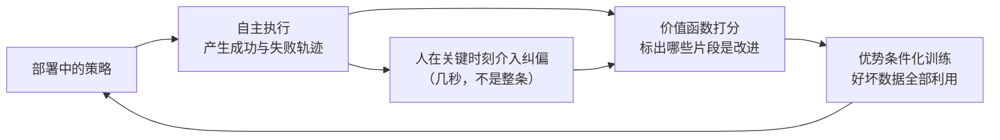

语言模型和视觉模型的成功建立在同一个前提上：**它们要学的东西，互联网上现成有**。文本是人类顺手写下的，图片是人类顺手拍下的，标注可以从上下文里自监督地挖出来。

具身智能没有这个便利。机器人要学的是"在这个状态下该输出什么动作"，而**互联网上没有动作**。视频里有人在切菜，但没有记录他手腕的六维位姿、手指的开合宽度、指尖的接触力；即使记录了，那也是人手的动作，不是夹爪的动作。这个缺口——**观测遍地都是，动作无处可寻**——就是具身智能过去几年所有数据工作的起点。

本文沿着时间线梳理这些工作，但重点不是罗列数据集，而是回答两个问题：**每一次范式转移到底解决了什么、代价是什么**，以及**这些手段的吞吐量算下来到底够不够**。

## 1. 先把账算清楚：缺口有多大

几个真实数字放在一起就很说明问题。

[ALOHA](/posts/ACT与DiffusionPolicy原理解析/)（RSS 2023）是低成本双臂遥操作的标杆，它训练一个任务用 50 条演示。论文里有一句常被略过但极其重要的话：每条演示 8~14 秒，50 条合计约 **10~20 分钟**的数据，但**墙钟时间是 30~60 分钟**——因为要复位场景、要重来失败的尝试。也就是说，**有效数据的占空比只有三分之一**。

DROID（RSS 2024）是迄今组织得最好的分布式真机采集：**13 个机构、50 名采集者、12 个月**，采到 76,000 条轨迹、**350 小时**交互数据，覆盖 564 个场景、52 栋建筑、86 类任务。这是学术界能做到的极限动员。

作为对照，Ego4D 一个数据集就有 **3,670 小时**第一视角视频，由 931 个佩戴者在 74 个地点录制——是 DROID 的十倍，而且这些人只是**戴着相机过日子**，没有任何一个人在操作机器人。

_(a) 真机数据集按轨迹条数：从 ALOHA 单任务的 50 条，到聚合 60 个数据集的 Open X-Embodiment 百万条。(b) 换成小时数看：全球协作一年的 DROID 是 350 小时，而人类第一视角视频轻松到几千小时。数据来自各自论文_

把 ALOHA 的占空比套到规模上算一笔：假设要凑 100 万小时的真机交互数据（这才勉强接近其他领域"大数据"的语感），按三分之一占空比需要约 **300 万人·小时**——相当于 1500 人全职干一年，只为采数据。这就是为什么"多雇人采数据"从来不是一条能走通的路线，也是后面每一次范式转移的根本动机。

## 2. 第零代：脚本与仿真

最早的思路是根本不要人：用脚本策略在仿真里刷数据。RoboNet 用脚本采集拿到了 16.2 万条轨迹，规模在当年遥遥领先。

但脚本数据有个致命问题：**它只覆盖脚本会做的事**。策略学到的是脚本的行为分布，而脚本本身不会处理意外——抓滑了怎么办、物体倒了怎么办。恰恰是这些**纠错行为**决定了策略在真实世界的成败（这也是 [π0](/posts/Pi系列VLA原理解析/) 预训练里刻意保留低质量数据的原因：多样但带错误的数据教会模型"犯错后怎么恢复"）。

仿真的问题在 [sim-to-real 那篇](/posts/足式机器人RL与sim-to-real/)讨论过，但操作任务比足式移动难得多，原因具体到三点：

- **接触**：抓取涉及多点接触、摩擦、微滑，接触模型的参数误差直接改变成败，而足式的接触相对简单（脚与地面）；
- **可变形物体**：衣物、绳索、食物的仿真至今没有又快又准的方案，而这些恰是家务任务的主体；
- **视觉**：足式可以用本体感知为主（甚至盲走），操作必须看，而渲染与真实图像的差距要靠大量随机化去填。

所以仿真在操作领域的定位一直是**辅助而非主力**：用来做预训练表征、做数据增强、做安全性验证，而不是直接训出可部署的策略。

## 3. 第一代：真机遥操作——把人的技能"抄"进机器人

既然要动作标签，最直接的办法就是让人**直接驱动机器人**，把机器人自己的关节读数当作动作标签。这条路线的演进是一部"降低操作阻力"的历史。

**动觉示教（kinesthetic teaching）**：直接拖着机器人的手臂走。优点是零成本、动作天然可执行；缺点致命——人的手挡在机器人和物体之间，**视觉观测被污染**（训练时画面里有人手，部署时没有），而且拖不动重臂、做不了双臂协同、也没法做快速动作。

**主从遥操作（leader-follower）**：人操作一个输入设备，机器人跟随。输入设备的选择决定了一切：

- **空间鼠标 / VR 手柄**：控制的是末端位姿（笛卡尔空间），需要在线做[逆运动学](/posts/机械臂运动学/)。问题是人对"机器人手肘在哪"没有直觉，容易走到奇异或限位；
- **力反馈主手**：能感受接触力，但设备昂贵，且工作空间与从臂不匹配时需要非线性映射，学习曲线陡峭；
- **同构主从**：这是 ALOHA 的关键选择——**主臂和从臂是同一款机器人的缩小/同尺寸版本**，人反驱主臂，从臂在关节空间直接镜像。

同构主从的价值在于它把三个问题一次性消掉了：不需要 IK（关节角直接映射，没有奇异问题）、人对机器人的构型有直接的物理直觉（因为他握着的就是同构的臂）、以及**动作标签就是关节指令本身**，不存在任何转换损失。代价是主从必须成对购买——ALOHA 用四条臂（两主两从），总价压在 2 万美元以内，靠的是选用低成本舵机臂。

这个选择的深层含义值得强调：**遥操作界面的设计，本质是在决定动作标签的定义域**。同构主从给出的是关节空间动作，最"真"但绑死本体；笛卡尔遥操作给出的是末端位姿动作，跨本体迁移更容易但丢掉了冗余自由度的信息。数据集能不能跨本体复用，在采集界面设计的那一刻就已经决定了。

**吞吐量的天花板。**不管界面怎么改进，真机遥操作都受制于同一组物理约束：机器人只有一台、场景要人工复位、失败要重来、操作员会累。这就是为什么动觉示教、ALOHA、DROID 三者的吞吐量落在同一个数量级里：

_横轴是每人每小时能产出的演示条数（按各论文报告的单条时长推算，量级估计），纵轴是数据里保留了多少动作与本体信息。真机遥操作全部挤在左上角的同一个方框里——这不是工程没做好，是范式的上限_

## 4. 第二代：把机器人从采集回路里拿掉

既然瓶颈是"机器人只有一台、且必须在现场"，那就别用机器人采。

**UMI**（Universal Manipulation Interface，RSS 2024）是这个思路最干净的实现：一个 3D 打印的**手持平行夹爪**，上面装一个 GoPro。人拿着它直接去干活——洗盘子、叠毛衣、扔东西——GoPro 记录腕部视角图像，视觉惯性 SLAM 反算出夹爪的六维轨迹，夹爪开合宽度由机械结构直接读出。所有信息存成一个标准 MP4 文件，**30 秒就能采一条演示**。

这个方案的精妙之处在于它把"观测"和"动作"用同一个设备一次性解决了：腕部相机的画面在部署时可以由机器人腕部相机复现，夹爪的外观和几何与真机夹爪一致，所以**视觉域差距被硬件设计压到了最小**。

但脱离机器人本体要付三笔代价，UMI 论文对每一笔都给了工程答案：

1. **运动学可行性未知**。人的手腕可以做出机器人做不到的姿态。UMI 在数据处理阶段就检查每条演示在目标机器人上是否可达，不可达的直接丢弃；
2. **延迟不匹配**。人手的观测-动作延迟和机器人的（相机曝光 + 推理 + 执行）完全不同。UMI 做**推理时延迟匹配**：在训练数据上人为对齐观测与动作的时间关系，使策略学到的时序对应部署时的真实延迟；
3. **没有绝对位姿基准**。SLAM 给的是相对轨迹，不同场景的世界坐标系不一致。UMI 索性采用**相对轨迹动作表示**——动作定义为相对当前夹爪位姿的增量，天然与世界系无关，也顺带让策略跨机器人平台可迁移。

保真度上的损失是实打实的：**没有本体感知（关节角、力矩），没有接触力**。对需要力控的任务（[插装、打磨](/posts/阻抗控制与力控/)），这类数据的信息是不完整的。外骨骼和数据手套走的是同一条路线的变体，用更复杂的硬件换回一部分本体信息。

## 5. 第三代：直接吃人类视频

再往前一步：连采集设备都不要，直接用现成的人类视频。Ego4D（3,670 小时）、EPIC-KITCHENS-100（100 小时、近 9 万个动作片段、45 个厨房）这类第一视角数据集，规模远超任何机器人数据集，而且完全免费。

问题只有一个，但是根本性的：**没有动作标签，而且人手和夹爪不是同一个东西**。目前有三条解法，成熟度递减：

**（a）只拿它做视觉表征预训练。**最保守也最可靠：用人类视频训一个视觉编码器（R3M、VIP 这类工作），再把编码器接到机器人策略上。它买到的是"厨房长什么样、抓握动作长什么样"的先验，不涉及动作。

**（b）估计人手姿态再做重定向。**用手部姿态估计得到人手的关节，再映射到夹爪的开合和位姿。难点在于**形态差异（morphology gap）**：五指手的抓握姿态没有唯一对应的两指夹爪动作，重定向必然有信息损失和歧义。

**（c）潜在动作模型（latent action models）。**这是最有前途的一条：既然真实动作标签拿不到，就**从视频本身学一套潜在动作**。做法是训练一个逆动力学式的模型，用相邻两帧 $(o_t, o_{t+1})$ 推断一个离散或连续的潜在动作 $z_t$，并要求 $z_t$ 能让前向模型从 $o_t$ 预测出 $o_{t+1}$：

$$
z_t = q_\phi(o_t, o_{t+1}),
\qquad
\hat o_{t+1} = f_\theta(o_t, z_t),
\qquad
\min_{\theta,\phi} \; \|\hat o_{t+1} - o_{t+1}\|
$$

关键约束是让 $z_t$ 的信息容量足够小（离散码本或低维瓶颈），逼迫它只编码"发生了什么变化"而不是把整张下一帧抄过去。这样海量无标签视频就能用来预训练一个"潜在动作策略"，最后再用少量带真实动作的机器人数据把潜在动作**对齐**到真实动作空间。Genie、LAPA 这类工作走的都是这条路。

它的诱人之处在于**打通了数据金字塔的底座**：人类视频的规模比机器人数据大三个数量级，如果能把其中哪怕一部分转化为可用的策略先验，收益远超再多采几万条真机数据。

## 6. 横向的一步：跨本体聚合

上面三代是纵向的（改进采集手段），还有一条横向的路：**把已有的数据合起来用**。

这件事在 2023 年之前被认为不可行——不同机器人的关节数、动作空间、相机配置、控制频率全不一样，混在一起训练直觉上只会互相干扰。Open X-Embodiment（ICRA 2024）用实验推翻了这个直觉：把 **34 个实验室的 60 个数据集**统一成 RLDS 格式，得到 **100 万条以上轨迹、22 种本体、527 种技能**，在上面训练的 RT-X 模型不仅能跨本体工作，而且**在单个机器人上的表现超过只用该机器人数据训练的策略**。

跨本体迁移为什么有效，这是个值得想清楚的问题。合理的解释是：视觉表征、物体语义、任务结构、乃至"接近—对准—闭合—提起"这类操作的时序骨架，在不同本体之间是共享的；本体特有的只是最后那层动作映射。大模型有足够容量同时学会"共享的部分"和"每个本体的差异"，于是数据量的收益压过了异构性的干扰。[π0.5 的消融实验](/posts/Pi系列VLA原理解析/)给出了更强的证据：去掉其他机器人的数据后性能大跌，跨本体数据是主要收益来源，而目标本体自己的数据只占训练混合的 2.4%。

这一步的意义在于它改变了单个实验室的成本结构：你不需要自己采一百万条，你只需要采好自己那一份并**让它可被别人复用**——统一格式、完整标定、记录元数据。这也是 DROID 坚持"所有数据用同一套 Franka 硬件栈、每条轨迹都带三路同步相机与标定"的原因。

## 7. 第四代：数据飞轮——让机器人自己产数据

前面所有手段都需要人在回路。最后一步是让**部署本身成为采集**：机器人干活，产生的轨迹（有成功有失败）回流成训练数据。

这条路线的障碍不在采集而在**利用**：自主 rollout 的数据是彻底离策略的，而且没有人告诉你哪些片段好、哪些片段坏。[π\*0.6 的 RECAP](/posts/Pi系列VLA原理解析/) 给出了一套可行方案——训练价值函数给每个片段打分，再用优势条件化把"好坏混杂的数据"全部转化为监督信号，而不是像 AWR 那样把低优势数据扔掉。实测把最难任务的吞吐量翻倍、失败率减半。

配套的是**人在回路的纠偏**：机器人快要失败时人接管一下，这一小段纠偏数据的价值密度极高——它恰好落在策略的分布边缘，正是策略最需要的地方。这其实是 DAgger 思想的现代形态，只不过纠偏不再是重新示教整条轨迹，而是**只在关键时刻介入几秒**。从吞吐量角度看，这是所有人工介入方式里性价比最高的：一小时的人工介入，抵得上几十小时的从头示教。

飞轮的前提是**策略已经够好到能部署**。所以它不是替代前几代手段，而是接在它们后面——前几代把策略从零推到"能用"，飞轮把"能用"推到"好用"。

## 8. 生成式数据：还在路上

最新的一条支线是用生成模型造数据：用 LLM 生成任务与场景配置（RoboGen、RoboCasa 这类工作自动生成仿真资产与任务），用视频生成模型当世界模型来"想象"轨迹，或者对已有数据做语义级增强（换背景、换物体、换光照）。

诚实的评价是：**语义多样性上有效，物理保真度上仍然可疑**。生成的视频看起来对，但接触力学是否自洽、动作是否可执行，目前没有可靠的校验手段。它现在的确定收益是在**数据增强**（提升视觉鲁棒性）和**任务生成**（提供多样的任务描述与场景布置），而不是替代真实交互数据。

## 9. 配方：这些数据怎么混

有了这么多来源，最后一个问题是配比。[π0.5 的做法](/posts/Pi系列VLA原理解析/)是目前最清晰的公开样本：目标本体（移动机器人家庭数据）只占 **2.4%**，其余 97.6% 是其他机器人数据、跨本体开源数据、以及网络多模态数据。消融告诉我们每一份的作用不同：

| 数据类型 | 主要贡献 | 去掉之后 |
|---|---|---|
| 目标本体数据 | 本体特有的动作分布 | 无法执行，必需但量可以很小 |
| 其他机器人/跨本体 | 操作技能的通用结构 | 性能大跌，是主要收益来源 |
| 网络图文数据 | 开放词表语义 | 未见类别的语言跟随大幅下降 |
| 高质量后训练数据 | 流畅、高效地把事做好 | 会做但不够好 |

这张表的实践含义很直接：**如果你的机器人是新构型，不要指望靠自己采数据解决问题**。正确的做法是采少量高质量的本体数据（几百小时量级），把它挂到大规模跨本体与网络数据上联合训练。

## 10. 工程：采集系统本身怎么建

最后是最容易被低估的一块。数据的价值在细节里，而这些细节都是纯工程：

- **时间同步**。多相机、机器人状态、力传感器必须同步到毫秒级。相机用硬件触发，状态流打时间戳，落盘时做统一对齐。异步采集的数据训出来的策略会学到错误的因果关系——这是最隐蔽也最致命的数据污染；
- **标定与元数据**。相机内外参、[手眼关系](/posts/机械臂标定/)、夹爪几何必须随数据一起存。DROID 之所以能被广泛复用，很大程度上是因为每条轨迹都自带标定；
- **质量控制**。失败的演示要不要留？答案是**要留但要标**——预训练阶段它们提供纠错行为，后训练阶段要过滤掉。这意味着采集时必须记录成功/失败标签和失败原因；
- **动作表示的选择**。存关节角、末端位姿还是增量？关节角最真但绑死本体，末端增量最易迁移。稳妥做法是**都存**，训练时再决定用哪个；
- **存储格式**。RLDS（OXE 采用）和 LeRobot 格式是目前的两个事实标准。选一个标准格式的收益不在自己用，而在**别人能用**——你的数据能不能进下一个 OXE，取决于此。

## 11. 小结

1. 具身智能数据的根本困难是"观测遍地都是，动作无处可寻"，所有采集手段都在用不同方式弥补这个缺口。
2. 真机遥操作保真度最高但吞吐量有硬上限：ALOHA 的有效数据占空比只有 1/3，DROID 动员 13 个机构 12 个月也只得到 350 小时。靠堆人不可能达到其他领域的数据量级。
3. 手持夹爪（UMI）把机器人移出采集回路，吞吐量提升一个量级，代价是丢掉本体感知与力信息；它的三个工程解法（可达性过滤、延迟匹配、相对轨迹表示）值得任何自建采集系统借鉴。
4. 人类视频规模上大三个数量级，潜在动作模型是目前最有希望把它转化为策略先验的路线。
5. 跨本体聚合改变了成本结构：Open X-Embodiment 证明混合异构数据不仅可行而且互相增益，π0.5 里目标本体数据只占 2.4%。**采好自己那一份并让它可复用**，比自己采一百万条更现实。
6. 数据飞轮（自主 rollout + 人在关键时刻纠偏 + 优势条件化）是策略"能用之后"最高效的手段，一小时纠偏抵几十小时示教。
7. 采集系统的工程细节——同步、标定、元数据、失败标注、标准格式——决定数据的长期价值，而它们全部要在采集之前就设计好。

## 参考

- T. Z. Zhao, V. Kumar, S. Levine, C. Finn. *Learning Fine-Grained Bimanual Manipulation with Low-Cost Hardware*. RSS 2023.（ALOHA / ACT）
- C. Chi et al. *Universal Manipulation Interface: In-The-Wild Robot Teaching Without In-The-Wild Robots*. RSS 2024.（UMI）
- A. Khazatsky et al. *DROID: A Large-Scale In-The-Wild Robot Manipulation Dataset*. RSS 2024.
- Open X-Embodiment Collaboration. *Open X-Embodiment: Robotic Learning Datasets and RT-X Models*. ICRA 2024.
- K. Grauman et al. *Ego4D: Around the World in 3,000 Hours of Egocentric Video*. CVPR 2022.
- D. Damen et al. *Rescaling Egocentric Vision: Collection, Pipeline and Challenges for EPIC-KITCHENS-100*. IJCV 2022.
- Physical Intelligence. *π0 / π0.5 / π\*0.6* 系列技术报告。（数据配方与 RECAP 飞轮）
