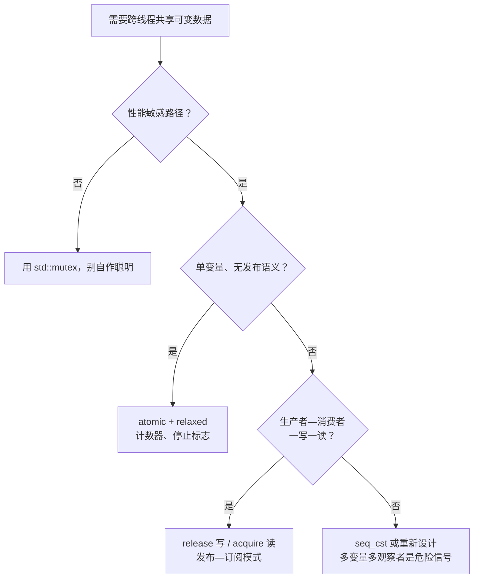

写实时控制程序时经常遇到这样的场景：控制线程 1 kHz 跑伺服环，通信线程随时更新目标位置。"一个线程写、一个线程读，变量就一个 double，不加锁应该没事吧？"——这句话是错的，而且错得很具体。要说清楚为什么错、以及不加锁的正确写法长什么样，就必须理解 C++ 内存模型。

## 1. 数据竞争：未定义行为，不是"偶尔读到旧值"

C++ 标准的定义：**两个线程访问同一内存位置，至少一个是写，且二者之间没有 happens-before 关系（未同步），这就是数据竞争（data race），程序行为未定义（UB）**。

未定义行为的含义比"读到旧值"或者"读到半个值"（撕裂读）严重得多——编译器在优化时**假定数据竞争不存在**，于是可以：

```cpp
// 线程 1
while (!stop) {   // stop 是普通 bool
    do_work();
}

// 线程 2
stop = true;
```

编译器看到线程 1 的循环体不修改 `stop`，完全有权把它提升到寄存器，循环变成死循环。这不是理论洁癖，`-O2` 下真实发生。**同步要么靠锁（mutex），要么靠原子操作，二选一，没有第三条路**。

## 2. std::atomic：不可分割 + 参与同步

`std::atomic<T>` 提供两重保证：对它的操作**不可分割**（不会撕裂），且可以指定**内存序**参与线程间同步。

```cpp
std::atomic<bool> stop{false};

// 线程 1
while (!stop.load(std::memory_order_relaxed)) {
    do_work();
}

// 线程 2
stop.store(true, std::memory_order_relaxed);
```

常用操作一览：

- `load` / `store`：读、写；
- `exchange`：写入新值并返回旧值；
- `compare_exchange_weak/strong`（CAS）：`expected` 相符才写入，无锁算法的基本积木；`weak` 允许伪失败（配循环用，某些平台上更快），`strong` 不允许；
- `fetch_add` / `fetch_or` 等：读—改—写。

一个容易被忽略的接口是 `is_lock_free()`：`std::atomic<T>` 对任意可平凡复制的 `T` 都合法，但超过平台原子宽度时库会退化为**内置自旋锁**实现——在实时线程里用一个不是 lock-free 的 `std::atomic<Pose6D>`，等于偷偷引入了优先级反转的风险。实时代码中应当用 `static_assert(std::atomic<T>::is_always_lock_free)` 把这个假设钉死。

## 3. 内存序：问题不在原子性，在重排

单个原子变量不撕裂只是第一步。真正的难点是**多个变量之间的顺序**：

```cpp
// 线程 1（生产者）
data = 42;                 // 普通写
ready.store(true, /* ? */);

// 线程 2（消费者）
if (ready.load(/* ? */)) {
    use(data);             // 能保证看到 42 吗？
}
```

编译器和 CPU 都会重排访存（写缓冲、乱序执行、缓存一致性协议的传播延迟），线程 2 看到 `ready == true` 时**不一定**看到 `data == 42`——除非内存序参数建立了同步。

C++ 提供六种 `memory_order`，实际用三档就够：

### relaxed：只保证原子性

`memory_order_relaxed` 不建立任何跨变量的顺序，只保证这个变量本身的操作不可分割、且同一变量的修改顺序全局一致。适用于**不承载"发布数据"职责**的场合：停止标志、统计计数器、心跳。

### acquire/release：单向栅栏，配对使用

这是最重要的一档。规则：

> **release 写**之前的所有访存，对**读到这次写的 acquire 读**之后的代码可见。

```cpp
// 线程 1
data = 42;                                    // (a)
ready.store(true, std::memory_order_release); // (b)：(a) 不得重排到 (b) 之后

// 线程 2
if (ready.load(std::memory_order_acquire)) {  // (c)：(d) 不得重排到 (c) 之前
    use(data);                                // (d)：保证看到 42
}
```

当 (c) 读到了 (b) 写入的值，就建立了 **synchronizes-with** 关系，进而 (a) happens-before (d)，数据竞争消除。这就是"**发布—订阅**"模式：release 侧把数据准备好再举旗，acquire 侧看到旗子才碰数据。它是无锁队列、双缓冲、seqlock 等一切无锁结构的地基。mutex 的 lock/unlock 语义本质上就是 acquire/release。

### seq_cst:全局全序，默认但最贵

`memory_order_seq_cst`（不写参数时的默认值）在 acquire/release 之上再保证：**所有 seq_cst 操作存在一个全局一致的总顺序**。什么时候真的需要它？多个原子变量、多个观察者、且各观察者必须对"谁先发生"达成一致时——经典例子是两个标志、两个线程各写一个再读对方（Dekker 模式），acquire/release 允许两个线程都读到 false，seq_cst 不允许。

x86 上 seq_cst store 要多一条 `mfence`（或用 `xchg`），ARM 上差距更大。但**默认先用 seq_cst 写对，测出瓶颈再降级**是正确的工程顺序——内存序放松错了产生的是低概率、平台相关的 heisenbug。



## 4. 两个完整例子

### 自旋锁：acquire/release 的最小应用

```cpp
class SpinLock {
    std::atomic_flag flag_ = ATOMIC_FLAG_INIT;
public:
    void lock() {
        while (flag_.test_and_set(std::memory_order_acquire)) {
            // C++20 可加 flag_.wait(true) 避免空转
        }
    }
    void unlock() {
        flag_.clear(std::memory_order_release);
    }
};
```

lock 用 acquire（临界区代码不得上浮），unlock 用 release（临界区代码不得下沉），恰好把临界区夹住——这就是"锁语义"的原子操作表达。

### 双缓冲发布：实时线程读、非实时线程写

回到开头的伺服场景，无等待（wait-free）的读侧可以这样做：

```cpp
struct Target { double pos[6]; double vel[6]; };

Target buf[2];
std::atomic<int> front{0};   // 当前可读的缓冲编号

// 通信线程（写者，允许慢）
void publish(const Target& t) {
    int back = 1 - front.load(std::memory_order_relaxed);
    buf[back] = t;                                    // 写后台缓冲
    front.store(back, std::memory_order_release);     // 发布
}

// 1 kHz 控制线程（读者，必须无阻塞）
Target read_target() {
    return buf[front.load(std::memory_order_acquire)]; // 读前台缓冲
}
```

单写者单读者时这个结构成立：release/acquire 保证读者看到 `front` 切换时，新缓冲的内容已完整可见。注意它的边界——**多个写者、或读者读取期间写者可能再次翻转缓冲时就不够了**，需要 seqlock（版本号奇偶校验）或三缓冲。无锁结构的正确性总是和使用假设绑死的，把假设写进注释和 `static_assert` 里。

## 5. 相关的性能事实：伪共享

和内存序无关但总在同一个场景出现的问题：两个线程各自频繁写**不同**变量，若它们落在同一条缓存行（通常 64 字节）里，缓存一致性协议会让这条行在两个核之间反复弹跳，性能可能差一个数量级。这就是伪共享（false sharing）：

```cpp
struct Counters {
    alignas(std::hardware_destructive_interference_size) std::atomic<long> a;
    alignas(std::hardware_destructive_interference_size) std::atomic<long> b;
};
```

用 `alignas` 把各线程专属的热点变量隔离到不同缓存行。逻辑正确性不受影响，所以这类问题只有 profile 才能发现。

## 6. 小结

1. **数据竞争是 UB**，不是"读到旧值"；跨线程共享可变数据必须用锁或原子操作同步，`volatile` 与线程同步无关。
2. 内存序三档用法：**relaxed** 管好自己一个变量；**acquire/release** 成对使用实现发布—订阅，是无锁结构的通用地基；**seq_cst** 在多变量多观察者需要全局一致顺序时才不可替代。
3. 实时系统中额外检查两件事：`is_always_lock_free`（防止隐藏的库内自旋锁）和缓存行隔离（防止伪共享）。
4. 心法：**先用 mutex 写出正确的版本，测量证明锁是瓶颈之后，再换成无锁**——顺序反过来，得到的往往是一个更快地给出错误答案的程序。

## 参考

- A. Williams. *C++ Concurrency in Action, 2nd Edition*. Manning. 第 5 章。
- H. Sutter. *atomic<> Weapons: The C++ Memory Model and Modern Hardware*. C++ and Beyond 2012 演讲。
- J. Preshing. [*An Introduction to Lock-Free Programming*](https://preshing.com/20120612/an-introduction-to-lock-free-programming/) 系列博客。
- cppreference: [std::memory_order](https://en.cppreference.com/w/cpp/atomic/memory_order)。
