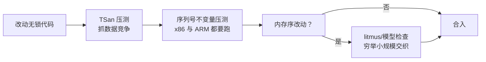

[内存模型那篇](/posts/内存模型与原子操作/)讲完了 acquire/release 的语义，这篇把它用起来：完整实现一个单生产者单消费者（SPSC）无锁环形队列——[实时控制系统](/posts/实时Linux与EtherCAT/)里控制线程与日志/通信线程之间的标准管道。目标不只是贴代码，而是把**每个内存序为什么是它**论证清楚，因为无锁代码里"碰巧能跑"和"正确"之间隔着一个平台差异或一次编译器升级。

## 1. 需求先行：为什么是 SPSC，为什么无锁

1 kHz 控制线程要把状态数据交给日志线程落盘。用 `std::mutex` 的问题不是慢——无竞争的 mutex 也就几十纳秒——而是**最坏情况无上界**：控制线程拿锁的瞬间若日志线程恰好持锁且被换出，控制线程就要睡等。普通内核下这是优先级反转的经典现场；即便 PREEMPT_RT 的优先级继承能救，也平白引入了毫秒尾巴的可能性。实时路径的要求是 **wait-free**：入队操作的步数有常数上界，不依赖其他线程的进度。

场景本身也给了简化条件：只有一个生产者（控制线程）、一个消费者（日志线程）。**SPSC 是无锁数据结构里唯一简单的东西**——不需要 CAS、没有 ABA 问题、不需要内存回收方案。需求匹配时选它，是用最小的复杂度买到 wait-free；需求不匹配（多生产者/多消费者）时，正确答案几乎总是"用别人写好的 MPMC 队列或者干脆用锁"，而不是自己升级这份代码。

## 2. 结构：两个索引，各自只有一个写者

固定容量环形缓冲 + 两个单调递增的索引：


_`tail` 只被生产者写、`head` 只被消费者写——"每个变量只有一个写者"是整个设计的正确性根基_

- `tail`：生产者下一个要写的槽位，只被生产者修改；
- `head`：消费者下一个要读的槽位，只被消费者修改；
- `head == tail` 时队空；`tail - head == capacity` 时队满。

两个设计决策先定下来：

**索引不回卷，用位掩码取模**。`head`/`tail` 用 64 位无符号数一直加，访问数组时才 `idx & (capacity - 1)`（容量取 2 的幂）。好处一是空/满判断变成纯算术，不用浪费一个哨兵槽位，也不用额外的 size 计数器；二是除法/取模在热路径上消失。64 位计数器按每纳秒一次入队算，584 年才溢出，不必处理。

**槽位里放平凡可复制的值**。`T` 要求 `std::is_trivially_copyable`，直接按值拷进数组。放指针（生产者 `new`、消费者 `delete`）会把内存分配拖回实时路径，前功尽弃；真需要变长数据，用第二个大缓冲配偏移量，队列里只传描述符。

## 3. 实现：每个内存序都有一句解释

```cpp
#include <atomic>
#include <cstddef>
#include <new>          // std::hardware_destructive_interference_size
#include <type_traits>

template <typename T, size_t Capacity>
class SpscQueue {
    static_assert(std::is_trivially_copyable_v<T>);
    static_assert(Capacity > 0 && (Capacity & (Capacity - 1)) == 0,
                  "capacity must be a power of two");
    static constexpr size_t kMask = Capacity - 1;
    static constexpr size_t kCL = std::hardware_destructive_interference_size;

    T buf_[Capacity];

    // 两个索引分属两条缓存行，再各自带一份对方索引的本地缓存
    alignas(kCL) std::atomic<uint64_t> tail_{0};   // 生产者写
    alignas(kCL) uint64_t head_cache_ = 0;         // 生产者私有

    alignas(kCL) std::atomic<uint64_t> head_{0};   // 消费者写
    alignas(kCL) uint64_t tail_cache_ = 0;         // 消费者私有

public:
    bool try_push(const T& v) {                    // 仅生产者线程调用
        const uint64_t t = tail_.load(std::memory_order_relaxed);   // (1)
        if (t - head_cache_ == Capacity) {         // 看起来满了？
            head_cache_ = head_.load(std::memory_order_acquire);    // (2)
            if (t - head_cache_ == Capacity) return false;          // 真满
        }
        buf_[t & kMask] = v;                                        // (3)
        tail_.store(t + 1, std::memory_order_release);              // (4)
        return true;
    }

    bool try_pop(T& out) {                         // 仅消费者线程调用
        const uint64_t h = head_.load(std::memory_order_relaxed);   // (5)
        if (h == tail_cache_) {                    // 看起来空了？
            tail_cache_ = tail_.load(std::memory_order_acquire);    // (6)
            if (h == tail_cache_) return false;                     // 真空
        }
        out = buf_[h & kMask];                                      // (7)
        head_.store(h + 1, std::memory_order_release);              // (8)
        return true;
    }
};
```

### 3.1 内存序逐行论证

无锁代码的正确性论证要回答两个问题：**数据可见性**（读到的槽位内容是完整的）和**槽位不被踩踏**（写者不会覆盖还没读走的数据）。

**数据可见性，(3)(4) 配 (6)(7)**：生产者先写槽位 (3)，再以 release 发布新 `tail` (4)。消费者以 acquire 读 `tail` (6)，若读到了新值，release/acquire 建立 synchronizes-with——(3) 的普通写 happens-before (7) 的普通读。**槽位内容本身不需要是原子的**，同步全由 `tail` 这一个原子变量背书。这正是[上一篇](/posts/内存模型与原子操作/)里"发布—订阅"模式的教科书应用：把一个原子变量当作一批普通数据的发布闸门。

**槽位不被踩踏，(7)(8) 配 (2)(3)**：生产者要复用槽位，必须先通过 (2) 的 acquire 读到消费者 release 发布 (8) 的新 `head`。同样的 release/acquire 链保证：消费者从槽位里拷出数据 (7) happens-before 生产者往同一槽位写入新数据 (3)。两条链合起来，缓冲区里每个字节的读写都被排了序——**没有任何数据竞争**，这个结论可以拿给 ThreadSanitizer 验证。

**(1)(5) 为什么可以 relaxed**：生产者读自己写的 `tail`，同一线程内程序序天然保证看到最新值，不需要任何跨线程同步——对自己私有索引用 acquire 纯属浪费。

一个常见的错误变体值得点名：把 (4) 写成 `relaxed`、在后面补一个 `atomic_thread_fence(release)`——顺序反了，栅栏必须在 store **之前**。栅栏版本能写对，但可读性和被后人改错的概率都不如直接在操作上标内存序。

### 3.2 缓存索引：一行优化，一半吞吐

`head_cache_`/`tail_cache_` 这对私有缓存是这份实现里最值钱的优化。没有它，生产者**每次** push 都要读 `head_`——那条缓存行刚被消费者写过，读它必然触发一次跨核缓存行迁移（几十纳秒），而且反过来又把消费者那边的行弹走。有了缓存：只有"看起来满了"才去读真值，队列长期不满不空时，生产者和消费者各自在自己的缓存行上跑，几乎零一致性流量。实测（x86，两个绑核线程互灌 8 字节消息）这一项优化通常带来 2~3 倍吞吐差距。

`alignas(kCL)` 的作用同理：四个索引变量若挤在同一缓存行，生产者写 `tail_` 会把消费者正在读的 `head_` 缓存行打飞——这就是[上一篇](/posts/内存模型与原子操作/)结尾说的伪共享，逻辑正确性无损，性能悄悄少一个量级。

## 4. 使用侧的纪律

队列 wait-free 只是必要条件，用法错了照样出事：

**满了怎么办由业务定，队列不定**。`try_push` 返回 false 时，控制线程绝不能自旋等待（等于把自己降级成阻塞）。日志场景的正确策略是**丢弃 + 计数**：

```cpp
if (!log_queue.try_push(entry)) {
    dropped_.fetch_add(1, std::memory_order_relaxed);  // 丢了多少要能看见
}
```

丢日志可以接受，丢周期不可以。反过来，参数下发（非实时 → 实时）方向通常配成"队列满 = 调用方稍后重试"，因为非实时侧可以等。

**消费者的唤醒方式**。忙轮询最简单但烧一个核；`try_pop` 空转几次后退避到 `std::this_thread::sleep_for(100us)` 是日志线程的合理折中——代价是尾延迟 100 μs，对落盘无所谓。需要低延迟唤醒再上 eventfd/futex，但要清楚：**唤醒系统调用放在生产者侧就进了实时路径**，`write(eventfd)` 虽快也是内核入口，预算里要记账。

**容量怎么定**。按"消费者最长停顿 × 生产速率"取包络再翻倍：日志线程最坏被磁盘 IO 卡 100 ms、控制线程 1 kHz 各写一条，容量就至少 200 条，取 256。容量不足的表现是丢弃计数上涨，而不是任何形式的阻塞——这正是把失效模式设计成可观测、可容忍的思路。

## 5. 怎么验证：测试无锁代码的三板斧

无锁代码"跑了一晚上没崩"约等于什么都没证明，验证要分层：

1. **ThreadSanitizer 压测**：TSan 理解 C++ 内存序语义，能在动态执行中抓真数据竞争。把 (4) 的 release 故意改成 relaxed，TSan 会立刻报告 buf_ 上的竞争——顺手验证了"测试本身测得到问题"；注意 TSan 有约 5~15 倍减速，压测线程数和时长要按比例给够；
2. **不变量断言压测**：生产者写单调递增的序列号，消费者断言收到的序列连续（允许 try_push 失败造成的空洞则断言单调）。在 ARM 板子上跑——x86 的强内存模型（TSO）会掩盖大量 acquire/release 错误，**弱内存序平台才是无锁代码的照妖镜**；
3. **模型检查**：对改动过内存序的版本，用 herd7/litmus 或 CDSChecker 这类工具穷举小规模交织。手写证明 + 工具复核，才敢说"正确"。



## 6. 小结

1. SPSC 的全部简单性来自**每个原子变量只有一个写者**：不需要 CAS、没有 ABA、没有内存回收问题。需求超出 SPSC 时，换现成的库或用锁，不要"顺手"升级这份代码。
2. 内存序的选择完全由两条 happens-before 链决定：`tail` 的 release/acquire 保护"数据先写后读"，`head` 的 release/acquire 保护"槽位先读后覆盖"；私有索引的自读用 relaxed。
3. 性能的大头不在指令数，在**缓存一致性流量**：缓存索引 + 缓存行对齐两项加起来常有数倍差距。
4. 失效模式要显式设计：满即丢弃并计数（实时侧）或重试（非实时侧），绝不自旋等待。
5. 验证分三层：TSan 抓竞争、弱内存序平台跑不变量、模型检查复核内存序——x86 上"能跑"对无锁代码而言不构成证据。

## 参考

- D. Vyukov. [*Producer-Consumer Queues*](https://www.1024cores.net/home/lock-free-algorithms/queues) 系列（1024cores.net），SPSC/MPMC 设计空间最好的导览。
- A. Williams. *C++ Concurrency in Action, 2nd Edition*. Manning. 第 5、7 章。
- folly 的 [`ProducerConsumerQueue`](https://github.com/facebook/folly/blob/main/folly/ProducerConsumerQueue.h) 与 rigtorp 的 [`SPSCQueue`](https://github.com/rigtorp/SPSCQueue)：两份可对照阅读的生产级实现。
- J. Alglave et al. *herd7 / litmus7*（diy.inria.fr）：内存模型的可执行检验工具。
