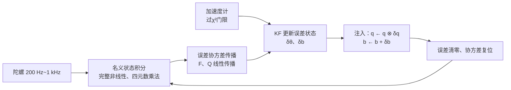

[卡尔曼滤波那篇](/posts/卡尔曼滤波原理解析/)结尾提到：姿态估计要用误差状态卡尔曼滤波（ESKF）。这篇把"要用"展开成"为什么以及怎么用"。IMU 姿态估计是每个机器人——无人机、足式、机械臂基座、手持设备——都绕不开的模块，它也是理解 VIO、组合导航这些更大系统的最小完整样本。

## 1. 原料：IMU 到底给了你什么

一颗 MEMS IMU 输出两组三轴测量，各自的误差模型必须先写清楚，后面滤波器的 $\mathbf Q$ 全部从这里来：

$$
\begin{aligned}
\boldsymbol\omega_m &= \boldsymbol\omega + \mathbf b_g + \mathbf n_g,
\qquad \dot{\mathbf b}_g = \mathbf n_{bg} \\
\mathbf a_m &= \mathbf R^\top(\mathbf a^W - \mathbf g) + \mathbf b_a + \mathbf n_a,
\qquad \dot{\mathbf b}_a = \mathbf n_{ba}
\end{aligned}
$$

- **陀螺仪**测角速度，误差 = 白噪声 $\mathbf n_g$ + **缓慢游走的偏置** $\mathbf b_g$。偏置不是常数：随温度、上电批次漂移，建模成随机游走；
- **加速度计**测的是**比力**（specific force）——重力与运动加速度之和在机体系的投影，同样带白噪声和偏置。

两类传感器的角色由误差的频谱决定：**陀螺仪积分短期极准**（毫秒到秒级），但偏置积分成角度后**无界漂移**；**加速度计静止时给出重力方向**（绝对的俯仰/横滚参考，长期无漂移），但瞬时噪声大，且机体一加速，"重力方向"就被线加速度污染。姿态融合的本质是**按频段分工**：高频信陀螺，低频信重力。

_仿真对比（真实生成）：纯陀螺积分漂移无界；加速度计瞬时噪声大且在线加速度段（黄色区间）给出完全错误的"倾角"；互补滤波和 KF 都实现了频段分工，但 KF 在线估计偏置，扰动后恢复更快、长期更稳_

参数从哪来？数据手册与 **Allan 方差**标定。把 IMU 静置数小时，对不同平均时长 $\tau$ 计算输出的方差，log-log 曲线上：斜率 $-1/2$ 段的截距给出**角度随机游走**（白噪声密度，决定 $\mathbf n_g$ 的强度），平底段给出**偏置不稳定性**（决定 $\mathbf n_{bg}$）。这两个数直接填进滤波器的 $\mathbf Q$——ESKF 的调参之所以比一般 KF 有据可依，就因为过程噪声有物理来源。

## 2. 障碍：四元数进不了标准 KF

姿态用单位四元数 $\mathbf q$ 表示（无奇异、插值好），但把它直接塞进 KF 状态向量会遇到三个结构性问题：

1. **约束**：$\|\mathbf q\| = 1$。KF 的更新是无约束加法 $\hat{\mathbf x} + \mathbf K\mathbf y$，加完就不是单位四元数了，硬归一化则破坏了最优性推导；
2. **过参数化**：4 个数表示 3 个自由度，$4\times4$ 姿态协方差矩阵必然奇异（法向上没有不确定性），数值上麻烦不断；
3. **加法不是那么回事**：旋转的复合是乘法（群运算），$\mathbf q_1 + \mathbf q_2$ 没有几何意义。KF 的整个推导建立在状态空间是向量空间的假设上，而旋转住在流形 $SO(3)$ 上。

ESKF 的解法可以概括成一句话：**让非线性归非线性，让高斯归高斯**。

## 3. ESKF：名义状态与误差状态双轨制

把真实状态拆成两部分：

$$
\mathbf q_{true} = \mathbf q_{nom} \otimes \delta\mathbf q(\delta\boldsymbol\theta),
\qquad
\mathbf b_{true} = \mathbf b_{nom} + \delta\mathbf b
$$

- **名义状态**（$\mathbf q_{nom}, \mathbf b_{nom}$）：大信号。用完整非线性方程积分陀螺数据，永远保持单位范数，不带协方差；
- **误差状态**（$\delta\boldsymbol\theta \in \mathbb R^3, \delta\mathbf b$）：小信号。姿态误差用**三维小角度向量**表示（$\delta\mathbf q \approx [1, \tfrac12\delta\boldsymbol\theta]^\top$），这是流形在当前估计点的切空间坐标。滤波器只对它做 KF。

三个问题同时消解：误差状态是自由向量（无约束）、维数恰好 3（协方差满秩）、而且**因为它始终很小，线性化几乎不引入误差**——这正是 [EKF 线性化误差](/posts/卡尔曼滤波原理解析/)的对症药：EKF 在大状态上线性化，ESKF 永远在原点附近线性化。

### 3.1 一个周期的三步

**预测**：名义四元数按陀螺积分（零阶保持下的增量旋转 $\delta\boldsymbol\phi = (\boldsymbol\omega_m - \mathbf b_g)\Delta t$ 做四元数乘法），误差状态均值保持为零，协方差按误差动力学传播：

$$
\mathbf P \leftarrow \mathbf F\,\mathbf P\,\mathbf F^\top + \mathbf Q, \qquad
\mathbf F = \begin{bmatrix}
\exp(-[\delta\boldsymbol\phi]_\times) & -\mathbf I\,\Delta t \\
\mathbf 0 & \mathbf I
\end{bmatrix}
$$

$\mathbf F$ 右上角的 $-\mathbf I\Delta t$ 就是"陀螺偏置误差一个周期积累成多少姿态误差"，$\mathbf Q$ 里填 Allan 方差给出的两个噪声强度。

**更新**：静止或缓变时，加速度计的测量方向应等于名义姿态预测的重力方向。残差

$$
\mathbf y = \mathbf a_m / \|\mathbf a_m\| - \mathbf R^\top(\mathbf q_{nom})\,\mathbf g / g
$$

对误差状态的雅可比 $\mathbf H = [\,[\mathbf R^\top\mathbf g]_\times / g \;\; \mathbf 0\,]$，标准 KF 更新得到 $\delta\hat{\boldsymbol\theta}, \delta\hat{\mathbf b}$。注意加速度计只能观测**俯仰和横滚**——绕重力轴的偏航对重力方向不敏感（$\mathbf H$ 在该方向秩亏），偏航要靠磁力计、视觉或轮速计来定，否则它就以陀螺偏置的速度慢慢漂。

**注入与复位**：把估出的误差并回名义状态——四元数乘上 $\delta\mathbf q(\delta\hat{\boldsymbol\theta})$、偏置相加——然后误差状态清零，协方差做一个小的复位修正。切空间的原点被挪到了新的估计点，下一轮继续在原点附近工作。

### 3.2 线加速度：最重要的野值问题

加速度计更新的前提"测的是纯重力"在机体加速时不成立（图中黄色区间）。三层防御依次是：

1. **门限**：$\left|\,\|\mathbf a_m\| - g\,\right|$ 超阈值直接跳过更新（模长偏离重力，必有线加速度）——注意它挡不住"模长恰好等于 $g$ 的动态"（如匀速圆周运动）；
2. **自适应 $\mathbf R$**：不粗暴跳过，而是按偏离程度膨胀测量噪声，让更新平滑降权；
3. **把线加速度建进模型**：无人机可以用动力学模型（推力/阻力）预测比力，足式机器人用触地状态判断哪几段可信——这已经在往组合导航的方向走了。

图里 KF 与互补滤波在扰动段的差异就来自这层处理加上偏置估计：互补滤波以固定比例吞下被污染的加速度计读数，KF 可以拒绝或降权，且扰动期间靠已估准的偏置维持纯积分精度。

## 4. 跟互补滤波比：复杂度买到了什么

互补滤波一行就能写完：

$$
\hat\theta_k = \alpha\left(\hat\theta_{k-1} + \omega_m \Delta t\right) + (1-\alpha)\,\theta_{acc}
$$

高通给陀螺、低通给加速度计，$\alpha = \tau/(\tau + \Delta t)$ 定分频点。Mahony、Madgwick 滤波器是它在 $SO(3)$ 上的推广，无人机飞控里用得极多。**在噪声平稳、动态温和的场景，它和 ESKF 的精度差距很小**——这是必须诚实承认的。

ESKF 多出来的复杂度买到四样东西：

| 能力 | 互补滤波 | ESKF |
| --- | --- | --- |
| 偏置在线估计 | 无（偏置直接漏进姿态） | 状态之一，温漂自动跟踪 |
| 不确定度输出 | 无 | 协方差，供下游（规划、控制）消费 |
| 增益 | 固定分频点，全场景一套 | 随协方差自动调节：初始化快收敛、稳态低噪声 |
| 扩展性 | 到此为止 | 加状态就是 VIO / GNSS 组合导航 / 轮式里程计融合 |

最后一条是本质的：ESKF 的名义/误差双轨结构**原封不动地就是** VIO（MSCKF、VINS 的滤波内核）和 GNSS/INS 组合导航的骨架——状态从 6 维扩到位置、速度、外参、特征深度，套路完全一样。学 ESKF 不是为了姿态那 6 个状态，是为了这个可扩展的框架。

## 5. 实现清单

1. **初始化**：静置几秒，加速度计均值定横滚/俯仰，陀螺均值直接作为 $\mathbf b_g$ 初值；协方差给大让滤波器快速收敛。偏航初值没有磁力计就设零并如实给大方差；
2. **静止检测送温补**：检测到静止（角速度模长和加速度模长都稳定）时可以加"零角速度更新"（陀螺读数全额记为偏置观测），温漂跟踪立竿见影；
3. **振动**：电机振动频率高于采样奈奎斯特频率时会**混叠**进低频段，任何滤波器都救不回来——先机械减振（隔振垫），再抬采样率，最后才是数字滤波；
4. **时间戳**：融合多传感器时对齐时间戳比调 $\mathbf Q/\mathbf R$ 重要，几毫秒的错位在高动态下等效于巨大的测量噪声；IMU 硬件时间戳 > 驱动打戳 > 到达时间；
5. **验证**：和[上一篇](/posts/卡尔曼滤波原理解析/)一样，NIS 一致性监控要常开；姿态真值可用转台或视觉动捕，没有条件时至少做"积分-回零"测试（缓慢转一圈回到原位，看姿态是否归位）。

## 6. 小结

1. IMU 融合的物理本质是**频段分工**：陀螺管高频、重力参考管低频；一切方案（互补、Mahony、ESKF）都是这句话的不同实现精度。
2. 四元数不能直接进 KF 的三个原因——单位约束、协方差奇异、加法无意义——被 ESKF 的**切空间误差状态**一次性解决。
3. ESKF = 名义状态非线性积分 + 误差状态线性滤波 + 注入复位；因为误差永远在原点附近，线性化质量天然优于 EKF。
4. $\mathbf Q$ 不是玄学：Allan 方差标定给出角度随机游走和偏置不稳定性，直接填表。
5. 简单场景用互补滤波不丢人；要偏置跟踪、不确定度和向 VIO/组合导航扩展的路，选 ESKF。

## 参考

- J. Solà. *Quaternion kinematics for the error-state Kalman filter*. arXiv:1711.02508.（ESKF 最完整的推导，本文记号与其一致）
- N. Trawny, S. I. Roumeliotis. *Indirect Kalman Filter for 3D Attitude Estimation*. Tech. Report, 2005.
- R. Mahony, T. Hamel, J.-M. Pflimlin. *Nonlinear Complementary Filters on the Special Orthogonal Group*. IEEE TAC, 2008.
- IEEE Std 952: Allan 方差在陀螺标定中的标准方法。
- O. J. Woodman. *An Introduction to Inertial Navigation*. Cambridge Tech. Report, 2007.（IMU 误差模型入门最佳）
