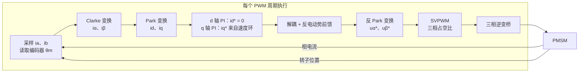

机器人关节里的电机绝大多数是永磁同步电机（PMSM）或无刷直流电机（BLDC）。它们没有电刷换向器，想让转子持续转动，必须由控制器主动决定"什么时刻给哪相绕组通多大电流"。磁场定向控制（Field-Oriented Control，FOC）要回答的问题是：

> 给定期望转矩，三相绕组的电流应该如何随转子位置实时变化，才能像直流电机那样——电流与转矩成正比、且每安培电流产生的转矩最大？

本文按信号流的顺序推导 FOC 的完整链路：为什么转矩只和一个分量有关、Clarke/Park 变换如何把三相交流量变成两个直流量、dq 模型下电流环怎么整定、以及 SVPWM 如何把电压指令变成六个开关管的通断。

## 0. 为什么直流电机好控而三相电机难控

有刷直流电机的转矩公式是 $T_e = K_T \, i$：电刷和换向器用机械方式保证了电枢磁场始终与定子磁场垂直，所以转矩直接正比于电流，控制器只需要一个电流环。

PMSM 去掉了电刷，转子上是永磁体，磁场随转子一起旋转。定子三相绕组在空间上相差 120°，通电后合成一个磁场矢量。转矩来自定子磁场与转子磁场的相互作用：

$$
T_e \propto \left|\boldsymbol\psi_s\right| \left|\boldsymbol\psi_r\right| \sin\delta
$$

其中 $\delta$ 是两个磁场的夹角。要转矩最大且平稳，就要让定子磁场**始终领先转子磁场 90° 电角度**。转子在转，所以定子电流必须是随转子位置变化的三相正弦量——直接在 abc 三相坐标下用 PI 控制三个正弦电流是不现实的：PI 对正弦给定存在稳态幅值与相位误差，且转速越高误差越大。

FOC 的思路是换坐标系：**跳到与转子同步旋转的坐标系上看，三相正弦电流就变成了两个直流量**，PI 控制器对直流量可以做到无稳态误差。这就是接下来两个变换的动机。

## 1. Clarke 变换：三相 → 两相静止

三相绕组电流 $i_a, i_b, i_c$ 在空间上相差 120°，合成的电流矢量可以用一个两维静止直角坐标系（αβ 系，α 轴与 a 相轴线重合）等价表示。取等幅值约定（amplitude-invariant）：

$$
\begin{bmatrix} i_\alpha \\ i_\beta \end{bmatrix}
= \frac{2}{3}
\begin{bmatrix}
1 & -\tfrac{1}{2} & -\tfrac{1}{2} \\[2pt]
0 & \tfrac{\sqrt3}{2} & -\tfrac{\sqrt3}{2}
\end{bmatrix}
\begin{bmatrix} i_a \\ i_b \\ i_c \end{bmatrix}
$$

系数 $\tfrac23$ 使得变换后 $i_\alpha$ 的幅值等于相电流幅值。星形接法且中性点不引出时 $i_a + i_b + i_c = 0$，代入可消去一相：

$$
i_\alpha = i_a, \qquad
i_\beta = \frac{i_a + 2 i_b}{\sqrt3}
$$

所以实际采样两相电流即可。变换后 $i_\alpha, i_\beta$ 仍是正弦量——坐标系还没有转起来。

## 2. Park 变换：静止 → 随转子旋转

把 αβ 系绕原点旋转电角度 $\theta_e$（转子磁链方向定义为 d 轴，超前 90° 为 q 轴），得到 dq 旋转坐标系：

$$
\begin{bmatrix} i_d \\ i_q \end{bmatrix}
=
\begin{bmatrix}
\cos\theta_e & \sin\theta_e \\
-\sin\theta_e & \cos\theta_e
\end{bmatrix}
\begin{bmatrix} i_\alpha \\ i_\beta \end{bmatrix}
$$

_同一个电流矢量 $i_s$：在 αβ 静止系下两个分量是正弦量，转到与转子同步的 dq 系下变成两个直流量_

在稳态下电流矢量与转子同步旋转，因此 $i_d, i_q$ 是**直流量**。物理含义非常清晰：

- $i_d$：与转子磁链同向的分量，改变气隙磁场强弱（励磁分量）；
- $i_q$：与转子磁链垂直的分量，产生转矩（转矩分量）。

注意 $\theta_e$ 是**电角度**：极对数为 $p$ 的电机，$\theta_e = p\,\theta_m$。编码器给出机械角 $\theta_m$ 后还要乘极对数、再对齐零位（通常上电时给 d 轴注入电流把转子拉到已知位置来标定）。

## 3. dq 坐标下的电机模型

对表贴式 PMSM（SPMSM，$L_d = L_q = L$）与内嵌式 PMSM（IPMSM，$L_d < L_q$），dq 系下的定子电压方程为

$$
\begin{aligned}
u_d &= R_s i_d + L_d \frac{\mathrm d i_d}{\mathrm d t} - \omega_e L_q i_q \\[4pt]
u_q &= R_s i_q + L_q \frac{\mathrm d i_q}{\mathrm d t} + \omega_e L_d i_d + \omega_e \psi_f
\end{aligned}
$$

其中 $\psi_f$ 是永磁体磁链，$\omega_e$ 是电角速度。三个非理想项都有名字：

- $-\omega_e L_q i_q$ 与 $+\omega_e L_d i_d$：**交叉耦合项**，d、q 轴互相干扰；
- $\omega_e \psi_f$：**反电动势**，随转速线性增大。

转矩方程为

$$
T_e = \frac{3}{2} p \left[ \psi_f i_q + (L_d - L_q)\, i_d i_q \right]
$$

对 SPMSM，第二项（磁阻转矩）为零，于是

$$
T_e = \frac{3}{2} p\, \psi_f\, i_q = K_T\, i_q
$$

**这就是 FOC 的全部要点**：只要坐标变换的角度准确，转矩就只由 $i_q$ 决定，和直流电机一模一样。控制策略随之明确——SPMSM 令 $i_d^* = 0$（每安培电流转矩最大）；IPMSM 则按最大转矩电流比（MTPA）分配 $i_d^*, i_q^*$，利用磁阻转矩多出一部分力矩。

## 4. 电流环：两个独立的一阶对象

令 $i_d^\*=0$ 并把耦合项当作扰动前馈补偿掉之后，d、q 两轴各自退化为一阶惯性对象：

$$
G(s) = \frac{i(s)}{u(s)} = \frac{1}{L s + R_s}
$$

用 PI 控制器 $C(s) = K_p + \dfrac{K_i}{s}$ 做**零极点对消**：取

$$
\frac{K_p}{K_i} = \frac{L}{R_s}
\quad\Longrightarrow\quad
C(s)G(s) = \frac{K_p}{L s}
$$

闭环变成标准一阶系统，带宽 $\omega_c = K_p / L$。于是整定公式简单到可以背下来：

$$
K_p = \omega_c L, \qquad K_i = \omega_c R_s
$$

工程上电流环带宽通常取 PWM 频率的 1/20 ~ 1/10（例如 20 kHz PWM 配 1~2 kHz 电流环带宽），再往上会被采样延迟和逆变器死区破坏相位裕度。两点实践细节：

- **解耦前馈**：把 $-\omega_e L_q i_q$、$+\omega_e L_d i_d + \omega_e \psi_f$ 直接加到 PI 输出上，高速时尤其重要，否则 q 轴阶跃会在 d 轴激起明显扰动；
- **抗积分饱和**：电压指令受母线电压限制（下一节的六边形），PI 必须做 back-calculation 或 clamping，否则减速时会出现长时间的转矩失控。

## 5. SVPWM：把电压矢量变成开关序列

电流环输出的是 dq 系电压指令 $u_d^\*, u_q^\*$，反 Park 变换回 αβ 系得到 $u_\alpha^\*, u_\beta^\*$。最后一步是让三相两电平逆变器"输出"这个电压矢量。

三相桥有 $2^3 = 8$ 种开关组合：6 个非零基本矢量把平面分成六个扇区，幅值均为 $\tfrac23 U_{dc}$；2 个零矢量（000、111）位于原点。

_参考矢量落在扇区 I 时，用相邻的 $\vec U_1$、$\vec U_2$ 与零矢量按伏秒平衡合成_

任意参考矢量 $\vec U_{ref}$（幅角 $\theta$ 落在扇区 I）在一个开关周期 $T_s$ 内用相邻两个基本矢量加零矢量做**伏秒平衡**：

$$
\vec U_{ref}\, T_s = \vec U_1 T_1 + \vec U_2 T_2 + \vec U_{0,7}\, T_0
$$

解出作用时间：

$$
T_1 = \frac{\sqrt3\, T_s \left|\vec U_{ref}\right|}{U_{dc}} \sin\!\left(\frac{\pi}{3} - \theta\right),
\qquad
T_2 = \frac{\sqrt3\, T_s \left|\vec U_{ref}\right|}{U_{dc}} \sin\theta,
\qquad
T_0 = T_s - T_1 - T_2
$$

把 $T_0$ 均分给 000 与 111 并对称排列（七段式：$\vec U_0\,\vec U_1\,\vec U_2\,\vec U_7\,\vec U_2\,\vec U_1\,\vec U_0$），每个周期内每相只开关两次，谐波性能最优。

线性调制区的极限是参考矢量圆内切于六边形：

$$
\left|\vec U_{ref}\right|_{max} = \frac{U_{dc}}{\sqrt3} \approx 0.577\, U_{dc}
$$

比普通正弦 PWM 的 $0.5\,U_{dc}$ 高约 15.5%——这就是 SVPWM 直流母线利用率更高的确切含义。实现上不必真的做扇区判断和三角函数：注入共模三次谐波（min-max 中点平移）的载波调制与七段式 SVPWM 在数学上等价，代码只有几行。

## 6. 把整条链路串起来

外面再套速度环和位置环就是机器人关节常见的三环结构。各环带宽按约一个数量级递减（例如电流环 1 kHz、速度环 100 Hz、位置环 20 Hz），保证内环对外环近似为理想执行器：

$$
\omega_{pos} \ll \omega_{vel} \ll \omega_{cur} \ll \omega_{PWM}
$$

## 7. 实现清单：仿真里没有、板子上全有的问题

真正把 FOC 跑在 MCU 上，坑几乎都不在算法本身：

1. **电流采样时刻**：低边采样电阻方案只能在下管导通时采样，ADC 触发必须与 PWM 计数器中心对齐；占空比接近 100% 时下管导通窗口太短，要做最小脉宽限制或移相。
2. **电角度标定**：编码器零位和 d 轴的偏差直接变成转矩损失（$\cos\Delta\theta$）和 d 轴扰动。标定方法：给 $i_d > 0, i_q = 0$ 强制转子对齐，记录此时编码器读数。
3. **死区补偿**：上下管互锁死区（典型 0.5~2 μs）造成电压畸变，低速轻载时表现为电流过零附近的爬行和噪声，需按电流方向做补偿。
4. **速度测量**：低速时编码器脉冲计数噪声大，用 M/T 法或对位置做跟踪微分器/PLL 提取速度。
5. **执行时序**：整条链路（采样 → 变换 → PI → SVPWM 装载比较寄存器）必须在一个 PWM 周期内完成，20 kHz 下预算只有 50 μs，三角函数用查表或 CORDIC。

## 8. 再往上：弱磁与无传感器

两个常见扩展，思路在 dq 模型里都已经埋好：

- **弱磁（field weakening）**：反电动势 $\omega_e\psi_f$ 随转速增大，逼近电压极限 $u_d^2 + u_q^2 \le U_{max}^2$ 后电流环失去调节余量。解决办法是注入负的 $i_d$ 抵消一部分永磁磁链，用铜损换转速上限，电流工作点沿电压极限椭圆滑动。
- **无传感器（sensorless）**：中高速用反电动势观测器（滑模观测器或磁链观测器）从 $u_{\alpha\beta}, i_{\alpha\beta}$ 反推 $\theta_e$；零低速反电动势太小，改用高频注入（HFI）利用 $L_d \ne L_q$ 的凸极性提取位置。云台、风机类负载常用纯无感方案，机器人关节因为要做位置控制，一般仍配编码器。

## 9. 小结

| 模块 | 输入 → 输出 | 关键结论 |
| --- | --- | --- |
| Clarke | $i_{abc} \to i_{\alpha\beta}$ | 三相冗余信息压缩为两维，采两相电流即可 |
| Park | $i_{\alpha\beta} \to i_{dq}$ | 正弦量变直流量，PI 无稳态误差成为可能 |
| dq 模型 | — | $T_e = \tfrac32 p \psi_f i_q$，转矩控制退化为 $i_q$ 控制 |
| 电流环 PI | $i_{dq}^\* \to u_{dq}^\*$ | 零极点对消：$K_p = \omega_c L$，$K_i = \omega_c R_s$ |
| SVPWM | $u_{\alpha\beta}^\* \to$ 占空比 | 母线利用率 $U_{dc}/\sqrt3$，比 SPWM 高 15.5% |

FOC 的本质一句话就能说完：**用准确的转子角度做坐标变换，把交流电机的转矩控制问题变换成两个直流量的调节问题**。链路里每一环（角度、采样时刻、死区、带宽分配）损失的精度，最后都会以转矩纹波和噪声的形式还回来。

## 参考

- P. C. Krause, O. Wasynczuk, S. D. Sudhoff. *Analysis of Electric Machinery and Drive Systems*. Wiley-IEEE Press.
- R. Krishnan. *Permanent Magnet Synchronous and Brushless DC Motor Drives*. CRC Press.
- 阮毅, 陈伯时. 《电力拖动自动控制系统——运动控制系统》. 机械工业出版社.
- TI Application Report: *Field Orientated Control of 3-Phase AC-Motors* (BPRA073).
