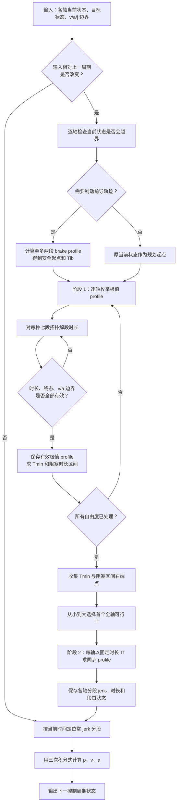
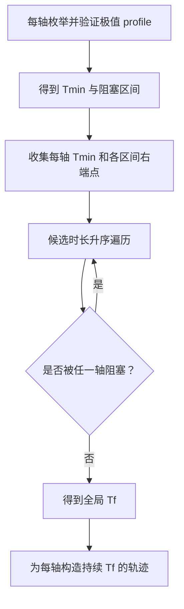

Ruckig 是一个在线轨迹生成（Online Trajectory Generation，OTG）库。给它当前状态、目标状态和运动学边界，它要在一个控制周期内回答一个严格的问题：

> 能否从当前状态到达目标状态？若能，满足速度、加速度、jerk 约束的最短时间轨迹是什么？多轴又如何同时到达？

“平滑插值”并不等价于这个问题。三次样条能够让位置曲线连续，但未必满足速度、加速度和 jerk 上限；梯形速度规划能够限制加速度，却可能在加速度切换点产生无限大的 jerk。Ruckig 的目标是**状态到状态的、jerk 受限的、运动学时间最优轨迹**。

本文依据 Berscheid 与 Kröger 发表的论文 *Jerk-limited Real-time Trajectory Generation with Arbitrary Target States*，按算法实际执行顺序推导其思想。重点是 Position Interface 下的状态到状态计算；带中间路点的路径规划不属于这篇论文的核心求解器。

## 0. 一次 `update` 到底计算了什么

Ruckig 的完整计算分为“重新规划”和“轨迹采样”两条路径。输入的当前状态、目标状态或约束发生变化时，才走代价较高的重新规划路径；否则只在已经确定的分段多项式上采样。



可把流程压缩为下面的伪代码。这里 `calculate_extremal_profiles` 对应论文的 Step 1，`calculate_profile_at_duration` 对应 Step 2：

```text
if input_has_changed(input):
    for dof in degrees_of_freedom:
        brake[dof] = calculate_brake_if_required(input[dof])
        profiles[dof] = calculate_extremal_profiles(
            brake[dof].final_state, target[dof], limits[dof]
        )
        valid[dof] = validate_and_sort(profiles[dof])
        Tmin[dof], blocked[dof] = durations_and_blocked_intervals(valid[dof])

    Tf = first_time_not_blocked_by_any_axis(Tmin, blocked, brake.duration)
    for dof in degrees_of_freedom:
        synchronized[dof] = calculate_profile_at_duration(Tf, dof)

return sample_piecewise_constant_jerk_trajectory(current_time)
```

后文的重点就是三个函数：如何枚举极值 profile、为什么存在阻塞时长区间，以及如何在给定 $T_f$ 时重新构造同步轨迹。

## 1. 先把问题说准确

对第 $i$ 个自由度，位置及其前三阶导数为

$$
x_i(t) = \left(p_i(t),\,v_i(t),\,a_i(t),\,j_i(t)\right)
$$

其中

$$
v_i = \dot p_i,\qquad
a_i = \dot v_i,\qquad
j_i = \dot a_i
$$

给定 $N$ 个自由度的初态 $\boldsymbol{x}_0$ 和终态 $\boldsymbol{x}_f$，Ruckig 求解：

$$
\begin{aligned}
\min_{\boldsymbol{x}(t),\,T_f}\quad &T_f \\
\text{s.t.}\quad
&\boldsymbol{x}(0)=\boldsymbol{x}_0, \\
&\boldsymbol{x}(T_f)=\boldsymbol{x}_f, \\
&v_{i,\min}\le v_i(t)\le v_{i,\max}, \\
&a_{i,\min}\le a_i(t)\le a_{i,\max}, \\
&j_{i,\min}\le j_i(t)\le j_{i,\max}.
\end{aligned}
$$

这里有三个常被混淆的点：

1. **目标状态是完整的。** $p_f$、$v_f$、$a_f$ 都可非零。这使轨迹能自然接到另一段运动，而不是每个路点都停住。
2. **这是运动学时间最优。** 每个自由度以独立的运动学约束求解，再做同步；它不直接包含关节力矩、质量矩阵、柔性振动或碰撞约束。
3. **各轴共用结束时间。** 虽然逐轴构造轨迹，但最终必须有同一个 $T_f$，否则机械臂不会在同一时刻到达目标构型。

为简化推导，论文取对称 jerk 上限：

$$
j_{\min}=-j_{\max}
$$

但速度和加速度允许不对称，例如 $v_{\min}\neq-v_{\max}$。这对人机协作很实用：向人的方向可以限得很慢，远离人的方向仍可较快。

## 2. 为什么 jerk 约束会产生 S 曲线

若一段时间内 jerk 为常数 $j$，从段首状态 $(p_k,v_k,a_k)$ 出发，经过 $\tau$ 后有：

$$
a(\tau)=a_k+j\tau
$$

$$
v(\tau)=v_k+a_k\tau+\frac{1}{2}j\tau^2
$$

$$
p(\tau)=p_k+v_k\tau+\frac{1}{2}a_k\tau^2+\frac{1}{6}j\tau^3
$$

因此 jerk 阶跃不会让加速度突变：加速度是线性的、速度是二次的、位置是三次的。把若干常 jerk 段拼接起来，就得到常说的 S 曲线运动。

时间最优解还具有一个关键结构：除保持在边界上的平台段外，jerk 会尽可能取边界值

$$
j(t)\in\{-j_{\max},\,0,\,+j_{\max}\}.
$$

直觉很简单：若某段的 $|j|<j_{\max}$，且它又不是被边界或终态条件强制的，那么可以增大 jerk、缩短这段时间，从而得到更快的可行运动。Ruckig 把这种利用完整动态能力的候选轨迹称为**极值轨迹**（extremal profile）。

这一步是 Ruckig 能实时运行的基础：原本看似连续、无限维的最优控制问题，被收缩为有限个轨迹拓扑的枚举和求根问题。

## 3. 极值轨迹为什么最多只有七段

单轴时间最优轨迹不需要任意多次在边界间摆动。论文给出两个结构性结论：

- 一个极值轨迹至多触及一次速度边界；
- 一个极值轨迹至多触及两次加速度边界。

以“速度边界被触及两次”为反例：两次触及同方向速度边界之间必然夹着一次减速；消去这段不必要的减速并延长速度平台，可以构造更短的轨迹，因此原轨迹不可能时间最优。类似地，若加速度有第三个峰值，则至少有同向峰值重复出现，也可以将后一次峰值前移来缩短总时长。

于是，最多只有三个受限平台：第一个加速度平台 `ACC0`、速度平台 `VEL`、第二个加速度平台 `ACC1`。平台之间以及首尾需要 jerk 段连接，形成统一的七段模板：

| 段 | jerk | 是否可能为零时长 | 作用 |
| --- | --- | --- | --- |
| $t_1$ | $\pm j_f$ | 否（拓扑中存在时） | 向 `ACC0` 过渡 |
| $t_2$ | $0$ | 是 | 保持 `ACC0` |
| $t_3$ | $\pm j_f$ | 否（拓扑中存在时） | 离开第一个加速度平台 |
| $t_4$ | $0$ | 是 | 保持 `VEL` |
| $t_5$ | $\pm j_f$ | 否（拓扑中存在时） | 向 `ACC1` 过渡 |
| $t_6$ | $0$ | 是 | 保持 `ACC1` |
| $t_7$ | $\pm j_f$ | 否（拓扑中存在时） | 对齐终态加速度 |

极值轨迹中 $j_f=j_{\max}$。若某个限制没有被触及，对应平台段直接令 $t_k=0$；所以“七段”是上界，而不是每一条轨迹都必须有七段。


_图 1：一个七段极值轨迹的示意。每段 jerk 恒定；加速度因此是分段线性函数，速度和位置分别为分段二次、三次函数。虚线是各段切换时刻。_

非零 jerk 段的符号组合经过对称性约简后，主要可归为

$$
\uparrow\downarrow\downarrow\uparrow
\qquad\text{和}\qquad
\uparrow\downarrow\uparrow\downarrow
$$

及其把正负号、上下边界同时镜像后的形式。再枚举 `ACC0`、`VEL`、`ACC1` 哪些存在，就得到有限个 profile type。Ruckig 不依赖一个巨大的手写决策树，而是对这些类型求解、验证并筛选。

## 4. 一个 profile type 如何变成方程

设某个候选的段时长为 $\boldsymbol{t}=(t_1,\ldots,t_7)$。按上节的常 jerk 传播公式连续积分，末状态必须满足：

$$
p_7=p_f,\qquad v_7=v_f,\qquad a_7=a_f.
$$

这是三条等式，但存在七个段时长未知量。剩余四个条件由该 profile type 的结构补齐：

- 某些段触及加速度上限或下限，例如 $a_1=a_{\max}$；
- 某些段触及速度上限或下限，例如 $v_3=v_{\max}$；
- 不存在的平台被固定为零，例如 $t_4=0$；
- 最后一条由拓扑决定，例如速度平台要求进入平台时 $a_3=0$，或要求某个相邻 jerk 段融合。

因此，每一种类型都是一个从输入状态与边界到段时长的映射：

$$
\begin{aligned}
S_1:\ &(p_0,p_f,v_0,v_f,a_0,a_f,\\
&v_{\max},a_{\max},a_{\min},j_{\max})
\mapsto(t_1,\ldots,t_7).
\end{aligned}
$$

许多类型可直接解析求解；个别类型最终会归结为最高六次的多项式。这里的难点不是“把多项式丢给通用优化器”，而是实时系统必须保证最坏计算时间。论文的做法是：

1. 通过多项式的一阶、二阶导数定位包含孤立根的区间；
2. 在区间内使用 Newton 法快速迭代；
3. Newton 迭代不可靠时回退到二分法；
4. 为指定误差容限给出迭代次数上界。

Newton 法带来通常的二次收敛，二分法提供确定性。这种组合比无界迭代的数值优化更适合控制线程。

## 5. 求出根以后，还必须做可行性验证

方程有实根不等于候选轨迹物理可行。Ruckig 对每个 profile type 至少检查以下条件。

### 5.1 每一段时间非负

$$
t_k\ge0,\qquad k=1,\ldots,7.
$$

负时间通常意味着“该拓扑不适用于当前输入”，而不是需要将时长取绝对值。

### 5.2 段末状态精确满足目标

按常 jerk 方程逐段传播：

$$
a_{k+1}=a_k+s_kj_ft_k
$$

$$
v_{k+1}=v_k+a_kt_k+\frac{1}{2}s_kj_ft_k^2
$$

$$
p_{k+1}=p_k+v_kt_k+\frac{1}{2}a_kt_k^2+\frac{1}{6}s_kj_ft_k^3,
$$

其中 $s_k\in\{-1,0,+1\}$ 表示第 $k$ 段的 jerk 符号。末状态必须回到 $(p_f,v_f,a_f)$，仅在浮点容差内允许偏差。

### 5.3 加速度与速度的全过程不越界

加速度在每段内是线性的，检查相邻段端点即可覆盖极值。速度则更细一点：速度导数是加速度；若某段加速度从正变负或反之，速度会在 $a(\tau)=0$ 处出现内部极值。

对于非零 jerk 段，内部极值时刻为

$$
\tau^\ast=-\frac{a_k}{s_kj_f}.
$$

只有当 $\tau^\ast\in[0,t_k]$ 时，才需要额外检查

$$
v(\tau^\ast)=v_k-\frac{a_k^2}{2s_kj_f}
$$

是否落在 $[v_{\min},v_{\max}]$ 内。这个检查避免了一个常见错误：只验证段首和段末速度，却漏掉中途的速度峰值。

通过所有检查的候选构成该轴的**有效极值轨迹集合**。比较它们的总时长

$$
T=\sum_{k=1}^{7}t_k
$$

即可得到该轴最短时间 $T_{i,\min}$。

## 6. 为什么需要制动前导轨迹

输入状态可能已经在边界外，或虽然当前未越界但不可避免地即将越界。典型例子是：

$$
v_0=v_{\max},\qquad a_0>0.
$$

此时即便立即施加 $-j_{\max}$，加速度也需要时间才能降到零；在这段时间里速度还会继续上升。因此不能直接把当前状态交给常规求解器。

在对称 jerk 上限下，若速度接近正上限，避免将来超速必须满足：

$$
a\le\sqrt{2j_{\max}(v_{\max}-v)}.
$$

推导来自“以最大反向 jerk 将当前加速度降至零”期间的额外速度：

$$
\Delta v=\frac{a^2}{2j_{\max}}.
$$

只有 $v+\Delta v\le v_{\max}$ 才仍有制动余量。

Ruckig 在正式轨迹前增加可选的 brake pre-trajectory。它优先用最大反向 jerk 把状态拉回安全区域；必要时再接一个零 jerk 段，防止制动过程中撞上另一侧的约束。这个前导轨迹至多两段，其时长记作 $T_{ib}$。正式 profile 从制动后的状态开始求解，总时长需要把 $T_{ib}$ 加回去。

## 7. 多轴同步真正难在哪里

若第 $i$ 轴单独运动，它有最短时长 $T_{i,\min}$。很自然会猜测：

$$
T_f=\max_i(T_{ib,i}+T_{i,\min}).
$$

这个结论对很多简单的“终点静止”问题成立，却不适用于一般的三阶完整终态。原因是：对给定初末状态，**不是每一个大于最短时间的时长都可实现**。

### 7.1 被阻塞的时长区间

考虑某一轴。有效极值 profile 按时长排序后，可能存在两个边界 profile 之间没有任何可行轨迹时长。也就是说，该轴在 $T=2.0s$ 和 $T=2.6s$ 都可到达，却在开区间 $(2.0,2.6)$ 内无法同时满足边界和完整目标状态。论文把这类间隔称为 blocked interval。

目标状态的导数越完整，可能出现的阻塞区间越多：

| 目标速度 | 目标加速度 | 最多阻塞区间数 |
| --- | --- | --- |
| $v_f=0$ | $a_f=0$ | 0 |
| $v_f\neq0$ | $a_f=0$ | 1 |
| 任意 | $a_f\neq0$ | 2 |


_图 2：每一行表示一个自由度的可达时长集合。蓝色区间可行，灰色区间不可行；虚线是第一个不被任一自由度阻塞的公共时长 $T_f$。_

为何极值 profile 正好是区间边界？非极值轨迹总可以稍微降低 jerk 或改变未饱和的平台，使其持续时间连续地变长或变短；只有已用尽动态资源的轨迹，在某一侧无法继续扰动。因此可行时长集合的断裂处必然对应极值轨迹。

若一轴的有效极值 profile 有 1、3 或 5 个，分别意味着 0、1 或 2 个阻塞区间。按时长排序后，阻塞区间位于第 2 与第 3 个、以及第 4 与第 5 个 profile 之间。

### 7.2 选择全局最小时长

每个自由度都给出自己的最短时长和阻塞区间。全局时间只能从有限的候选值中产生：

$$
T_f\in
\left\{
T_{ib,i}+T_{i,\min},\,
T_{ib,i}+T_{i,\alpha},\,
T_{ib,i}+T_{i,\beta}
\right\}_{i=1}^{N},
$$

其中 $T_{i,\alpha}$、$T_{i,\beta}$ 是存在时的阻塞区间右边界。将这些候选时长升序检查，取第一个**不落入任一轴阻塞区间**的值，便是全局最短同步时长。



对应 $T_f$ 的那根轴是限制轴（limiting DoF），它已经拥有一个极值 profile，可直接复用。其他轴则进入第二阶段：在固定时长内找一条可行轨迹。

## 8. 固定时长下如何构造同步轨迹

第二阶段的输入多了指定时长 $T_p=T_f-T_{ib}$：

$$
\begin{aligned}
S_2:\ &(T_p,p_0,p_f,v_0,v_f,a_0,a_f,\\
&v_{\max},a_{\max},a_{\min},j_{\max})
\mapsto(t_1,\ldots,t_7,j_f).
\end{aligned}
$$

它与第一阶段的差异在于：第一阶段必须使用 $j_f=j_{\max}$ 寻找极值时间；第二阶段可以通过两种方式把较快的轴延长到 $T_p$：

1. 将速度平台从边界 $v_{\max}$ 或 $v_{\min}$ 下调到内部值 $v_{\text{plat}}$；
2. 降低 jerk 幅值，使 $|j_f|<j_{\max}$。

这不是把位置、速度、加速度曲线按时间比例简单拉伸。简单缩放会改变各导数的比例，很容易违反终态或边界；第二阶段仍然逐个 profile type 解方程并做同样的可行性检查，只是现在目标是“给定时长内可达”。

## 9. 放入控制循环后发生什么

Ruckig 最常见的接口是每个控制周期调用一次 `update`。输入包含当前、目标和约束，输出为下一个采样时刻的状态：

```cpp
ruckig::Ruckig<6> otg {0.001};  // 1 ms 控制周期
ruckig::InputParameter<6> input;
ruckig::OutputParameter<6> output;

while (otg.update(input, output) == ruckig::Result::Working) {
  robot.set_joint_positions(output.new_position);
  output.pass_to_input(input);
}
```

完整的 profile 求解只在输入变化时进行。若目标和当前实际状态仍与已规划轨迹一致，后续周期只需：

1. 找到当前时间所在的分段；
2. 对该常 jerk 段用三次多项式积分；
3. 输出新的 $p$、$v$、$a$。

这也是“在线”的真正含义：不是预先生成一条曲线后机械播放，而是在每个周期都允许使用最新的反馈状态和最新目标重新生成轨迹。传感器发现人进入危险区、上层控制器改变目标、或实际执行偏离预期时，下一次 `update` 就可重新规划。

论文的实验在 7 自由度随机测试上给出约 $19.8\,\mu s$ 的平均计算时长和约 $123\,\mu s$ 的最坏时长（特定硬件与测试分布下）。这些数字不能直接当作所有平台的实时保证，但说明“有限类型枚举 + 有界数值求根”的设计确实适合毫秒级控制周期。

## 10. Ruckig 能解决什么，不能替代什么

Ruckig 擅长的是：给定状态目标和逐轴运动学限制后，快速生成连续、jerk 受限且多轴同步的轨迹。它通常放在机器人软件栈的底层运动生成位置：

1. 路径规划器或任务规划器决定目标或无碰路径；
2. 安全模块根据环境修正目标、速度和加速度边界；
3. Ruckig 产生每个控制周期的平滑状态参考；
4. 伺服控制器跟踪该参考。

它不自动完成碰撞检测、逆运动学、动力学力矩约束或避障路径搜索。若这些因素决定了可行域，就必须在上层先处理，或与 Ruckig 的运动学边界配合使用。

此外，当前社区版在使用中间路点时会转向云端计算，因此中间路点场景不应被视作本地硬实时计算。本文的实时性分析对应本地的状态到状态轨迹生成。

## 总结

Ruckig 的算法不是神秘地“拟合一条 S 曲线”，而是一套明确的求解过程：

1. 用常 jerk 积分公式表示轨迹；
2. 用极值性将无限连续的控制选择压缩为有限个七段 profile type；
3. 解每种 profile 的边界方程，并严格检查段时长和中途极值；
4. 必要时先生成制动前导轨迹，让状态回到可行区域；
5. 从极值 profile 导出阻塞时长区间，选择所有自由度共同可行的最短 $T_f$；
6. 让非限制轴在固定时长内重新求解，实现真正的多轴同步。

这也是 Ruckig 相比“梯形速度规划 + 取最大轴时间”更完整的地方：它处理了 jerk、任意目标加速度，以及多轴同步时不连续的可达时间集合。

## 参考资料

- Lars Berscheid, Torsten Kröger. [Jerk-limited Real-time Trajectory Generation with Arbitrary Target States](https://arxiv.org/abs/2105.04830), *Robotics: Science and Systems XVII*, 2021.
- [pantor/ruckig](https://github.com/pantor/ruckig) 项目主页与 API 文档。
