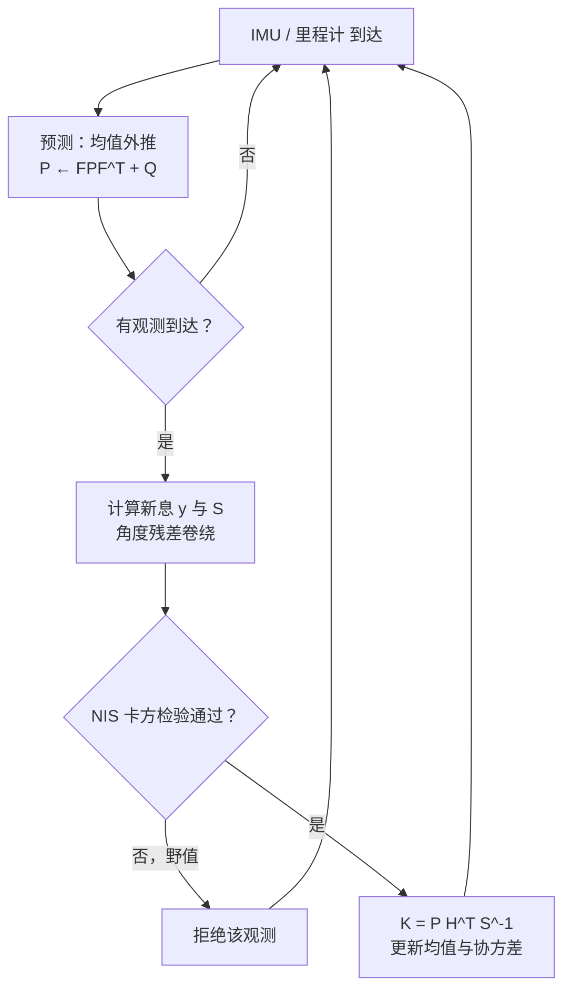

机器人对自身状态的了解全部来自间接证据：编码器会漂移、IMU 会有偏置、相机会丢帧、激光会被玻璃骗。状态估计要回答的问题是：

> 给定一串有噪声的控制输入和一串有噪声的观测，机器人此刻的状态（位置、速度、姿态……）最可能是什么？置信度多大？

卡尔曼滤波（Kalman Filter，KF）是这个问题在"线性系统 + 高斯噪声"假设下的**精确最优解**，也是几乎所有实用估计器（EKF、UKF、ESKF、MSCKF）的骨架。本文从贝叶斯滤波推起，让卡尔曼增益的每一项都有出处，再讲清楚非线性化的 EKF 和真正决定成败的工程细节。

## 1. 贝叶斯滤波：所有滤波器的母体

把机器人状态记为 $\mathbf x_k$，控制输入 $\mathbf u_k$，观测 $\mathbf z_k$。我们要维护的对象是**后验分布**（belief）：

$$
bel(\mathbf x_k) = p\left(\mathbf x_k \mid \mathbf z_{1:k}, \mathbf u_{1:k}\right)
$$

在马尔可夫假设（状态完备：$\mathbf x_k$ 只依赖 $\mathbf x_{k-1}$ 和 $\mathbf u_k$；观测只依赖当前状态）下，belief 有一个两步递推：

**预测**（用运动模型把上一时刻的 belief 推向前）：

$$
\overline{bel}(\mathbf x_k) = \int p\left(\mathbf x_k \mid \mathbf x_{k-1}, \mathbf u_k\right)\, bel(\mathbf x_{k-1})\, \mathrm d \mathbf x_{k-1}
$$

**更新**（用观测似然对预测做贝叶斯修正）：

$$
bel(\mathbf x_k) = \eta\; p\left(\mathbf z_k \mid \mathbf x_k\right)\, \overline{bel}(\mathbf x_k)
$$

这个递推对任意分布成立，但一般情况下积分算不动。粒子滤波用采样近似分布；直方图滤波用网格近似；**卡尔曼滤波的选择是：假设一切都是高斯的、模型都是线性的，此时递推有闭式解，且高斯性永远保持**。

## 2. 卡尔曼滤波：高斯假设下的闭式递推

线性高斯系统：

$$
\begin{aligned}
\mathbf x_k &= \mathbf A \mathbf x_{k-1} + \mathbf B \mathbf u_k + \mathbf w_k, \qquad \mathbf w_k \sim \mathcal N(\mathbf 0, \mathbf Q) \\
\mathbf z_k &= \mathbf H \mathbf x_k + \mathbf v_k, \qquad\qquad\quad\;\; \mathbf v_k \sim \mathcal N(\mathbf 0, \mathbf R)
\end{aligned}
$$

belief 用均值和协方差 $(\hat{\mathbf x}, \mathbf P)$ 完全描述。两步递推变成五个方程。

**预测**（高斯经过线性变换仍是高斯）：

$$
\begin{aligned}
\hat{\mathbf x}_k^- &= \mathbf A \hat{\mathbf x}_{k-1} + \mathbf B \mathbf u_k \\
\mathbf P_k^- &= \mathbf A \mathbf P_{k-1} \mathbf A^\top + \mathbf Q
\end{aligned}
$$

均值按模型外推；协方差经模型传播后**加上** $\mathbf Q$——预测永远让不确定度变大。

**更新**（两个高斯相乘仍是高斯）：

$$
\begin{aligned}
\mathbf K_k &= \mathbf P_k^- \mathbf H^\top \left(\mathbf H \mathbf P_k^- \mathbf H^\top + \mathbf R\right)^{-1} \\
\hat{\mathbf x}_k &= \hat{\mathbf x}_k^- + \mathbf K_k \underbrace{\left(\mathbf z_k - \mathbf H \hat{\mathbf x}_k^-\right)}_{\text{新息 } \mathbf y_k} \\
\mathbf P_k &= \left(\mathbf I - \mathbf K_k \mathbf H\right) \mathbf P_k^-
\end{aligned}
$$

_一个周期：运动模型把后验推前并拉宽（预测），观测似然与预测加权融合，得到更窄的新后验（更新）_

### 卡尔曼增益到底在权衡什么

看一维标量情形，增益退化为

$$
K = \frac{P^-}{P^- + R}
$$

更新后的均值是 $\hat x = \hat x^- + K(z - \hat x^-) = (1-K)\,\hat x^- + K z$——**预测和观测的加权平均，权重是各自精度（方差的倒数）**：

- 观测很准（$R \to 0$）：$K \to 1$，完全信观测；
- 预测很准（$P^- \to 0$）：$K \to 0$，完全信模型;
- 更新后方差 $P = (1-K)P^- = \dfrac{P^- R}{P^- + R} \le \min(P^-, R)$，**融合之后一定比两个来源各自都更确定**。

这就是卡尔曼滤波的全部直觉：它不是什么魔法平滑器，而是**按噪声统计自动调节权重的递推最小二乘**。矩阵形式只是把"方差"换成协方差矩阵、把标量除法换成矩阵求逆。

在线性高斯假设成立时，这个解是精确的贝叶斯后验，同时也是最小均方误差（MMSE）意义下的最优估计——不是近似，是最优。

## 3. EKF：非线性系统的一阶妥协

机器人模型几乎都非线性——差速底盘的运动学有 $\cos\theta, \sin\theta$，观测路标是距离和方位角。系统变成

$$
\mathbf x_k = f(\mathbf x_{k-1}, \mathbf u_k) + \mathbf w_k, \qquad
\mathbf z_k = h(\mathbf x_k) + \mathbf v_k
$$

高斯分布经过非线性函数不再是高斯。EKF 的妥协是：**均值直接过非线性函数，协方差用当前估计点的一阶泰勒展开（雅可比）传播**：

$$
\mathbf F_k = \left.\frac{\partial f}{\partial \mathbf x}\right|_{\hat{\mathbf x}_{k-1}, \mathbf u_k}, \qquad
\mathbf H_k = \left.\frac{\partial h}{\partial \mathbf x}\right|_{\hat{\mathbf x}_k^-}
$$

五个方程里把 $\mathbf A \to \mathbf F_k$、$\mathbf H \to \mathbf H_k$，预测均值用 $f(\cdot)$、新息用 $\mathbf z_k - h(\hat{\mathbf x}_k^-)$，其余不变。

### 例：差速底盘定位

状态 $\mathbf x = [x, y, \theta]^\top$，里程计输入 $[\Delta s, \Delta\theta]$，运动模型

$$
f(\mathbf x, \mathbf u) =
\begin{bmatrix}
x + \Delta s \cos(\theta + \Delta\theta/2) \\
y + \Delta s \sin(\theta + \Delta\theta/2) \\
\theta + \Delta\theta
\end{bmatrix}
\;\Longrightarrow\;
\mathbf F =
\begin{bmatrix}
1 & 0 & -\Delta s \sin(\theta + \Delta\theta/2) \\
0 & 1 & \phantom{-}\Delta s \cos(\theta + \Delta\theta/2) \\
0 & 0 & 1
\end{bmatrix}
$$

$\mathbf F$ 的第三列意义很直白：**朝向不确定度会随着走过的距离放大成位置不确定度**——这就是纯里程计航位推算发散的机制，也是必须融合外部观测（UWB、路标、回环）的原因。

观测一个已知位置 $(m_x, m_y)$ 的路标的距离与方位角：

$$
h(\mathbf x) = \begin{bmatrix} \sqrt{q} \\ \operatorname{atan2}(m_y - y,\; m_x - x) - \theta \end{bmatrix},
\qquad q = (m_x - x)^2 + (m_y - y)^2
$$

对 $\mathbf x$ 求偏导得 $\mathbf H_k$，代入更新方程即可。注意角度残差必须卷绕到 $(-\pi, \pi]$——这是 EKF 实现里排名第一的低级错误来源。

### EKF 什么时候会骗你

线性化误差在两种情况下不可忽视：**非线性在当前不确定度范围内变化剧烈**（比如方位角观测、距离很近的路标），以及**初值差**（线性化点本身就错，雅可比也跟着错，可能发散）。缓解手段按代价递增：

- 缩短周期、提高更新频率，让每步的增量更小；
- 迭代 EKF（IEKF）：更新步内在新估计点重新线性化，迭代几次；
- UKF：不算雅可比，用确定性采样的 sigma 点过非线性函数，精度到二阶，代价是约 $2n+1$ 次函数求值；
- 姿态估计用**误差状态卡尔曼滤波（ESKF）**：名义状态用四元数全量积分，滤波器只估计小的误差状态——误差小意味着线性化好，这是 VIO/组合导航的标准做法。

## 4. 工程上真正难的部分：Q、R 与一致性

滤波器方程五分钟能抄完，**调 $\mathbf Q$ 和 $\mathbf R$ 才是全部工作量所在**。

$\mathbf R$ 相对好办：它是传感器噪声，可以拿静止数据实测统计，或者查数据手册。$\mathbf Q$ 难办：它名义上是"过程噪声"，实际上是模型误差、离散化误差、未建模动态的总口袋。经验规则：

- $\mathbf Q$ 调大：更信观测，响应快、噪声大；$\mathbf Q$ 调小：更信模型，平滑、但模型错时收敛慢甚至**过度自信**（$\mathbf P$ 缩得比真实误差小，增益趋零，滤波器"睡着"，对真实变化不再响应）；
- 过度自信比欠自信危险得多——欠自信只是噪声大，过度自信是发散的前兆。

验证工具是**新息一致性检验**。新息 $\mathbf y_k$ 的理论协方差是 $\mathbf S_k = \mathbf H \mathbf P_k^- \mathbf H^\top + \mathbf R$，归一化新息平方（NIS）

$$
\epsilon_k = \mathbf y_k^\top \mathbf S_k^{-1} \mathbf y_k \sim \chi^2(\dim \mathbf z)
$$

应服从卡方分布。批量回放数据，统计 $\epsilon_k$ 落在 95% 置信区间内的比例：长期偏高说明滤波器过度自信（$\mathbf Q$ 或 $\mathbf R$ 给小了），偏低则相反。NIS 同时兼职**野值门限**：单次 $\epsilon_k$ 超过阈值（如 $\chi^2$ 的 99% 分位）直接拒绝该观测，这是对抗激光玻璃反射、UWB 多径的第一道防线。

数值细节还有两处：协方差更新用 **Joseph 形式** $\mathbf P = (\mathbf I - \mathbf K\mathbf H)\mathbf P^-(\mathbf I - \mathbf K\mathbf H)^\top + \mathbf K\mathbf R\mathbf K^\top$ 保证对称正定；多传感器不同频率时，预测按最快时钟跑，**每种观测到了就做各自的更新**，天然支持异步融合——这正是 KF 结构优雅的地方。

## 5. 小结与选型

| 方法 | 假设 | 代价 | 适用 |
| --- | --- | --- | --- |
| KF | 线性 + 高斯 | 一次矩阵求逆 | 目标跟踪、简单融合 |
| EKF | 弱非线性，一阶展开够用 | 额外算两个雅可比 | 轮式定位、GPS/INS |
| UKF | 中等非线性 | $2n{+}1$ 次函数求值 | 雅可比难求或非线性强 |
| ESKF | 姿态在流形上 | 与 EKF 相当 | IMU 姿态、VIO |
| 粒子滤波 | 任意分布（多峰） | 数百~数千粒子 | 全局定位、绑架恢复 |

三条经验总结：

1. 卡尔曼滤波是**按精度加权的递推平均**，不是平滑器；如果只想要平滑，低通滤波器更便宜也更诚实。
2. 方程是标准的，**功夫全在建模**：状态选取（要不要把 IMU 偏置放进状态里？要）、噪声整定、残差卷绕、野值剔除。
3. 滤波器不会报告"我错了"，它只会给出一个越来越自信的错误答案——**一致性监控（NIS/NEES）必须是系统的一部分**，而不是调试时才看一眼的曲线。

## 参考

- S. Thrun, W. Burgard, D. Fox. *Probabilistic Robotics*. MIT Press.（贝叶斯滤波框架的标准出处）
- Y. Bar-Shalom, X. R. Li, T. Kirubarajan. *Estimation with Applications to Tracking and Navigation*. Wiley.（一致性检验、NIS/NEES）
- J. Solà. *Quaternion kinematics for the error-state Kalman filter*. arXiv:1711.02508.（ESKF 推导）
- R. E. Kalman. *A New Approach to Linear Filtering and Prediction Problems*. 1960.（原始论文）
