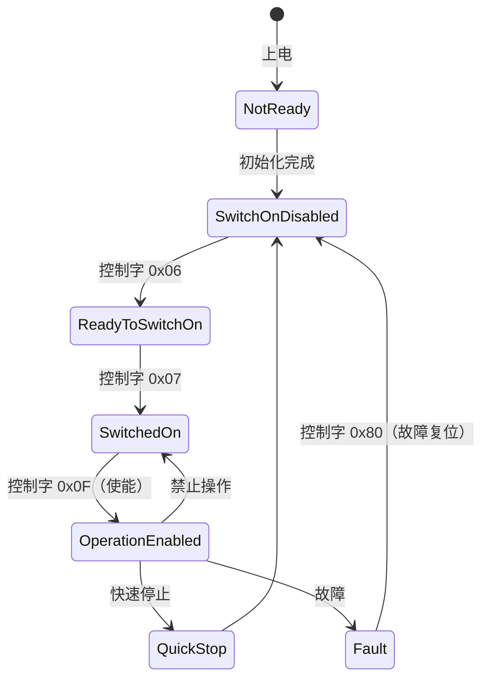
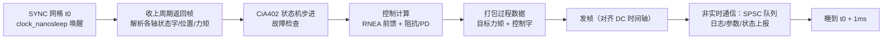

前面几篇讲的[动力学前馈](/posts/机械臂动力学/)、[阻抗控制](/posts/阻抗控制与力控/)都默认了一件事：控制器每 1 ms 准时醒来，读到新鲜的关节状态，算完，把指令按时发到每个关节。这件事本身就是一个工程领域。本文讲它的两大支柱：让 Linux 变得可预期的 PREEMPT_RT，和让几十个关节共享一根网线还保持微秒级同步的 EtherCAT。

## 1. 先把需求写成数字：抖动预算

"1 kHz 实时控制"的真正含义不是"平均每秒执行 1000 次"，而是**每个周期都在截止时间内完成**。把 1000 μs 的周期拆成账本：

| 环节 | 预算 | 说明 |
| --- | --- | --- |
| 定时器唤醒抖动 | < 50 μs | 内核责任，本文第 2 节 |
| EtherCAT 帧收发 | ~100 μs | 100 Mbps 下几百字节过程数据 + 线缆传播 |
| 状态解析 + 控制计算 | 200~400 μs | 逆动力学 RNEA、阻抗律、滤波器 |
| 指令打包 + 发送 | ~50 μs | |
| 安全余量 | ≥ 30% | 给缓存冷、分支预测失败的坏周期 |

要害在于：**所有环节按最坏情况（WCET）计账，不按平均**。平均 5 μs、偶发 800 μs 的唤醒延迟，在吞吐系统里无关痛痒，在控制系统里意味着丢周期——伺服驱动器的看门狗会掉使能，机械臂在半空中抱闸。

普通 Linux 恰恰给不出最坏情况的承诺。问题不在调度策略，在于**内核自身有不可抢占的区间**：自旋锁持有期、中断处理、软中断风暴，任何一个都可能把你的高优先级线程摁住几百微秒。

## 2. PREEMPT_RT：把"不可抢占"逐个拆掉

PREEMPT_RT 补丁集（2024 年已基本全部进入主线，`CONFIG_PREEMPT_RT`）做的事情可以概括成三刀：

1. **自旋锁 → 可抢占的 rtmutex**：普通内核里持自旋锁就关抢占；RT 内核把绝大多数 `spinlock_t` 换成可睡眠、带**优先级继承**的互斥体。低优先级线程持锁挡住高优先级线程时，前者临时继承后者的优先级把临界区尽快跑完——优先级反转（火星探路者号那个著名事故的机制）被系统性地解决；
2. **中断线程化**：硬中断处理函数缩到最小，实际工作交给可调度的内核线程（`irq/N-name`）。于是"网卡中断风暴打断控制环"变成了单纯的优先级问题——把你的控制线程优先级设得比无关中断线程高即可；
3. **高精度定时器与细粒度临界区**：`clock_nanosleep` 的唤醒精度从毫秒级（jiffies）进入微秒级。

这三刀的效果要用数据说话，工具是 `cyclictest`：

```bash
# 在目标机上跑够长时间（几小时起，最好叠加你的真实负载）
cyclictest -m -p 90 -i 1000 -h 1000 -l 100000000 --smi
```


_两条分布的主体几乎重合——差别全在尾部。实时性能的唯一有效指标是长时间压测下的最大值，不是均值_

经验数字：x86 工控机 + PREEMPT_RT + 正确隔离，最坏唤醒延迟可压到 20~50 μs；不打补丁的通用内核，几小时压测总能抓到几百微秒到毫秒级的尾巴。

### 内核之外：把 CPU 圈出来

RT 补丁管住了内核，还要管住"邻居"：

```text
# 内核启动参数：把 2、3 号核从通用调度里摘出来
isolcpus=2,3 nohz_full=2,3 rcu_nocbs=2,3
```

- `isolcpus`：调度器不再往这些核上放普通任务；
- `nohz_full`：核上只有一个可运行任务时停掉周期性时钟中断（每秒几百次的 tick，每次都是几微秒的打扰）;
- `rcu_nocbs`：RCU 回调挪到别的核执行;
- 再把无关中断的亲和性绑走（`/proc/irq/*/smp_affinity`），把 EtherCAT 网卡中断绑到隔离核上。

还有一个藏在 BIOS 里的敌人：**SMI（系统管理中断）**——CPU 直接进 SMM 模式，操作系统完全无感知也无法阻止，一次可达上百微秒。选工控机时用 `cyclictest --smi` 验货，必要时在 BIOS 里关掉 USB legacy、电源管理等 SMI 源头。C-state 深度睡眠同理（唤醒要几十微秒），实时核直接 `idle=poll` 或限制 C1。

### 实时线程的正确写法

内核给了能力，用户态代码还要正确使用。一个 1 kHz 控制线程的骨架，每一行都有对应的坑：

```c
// 1. 锁内存：RT 线程里缺页一次就是一次超时
mlockall(MCL_CURRENT | MCL_FUTURE);

// 2. 实时调度类。90 以下给自己留出比内核 irq 线程调优的空间
struct sched_param sp = { .sched_priority = 80 };
pthread_setschedparam(pthread_self(), SCHED_FIFO, &sp);

// 3. 预热栈，把将来会用到的栈页现在就摸一遍
unsigned char dummy[MAX_STACK]; memset(dummy, 0, sizeof(dummy));

// 4. 绝对时间踩点，杜绝周期漂移
struct timespec next;
clock_gettime(CLOCK_MONOTONIC, &next);
for (;;) {
    next.tv_nsec += 1000000;            // +1 ms
    tsnorm(&next);                       // 进位
    clock_nanosleep(CLOCK_MONOTONIC, TIMER_ABSTIME, &next, NULL);
    do_control_cycle();                  // 这里面：不 malloc、不 printf、
}                                        // 不碰磁盘、不拿非 PI 锁
```

第 4 点最容易被忽视：用相对睡眠（`usleep(1000)`）时，计算耗时会累加进周期——周期变成"1 ms + 计算时间"，慢慢漂移；`TIMER_ABSTIME` 按绝对时间网格踩点，计算慢了下个周期自动追回。循环体内的纪律同样是硬规矩：`malloc` 可能拿全局锁、`printf` 可能阻塞在终端、缺页会掉进文件系统——任何一个都能贡献一次毫秒级尾巴。和非实时部分的通信用无锁结构（见 [SPSC 队列](/posts/无锁SPSC队列/)），日志先进环形缓冲、由低优先级线程慢慢刷盘。

## 3. EtherCAT：一根网线上的微秒级总线

控制器准时醒了，还要在预算内和 N 个关节交换数据。普通以太网 + 交换机不行：交换机存储转发、队列不定长，延迟无上界。EtherCAT 保留了以太网物理层，把数据链路层改成了完全确定性的机制。

### 3.1 On-the-fly：一帧扫过全线

EtherCAT 的从站不"接收再转发"，而是**报文流过时就地读写**：主站发出一帧，帧沿菊花链依次穿过每个从站，每个从站的硬件（ESC 芯片）在帧经过的几纳秒里，把属于自己的输出数据抓走、把自己的输入数据塞进去，帧尾从最后一个从站折返。一个周期一帧（或少数几帧），几十个轴的过程数据全部搞定：

- 没有交换机、没有队列、没有碰撞——延迟只由线长和从站数决定，**可以拿尺子算**；
- 带宽利用率极高：一帧 payload 对所有从站复用，1 kHz 下挂 60 个轴毫无压力；
- 主站侧只需要一张**普通网卡**，确定性由从站芯片和拓扑保证。

逻辑寻址由 FMMU（现场总线内存管理单元）完成：主站把全线过程数据映射成一段连续的逻辑地址空间，控制程序读写一块本地缓冲，硬件负责散播和收集——这就是"过程数据镜像"。

### 3.2 分布式时钟：所有轴在同一微秒动作

多轴插补要求所有驱动器**在同一时刻**锁存指令、采样反馈，否则轮廓精度直接受损。EtherCAT 的分布式时钟（DC）机制分三步：

1. **传播延迟测量**：主站发广播帧，每个从站记录帧经过的本地时刻，主站据此算出到每个从站的线缆传播延迟（纳秒级）；
2. **偏移与漂移补偿**：选第一个支持 DC 的从站做参考时钟，其余从站连续地向它对齐——静态偏移一次补掉，晶振漂移靠周期性的时间戳帧持续伺服；
3. **SYNC 事件**：每个从站的 ESC 按对齐后的系统时间产生本地 SYNC0 脉冲，驱动器在 SYNC0 上锁存指令/采样编码器。

全线同步精度典型 **< 1 μs**——注意这是从站之间的硬件同步精度，与主站抖动无关；主站只要保证每周期把新数据**在 SYNC0 之前**送到即可。这就形成了一个漂亮的解耦：主站的几十微秒级抖动被从站的硬件同步兜底，前提是主站的发帧时刻要向 DC 时间轴对齐（IgH 主站的 `ecrt_master_application_time()` 一族接口就是干这个的）。

从站的同步模式对应三档：FreeRun（各跑各的）、SM-Synchronous（收到过程数据就动作，跟随主站抖动）、DC-Synchronous（按 SYNC0 动作，主站抖动被吸收）。多轴插补一律用 DC。

### 3.3 CiA402：驱动器说的那门方言

过程数据到了驱动器，语义由 CiA402 协议（CANopen 驱动协议在 EtherCAT 上的映射，即 CoE）规定。两块内容每个调过驱动器的人都背得出：

**状态机**。上使能不是写一个位，是走完一个状态机：



控制字（0x6040）驱动状态迁移，状态字（0x6041）回报当前状态；主站的周期任务里要跑一个小状态机，按位模式匹配状态字、给出下一个控制字。**故障处理要写成状态机的一部分**而不是特殊路径——现场的驱动器什么姿势都能给你摆出来。

**运行模式**（0x6060）。周期同步模式是主流：CSP（周期同步位置）、CSV（速度）、CST（力矩）。选型直接决定控制架构：

- **CSP**：位置环在驱动器里跑（几 kHz），主站每毫秒发目标位置。稳、省主站算力，但力控/阻抗要靠驱动器暴露的接口，灵活性差；
- **CST**：主站直接发力矩指令，位置/速度/阻抗环全部在主站——[计算力矩、笛卡尔阻抗](/posts/阻抗控制与力控/)这类全模型控制律只能走这条路。代价是主站抖动直接进力矩通道，对第 2 节的要求最苛刻。

还有一个容易踩的细节：EtherCAT 周期（1 kHz）和驱动器内环（如 8 kHz）之间有频率差，驱动器会对指令做插值（CSP 下的线性外推）。主站丢一个周期，驱动器外推出去的位置可能瞬间跳变——所以**丢周期的容忍度要在驱动器的看门狗和插值参数里显式配置**，不能假装不会发生。

### 3.4 主站栈选型

- **IgH EtherCAT Master**：内核态，和 PREEMPT_RT 配合成熟，提供专用网卡驱动旁路内核网络栈，机器人控制器的主流选择；
- **SOEM**：用户态库，轻量、好移植、上手快，适合工具链和中小系统；确定性依赖 raw socket 和你自己的实时线程纪律。

两者都要求网卡关中断合并（interrupt coalescing）——这个为吞吐设计的特性会给收包路径加几十到几百微秒的批处理延迟，正是实时系统的反面教材。

## 4. 把两半拼起来

一个典型的 1 kHz 力矩透传控制器，每周期的时间线：



验收标准也要写成数字：连续 72 小时压测（叠加真实负载 + 网络流量 + 磁盘 IO），cyclictest 最大值 < 50 μs，控制环无一次超周期，EtherCAT 工作计数器（WKC）无一次异常。**没有跑过长时间压测的实时系统，只是暂时还没暴露的非实时系统。**

## 5. 小结

1. 实时 = **最坏情况有上界**，一切指标看长时间压测的最大值；均值和百分位在这里没有意义。
2. PREEMPT_RT 解决内核的不可抢占区间（自旋锁改 rtmutex + 优先级继承、中断线程化）；CPU 隔离解决邻居干扰；BIOS/SMI/C-state 解决固件干扰——三层缺一不可。
3. 实时线程四件套：`mlockall`、`SCHED_FIFO`、栈预热、`TIMER_ABSTIME` 绝对时间踩点；循环体内不碰任何可能阻塞的东西。
4. EtherCAT 的确定性来自 on-the-fly 读写（无排队）+ DC 硬件同步（主站抖动被从站兜底）；CiA402 状态机和插值参数是每个现场问题的第一排查点。
5. CSP 和 CST 的选择就是"控制律放驱动器还是放主站"的选择，也决定了你对第 2 节要求的苛刻程度。

## 参考

- J. Ogness. *A Realtime Developer's Checklist*. Linux Plumbers Conference.（RT 用户态编程规范）
- Linux Foundation RT Wiki: *HOWTO build a simple RT application* 及 cyclictest 文档。
- EtherCAT Technology Group. *EtherCAT — The Ethernet Fieldbus* 技术白皮书；*Distributed Clocks* 应用说明。
- CiA 402 / IEC 61800-7-201: *Drives and motion control device profile*。
- IgH EtherCAT Master 文档（etherlab.org）；SOEM（github.com/OpenEtherCATsociety/SOEM）。
