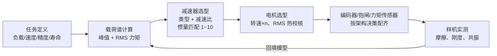

软件文章写了一路——[动力学](/posts/机械臂动力学/)、[力控](/posts/阻抗控制与力控/)、[标定](/posts/机械臂标定/)——每一篇的结尾都指向同一个事实：**算法的上限是硬件给的**。摩擦决定力控透明度，减速器柔性决定控制带宽，编码器安装位置决定你测到的是哪个角度。这篇把机械臂关节拆开，讲每个部件的选型逻辑和它们如何反过来约束控制。

一个现代关节模组从外到内：无框力矩电机、减速器、双编码器、失电抱闸、（可选）关节力矩传感器、驱动板。逐个来。

## 1. 根本矛盾：力矩密度 vs 反驱性

电机的力矩与体积粗略地按 $T \propto D^2 L$（气隙面积 × 力臂）增长，直接驱动一个需要 100 N·m 的肘关节要一颗又大又重的电机——所以要减速器，减速比 $n$ 把力矩放大 $n$ 倍。但代价在[动力学那篇](/posts/机械臂动力学/)已经算过：

$$
J_{reflected} = n^2 J_{motor}, \qquad \tau_{friction}^{output} \approx n\,\tau_{friction}^{motor} + \tau_{gear}
$$

**折算惯量按 $n^2$ 放大，摩擦按 $n$ 放大**。$n = 100$ 时电机转子那点惯量在输出端变成庞然大物，外力想推动关节（反驱）要先克服被放大百倍的摩擦——高减速比关节从输出端看几乎是"锁死"的。这就是力矩密度与反驱性（力控透明度）的根本矛盾，整个关节设计都在这对矛盾里选位置：

- **工业臂**（位置控制为主）：选高减速比（$n = 80\sim160$），要刚度和力矩密度，反驱性不要了，力控靠末端 F/T 传感器外环；
- **协作臂**：高减速比 + **关节力矩传感器**——反驱性物理上没有，用传感器闭环"算出来"一个软关节（Franka、iiwa 路线）；
- **足式/灵巧手**（接触频繁、需要透明度）：**准直驱**（QDD，$n = 6\sim10$ 行星）——牺牲力矩密度换取低摩擦低惯量，电流环直接当力矩源用，不要力矩传感器。

## 2. 减速器三选一

| | 谐波（Harmonic） | RV / 摆线 | 行星（含 QDD） |
| --- | --- | --- | --- |
| 典型减速比 | 50~160（单级） | 60~200 | 3~10/级 |
| 齿隙 | 近零（柔轮预紧） | 极小（<1 arcmin） | 有（数 arcmin，需消隙） |
| 扭转刚度 | **低**（柔轮是弹簧） | 高 | 中 |
| 效率 | 60~85%（随载荷/温度变化大） | 80~90% | 90~97% |
| 抗冲击 | 弱（柔轮怕过载） | 强 | 中 |
| 典型位置 | 协作臂全部关节、工业臂腕部 | 工业臂 1~3 大关节 | 足式、灵巧手、直驱云台 |

**谐波减速器**靠柔轮的弹性变形传动，天然无齿隙、同轴紧凑，是协作臂的标配。但"柔轮是弹簧"这句话要读成控制问题：

_目录参数风格的力矩-变形特性：三段刚化弹簧（厂商给 K1/K2/K3 三段刚度）叠加摩擦迟滞。零力矩附近的迟滞宽度就是换向时的角度盲区（lost motion）_

这条曲线给控制立了三条规矩：

1. **扭转共振限带宽**：关节刚度 $k$ 与负载惯量 $J_l$ 构成共振 $f_r = \frac{1}{2\pi}\sqrt{k/J_l}$，谐波关节典型几十 Hz。位置环带宽必须压在共振以下（或加陷波器），这就是"谐波关节的控制带宽天花板"的物理来源；
2. **迟滞吃掉换向精度**：图中零力矩迟滞 ≈ 0.75 mrad，负载换向时输出端有这么大的角度盲区，电机侧编码器完全看不见——精密轨迹在换向点的"平顶"痕迹就是它；
3. **刚度随载荷变**：三段刚化意味着轻载时刚度只有重载的三分之一，共振频率跟着漂，固定参数的陷波器在变载荷下会失配。

**RV/摆线**用于大臂关节：两级结构（渐开线 + 摆线针轮）、刚度高、抗冲击好，缺点是重、贵、有传动比波动（cyclic error，会以固定空间频率出现在轨迹上，精密应用要做谐波补偿）。**行星**效率最高、可反驱，QDD 用低减速比行星 + 大直径外转子电机，把"电流即力矩"的假设做实——但力矩密度低，同样力矩下关节更重更大。

## 3. 编码器：装在哪一侧，测的就是哪个世界

减速器有柔性和迟滞，于是"电机转了多少"和"关节输出转了多少"是**两个不同的角度**。编码器装哪侧是个架构决策：

- **电机侧**（高速轴）：必需品——FOC [换向](/posts/FOC-原理解析/)要电角度，速度环要高分辨率转速。经过减速比放大，输出端等效分辨率极高（17 位编码器 ÷ 100 减速比 → 输出端 24 位等效）。但它测不到减速器之后的变形、迟滞、齿隙；
- **输出侧**（低速轴）：测的才是真实关节角。分辨率要求高（直接就是关节精度），常用大直径中空磁编/感应式编码器。

**双编码器**（电机侧 + 输出侧）是协作臂的主流配置，好处远超"精度高一点"：

$$
\hat\tau_{joint} = k\left(\theta_{motor}/n - \theta_{output}\right)
$$

两个编码器的差就是减速器的扭转变形，乘刚度即关节力矩——**把谐波的柔性从缺陷变成了免费的力矩传感器**（串联弹性执行器 SEA 的思路）。精度受迟滞和刚度非线性限制（所以高端协作臂仍配应变片式力矩传感器），但做碰撞检测、拖动示教绰绰有余。此外输出侧编码器让上电无需回零（多圈绝对式），且能诊断减速器磨损（变形-力矩曲线随寿命漂移）。

绝对式还是增量式、单圈还是多圈：关节场景基本收敛到**多圈绝对磁编**（免回零、断电记圈，电池或韦根自发电记圈），增量式只在成本极敏感的场合残留。

## 4. 抱闸与力矩传感器：两个"要不要加"的决策

**抱闸**：重力轴（2、3 轴几乎必然）断电后会砸下来，失电抱闸（断电抱死、通电释放）是安全件不是可选件。选型看两个数：静态保持力矩要覆盖最大重力力矩 × 安全系数（≥1.5~2，考虑负载和末端加装）；**动态制动能量**——运动中急停时抱闸要吞掉动能，制动器的摩擦片按允许的单次/累计制动能量选，这个参数比保持力矩更容易被漏算。控制细节：抱闸释放/闭合有 30~100 ms 的机电延迟，使能时序要"先建立力矩再松闸"，否则重力轴上电瞬间会下坠一小段——用户看到的"点头"就是时序错了。

**关节力矩传感器**：应变片贴在输出法兰的弹性体上。加它的收益在[力控那篇](/posts/阻抗控制与力控/)讲透了（力矩闭环把摩擦"控掉"，透明度不再依赖机械反驱性）；成本除了钱还有**串联刚度下降**——弹性体本身又是一级弹簧，共振频率进一步下探。iiwa/Franka 选了加，UR 选了不加（用电流估计 + 好的摩擦模型），两条路线都成立，取决于目标市场对力控精度的要求。

## 5. 选型算账：一个肘关节的完整流程

以负载 5 kg、臂展 0.8 m 的协作臂肘关节为例，把流程走一遍：

1. **载荷谱**：最坏位形（手臂水平伸直）的静态重力力矩 + 期望加速度下的动态力矩。设算得峰值 60 N·m、以典型工作循环加权的 RMS 力矩 25 N·m；
2. **减速器**：谐波按"额定力矩 ≥ RMS、瞬时允许峰值 ≥ 冲击峰值"选型号（注意谐波目录里额定/启停峰值/瞬时峰值是三个不同的数，用错一档寿命大打折扣）；减速比在电机能力约束下取——$n$ 越大电机越小，但折算惯量和摩擦越大：这里的经典准则是**惯量匹配** $J_{load}/(n^2 J_m) \in [1, 10]$，比值太大则加减速时电机"拖不动"负载惯量，太小则电机惯量白白浪费力矩；
3. **电机**：需求转速 = 关节最大角速度 × $n$（肘关节 180°/s、$n=100$ → 电机 3000 rpm 量级）；连续力矩 = RMS / ($n\eta$) 再留热余量。**热约束用 RMS 不用峰值**——电机烧不烧看 $I^2R$ 的时间积分；
4. **编码器**：输出侧分辨率直接除进重复精度预算（0.02 mm @ 0.8 m → 25 μrad，19 位以上）；电机侧看速度环噪声需求；
5. **验证回路**：装好后实测摩擦-速度曲线、扭转刚度曲线，回填[动力学辨识](/posts/机械臂动力学/)模型——选型数据和实物总有出入，控制参数以实测为准。

## 6. 小结

1. 关节设计的主轴是**力矩密度 vs 反驱性**：工业臂选密度、QDD 选透明度、协作臂用力矩传感器在中间造了第三条路。
2. 减速器选型先定类型再定比：谐波（紧凑无隙但柔）、RV（刚硬抗冲但重）、行星（高效可反驱但有隙）；减速比受惯量匹配 1~10 的约束。
3. 谐波的柔性是控制问题：共振限带宽、迟滞吃换向精度、刚度随载漂移——[力控](/posts/阻抗控制与力控/)与轨迹精度的很多"软件问题"根子在这条迟滞回线上。
4. 双编码器不只是精度冗余：编码器差 × 刚度 = 免费力矩估计，顺带免回零和减速器健康监测。
5. 算账三个容易漏的点：谐波目录的三档力矩额定、抱闸的动态制动能量、电机热校核用 RMS。

## 参考

- Harmonic Drive 产品目录：刚度三段模型、迟滞与力矩额定定义（工程数据章节）。
- Nabtesco RV 减速器技术资料：传动原理与 cyclic error。
- P. M. Wensing, A. Wang, S. Seok, et al. *Proprioceptive Actuator Design in the MIT Cheetah*. IEEE T-RO, 2017.（QDD 设计哲学的出处）
- G. A. Pratt, M. M. Williamson. *Series Elastic Actuators*. IROS 1995.
- A. Albu-Schäffer et al. *The DLR Lightweight Robot: Design and Control Concepts*. Industrial Robot, 2007.（双编码器 + 力矩传感器架构）
