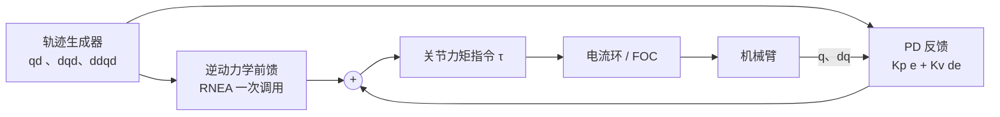

[运动学](/posts/机械臂运动学/)回答"关节角和末端位姿怎么换算"，但它对"要多大力矩才能跟上这条轨迹"一无所知。重力前馈、力矩控制、碰撞检测、仿真、[阻抗控制](/posts/阻抗控制与力控/)的内环——全都要回答同一个问题：

> 给定关节位置、速度、加速度，各关节需要输出多大力矩？（逆动力学）
> 反过来，给定力矩，机械臂会怎么动？（正动力学）

本文先用一个能完整算清楚的例子推导动力学方程的结构，再讲清楚两件教材常常一笔带过、但工程上真正要做的事：牛顿-欧拉递推的组织方式，和动力学参数辨识的完整流程。

## 1. 方程的结构：为什么总是 M、C、G 三项

拉格朗日方法从能量出发。定义拉格朗日量 $\mathcal L = T - V$（动能减势能），对每个广义坐标 $q_i$ 应用欧拉-拉格朗日方程：

$$
\frac{\mathrm d}{\mathrm d t}\frac{\partial \mathcal L}{\partial \dot q_i} - \frac{\partial \mathcal L}{\partial q_i} = \tau_i
$$

机械臂的动能总能写成广义速度的二次型 $T = \tfrac12 \dot{\mathbf q}^\top \mathbf M(\mathbf q)\, \dot{\mathbf q}$（$\mathbf M$ 是位形相关的惯量矩阵），势能 $V(\mathbf q)$ 只依赖位置。代入展开后，方程必然长成

$$
\mathbf M(\mathbf q)\,\ddot{\mathbf q} + \mathbf C(\mathbf q, \dot{\mathbf q})\,\dot{\mathbf q} + \mathbf G(\mathbf q) = \boldsymbol\tau
$$

三项分别来自 $\ddot q$ 的系数（惯性）、$\dot q$ 的二次项（科氏力与离心力，源于 $\mathbf M$ 随位形变化）、以及 $\partial V / \partial \mathbf q$（重力）。**这个结构不是建模选择，是拉格朗日方程对"刚体 + 理想关节"系统的必然输出。**

### 一个算得动的例子：平面 2R 臂

杆长 $L_1, L_2$，质量简化为集中在杆末端的点质量 $m_1, m_2$（真实连杆用质心加惯量张量，推导同理只是更长）。写出两个质点的位置、求速度、代入 $T$ 和 $V$，摇完欧拉-拉格朗日方程的曲柄后得到：

$$
\mathbf M(\mathbf q) =
\begin{bmatrix}
(m_1{+}m_2)L_1^2 + m_2 L_2^2 + 2 m_2 L_1 L_2 \cos q_2 & m_2 L_2^2 + m_2 L_1 L_2 \cos q_2 \\
m_2 L_2^2 + m_2 L_1 L_2 \cos q_2 & m_2 L_2^2
\end{bmatrix}
$$

$$
\mathbf C(\mathbf q, \dot{\mathbf q})\,\dot{\mathbf q} =
\begin{bmatrix}
-m_2 L_1 L_2 \sin q_2\, \left(2\dot q_1 \dot q_2 + \dot q_2^2\right) \\
m_2 L_1 L_2 \sin q_2\, \dot q_1^2
\end{bmatrix},
\qquad
\mathbf G(\mathbf q) =
\begin{bmatrix}
(m_1{+}m_2) g L_1 \cos q_1 + m_2 g L_2 \cos(q_1{+}q_2) \\
m_2 g L_2 \cos(q_1{+}q_2)
\end{bmatrix}
$$

几处值得停下来看的细节：

- $\mathbf M$ 里的 $\cos q_2$ 项说明**惯量随位形变化**：手臂伸直（$q_2 = 0$）时关节 1 感受到的惯量最大，蜷起来最小——挥网球拍的直觉；
- $\mathbf C$ 的第一行有 $\dot q_1 \dot q_2$ 交叉项（科氏力）和 $\dot q_2^2$ 项（离心力），它们**不做功但换向**，低速时小到可以忽略，高速甩动时是主要扰动；
- 非对角项 $M_{12} \ne 0$ 说明关节间**惯性耦合**：猛加速关节 2，关节 1 会被带着动。

把一条正弦轨迹代进去，三项的相对大小一目了然：

_中速轨迹下重力项通常是大头且始终存在，惯性项随加速度起伏，科氏/离心项在这个速度下几乎可以忽略——这就是"重力补偿是力矩控制第一步"的原因_

### 三个结构性质

后面的控制与辨识全靠这三条性质，值得单独列出：

1. $\mathbf M(\mathbf q)$ **对称正定**——动能恒正的直接推论，正动力学里 $\mathbf M^{-1}$ 才存在；
2. 取 Christoffel 符号约定的 $\mathbf C$ 时，$\dot{\mathbf M} - 2\mathbf C$ **反对称**——这是能量守恒的微分形式，基于无源性（passivity）的控制器（PD + 重力补偿的全局稳定性证明）就建在这条性质上；
3. **对惯性参数线性**：把每个连杆的 10 个惯性参数（质量 1、一阶矩 3、惯量张量 6）堆成 $\boldsymbol\theta$，则

$$
\boldsymbol\tau = \mathbf Y(\mathbf q, \dot{\mathbf q}, \ddot{\mathbf q})\, \boldsymbol\theta
$$

方程对 $\mathbf q$ 高度非线性，**对参数却是线性的**——第 4 节的辨识全靠这一条。

## 2. 牛顿-欧拉递推：工程实现选它

拉格朗日方法结构清晰，但符号推导的表达式规模随自由度爆炸，6 轴臂手推不现实。数值计算用**递推牛顿-欧拉算法**（RNEA），它对每个连杆直接用牛顿第二定律和欧拉方程，靠递推组织计算，复杂度 $O(n)$：

**外推（基座 → 末端）**：沿运动链传播运动学量。第 $i$ 个连杆的角速度、角加速度和质心加速度由第 $i-1$ 个连杆的量加上关节贡献得到：

$$
\begin{aligned}
{}^{i}\boldsymbol\omega_i &= {}^{i}\mathbf R_{i-1}\,{}^{i-1}\boldsymbol\omega_{i-1} + \dot q_i\, \hat{\mathbf z}_i \\
{}^{i}\dot{\boldsymbol\omega}_i &= {}^{i}\mathbf R_{i-1}\,{}^{i-1}\dot{\boldsymbol\omega}_{i-1} + {}^{i}\mathbf R_{i-1}\,{}^{i-1}\boldsymbol\omega_{i-1} \times \dot q_i \hat{\mathbf z}_i + \ddot q_i \hat{\mathbf z}_i
\end{aligned}
$$

线加速度同理传播（含向心项 $\boldsymbol\omega \times (\boldsymbol\omega \times \mathbf r)$）。**重力的处理是个经典技巧**：不单独算重力项，而是让基座以 $-\mathbf g$ "加速上升"——给 $\dot{\mathbf v}_0 = -\mathbf g$ 初值，重力就自动流进所有方程。

**内推（末端 → 基座）**：沿反方向传播力。第 $i$ 个连杆的牛顿/欧拉方程给出其质心处的净力和净力矩，加上第 $i+1$ 个连杆传回来的约束力，得到关节 $i$ 处的六维力，向 $\hat{\mathbf z}_i$ 投影即关节力矩：

$$
\tau_i = {}^{i}\mathbf n_i^\top \hat{\mathbf z}_i \;(+\; \text{摩擦、转子惯量项})
$$

末端若有接触力（装配、打磨），作为边界条件从末端喂进内推——这也是用动力学模型做**无传感器碰撞检测**（比较模型力矩与电流反推力矩的残差）的入口。

正动力学（仿真用）不需要显式求 $\mathbf M^{-1}$：Featherstone 的 ABA 算法（铰接体算法）同样 $O(n)$，Pinocchio、MuJoCo、Drake 的内核都是这一族算法。工程结论很简单：**推导和证明用拉格朗日，代码用递推算法，且不要自己写**——Pinocchio 的 `rnea()`/`crba()`/`aba()` 每个都被无数机器人验证过。

## 3. 有了模型能干什么：从重力补偿到计算力矩

按对模型依赖程度从浅到深：

**重力补偿**：$\boldsymbol\tau = \mathbf G(\mathbf q) + \text{PD}(\mathbf e)$。只用模型里最容易标定准的一项，就能让 PD 增益不必扛着重力开到很硬。示教模式（拖动示教）本质就是纯重力补偿加摩擦补偿。基于性质 2 可以证明它全局渐近稳定——这是"模型不准也不至于出事"的那一档。

**计算力矩（computed torque / 逆动力学控制）**：

$$
\boldsymbol\tau = \mathbf M(\mathbf q)\left(\ddot{\mathbf q}_d + \mathbf K_v \dot{\mathbf e} + \mathbf K_p \mathbf e\right) + \mathbf C(\mathbf q, \dot{\mathbf q})\,\dot{\mathbf q} + \mathbf G(\mathbf q)
$$

代回动力学方程，若模型精确，闭环变成解耦的线性误差方程 $\ddot{\mathbf e} + \mathbf K_v \dot{\mathbf e} + \mathbf K_p \mathbf e = \mathbf 0$——**精确反馈线性化**，每个关节都变成独立的二阶系统，极点随便配。代价是它把模型误差全额暴露给闭环：$\mathbf M$ 估计偏差直接乘在加速度上。实践中更常见的折中是**前馈形式**：沿参考轨迹算 $\boldsymbol\tau_{ff} = \mathbf M(\mathbf q_d)\ddot{\mathbf q}_d + \mathbf C(\mathbf q_d, \dot{\mathbf q}_d)\dot{\mathbf q}_d + \mathbf G(\mathbf q_d)$，叠加一个不太硬的反馈 PD——前馈扛大头，反馈只擦模型误差的屁股，对噪声也友好（不需要实测加速度）。

最后一环连到 [FOC](/posts/FOC-原理解析/)：力矩指令除以力矩常数就是 $i_q$ 给定，动力学前馈的输出直接喂电流环。

## 4. 参数辨识：模型里的数从哪来

CAD 给的惯性参数对不上实物（线缆、电机转子、装配公差），数据手册不会告诉你摩擦。参数辨识是把第 1 节的性质 3 变成一套可执行流程。

### 4.1 完整的参数集：刚体之外还有两样

实际关节力矩里除了刚体项还有两个不可忽略的东西：

$$
\boldsymbol\tau = \mathbf Y_{rb}(\mathbf q, \dot{\mathbf q}, \ddot{\mathbf q})\,\boldsymbol\theta_{rb}
+ \underbrace{n^2 J_m \ddot{\mathbf q}}_{\text{折算转子惯量}}
+ \underbrace{\mathbf F_v \dot{\mathbf q} + \mathbf F_c \operatorname{sgn}(\dot{\mathbf q})}_{\text{粘性 + 库仑摩擦}}
$$

- **折算转子惯量**：电机转子惯量经减速比 $n$ 折算后乘 $n^2$。谐波减速器 $n = 100$ 时 $n^2 = 10^4$，折算惯量常常**超过连杆本身**——这就是高减速比机械臂难以反驱、力控透明度差的定量原因；
- **摩擦**：谐波减速关节的摩擦可占额定力矩的 20~30%。库仑 + 粘性是最低配置，低速正反换向有明显迟滞的关节要加 Stribeck 项 $(F_s - F_c)e^{-|\dot q/\dot q_s|^\delta}$。

好消息：这两项对各自的参数依然是线性的，可以并入回归矩阵一起辨识。

### 4.2 基参数：满秩之前先降维

逐连杆 10 个参数堆出来的 $\mathbf Y$ **必然列不满秩**：有些参数不影响动力学（如第一个关节绕自身轴的某些惯量分量），有些只以线性组合出现（远端质量和近端一阶矩纠缠在一起）。直接最小二乘会得到病态解。

标准做法是求**基参数集**（base parameters）：对大量随机位形堆叠的回归矩阵做带列主元的 QR 分解，秩亏损的列告诉你哪些参数要合并、哪些直接删掉。6 轴臂 60 个刚体参数通常缩到 40 个上下的基参数。这一步做完，辨识问题才是良定的。

### 4.3 激励轨迹：辨识质量在采数据之前就决定了

辨识精度由回归矩阵的**条件数**决定——轨迹没把某个参数方向激励起来，那个方向的估计就淹没在噪声里。工程标准做法是**有限项傅里叶级数轨迹**：

$$
q_i(t) = q_{i0} + \sum_{k=1}^{N} \left(a_{ik} \sin(k\omega_f t) + b_{ik}\cos(k\omega_f t)\right)
$$

以 $\operatorname{cond}(\mathbf Y)$ 为目标、以关节限位/速度/加速度和自碰撞为约束，对系数 $a_{ik}, b_{ik}$ 做非线性优化。周期轨迹的额外好处：跑十个周期做**同步平均**，噪声按 $1/\sqrt{N}$ 缩。

数据处理的细节决定成败：

- $\dot q, \ddot q$ 不要用实时差分——离线用零相位滤波（`filtfilt`）后再中心差分，避免相位滞后污染回归矩阵；
- 力矩用电流乘力矩常数时，$K_T$ 本身的误差直接乘进所有参数，有条件先单独标定；
- 最小二乘换成**加权**（各关节噪声方差不同）并检查残差：残差里若有和位置相关的周期结构，说明模型缺项（典型是关节柔性或齿隙），而不是噪声。

### 4.4 验证：别用训练轨迹考自己

拿一条**没参与辨识**的验证轨迹，比较模型预测力矩与实测力矩的相对均方根误差；6 轴工业臂做到 5~10% 是正常水平。另一个便宜的健全性检查：辨识出的质量必须为正、惯量张量必须物理一致（正定 + 三角不等式）——加物理一致性约束的辨识（LMI 约束的半定规划）比裸最小二乘多花的功夫，会在模型外推时全部赚回来。

## 5. 小结

| 需求 | 用什么 | 关键点 |
| --- | --- | --- |
| 理解结构、证明稳定性 | 拉格朗日 + 三个结构性质 | $\dot{\mathbf M} - 2\mathbf C$ 反对称是无源性控制的根基 |
| 实时逆动力学 | RNEA（$O(n)$，用 Pinocchio） | 重力用基座加速度技巧处理，末端接触力从边界条件进 |
| 仿真 | ABA | 不要显式求 $\mathbf M^{-1}$ |
| 控制 | 重力补偿 → 前馈 + PD → 计算力矩 | 模型越准才配用越依赖模型的控制律 |
| 模型从哪来 | 基参数 + 傅里叶激励轨迹辨识 | 摩擦和折算转子惯量必须进模型；条件数在采数据前优化 |

动力学是"模型换性能"的杠杆：重力补偿几乎白送，前馈把跟踪误差再压一个量级，计算力矩把极点直接交到你手上——但每上一档，模型误差的账单也翻一倍。辨识流程做得多扎实，控制律就敢用得多激进。

## 参考

- R. Featherstone. *Rigid Body Dynamics Algorithms*. Springer.（RNEA/ABA 的标准出处）
- J. J. Craig. *Introduction to Robotics: Mechanics and Control*. Pearson. 第 6 章。
- W. Khalil, E. Dombre. *Modeling, Identification and Control of Robots*. Butterworth-Heinemann.（基参数与辨识流程最完整的一本）
- J. Swevers, W. Verdonck, J. De Schutter. *Dynamic Model Identification for Industrial Robots*. IEEE Control Systems Magazine, 2007.（傅里叶激励轨迹）
- J. Carpentier et al. *The Pinocchio C++ library*. SII 2019.
