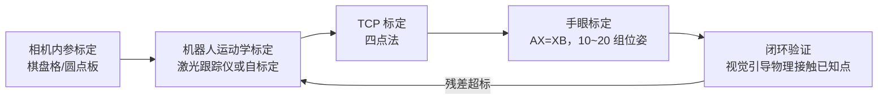

工业机械臂的数据手册上有一个常被误读的数字：重复定位精度 ±0.02~0.05 mm。它的意思是**回到同一个示教点**的散布很小；而**第一次走到一个用坐标算出来的点**能差多少——绝对定位精度——手册上通常不写，实测普遍在 1~3 mm。差了二十倍不止。

只要工作流是"示教-再现"，绝对精度无所谓。但下面这些场景全靠绝对精度：离线编程（CAD 里算好的轨迹直接下发）、视觉引导抓取（相机给出的目标位姿要换算到基座系）、双臂/多机协同（两台臂共享一个世界坐标系）。标定就是把绝对精度从毫米级拉回亚毫米级的那套流程。本文先讲机器人本体的运动学标定，再讲把相机接进来的手眼标定。

## 1. 误差从哪来：几何占大头

把 TCP 定位误差按来源拆开：

- **几何误差（约 80~90%）**：连杆长度制造公差、相邻关节轴线的平行度/垂直度装配偏差、关节零位偏置。它们体现为 [DH 参数](/posts/机械臂运动学/)的真实值偏离名义值——每个关节 4 个参数，6 轴臂几十个参数，每个差零点几毫米、零点几度，经运动链放大到末端就是毫米级；
- **非几何误差（约 10~20%）**：关节与连杆在重力/负载下的弹性变形（谐波减速器的[柔性](/posts/机械臂关节硬件/)是主力）、齿隙、热漂移（电机发热让结构伸长，开机后前两小时 TCP 能漂零点几毫米）、编码器安装偏心。

这个比例结构决定了标定策略：**先做几何标定拿走大头，剩下的地板由非几何误差决定**——要继续压就得上关节刚度模型、温度模型，边际成本陡增。

## 2. 运动学标定四步：建模、测量、辨识、补偿

### 2.1 建模：误差模型的三个必要性质

写出 TCP 位姿对参数偏差的一阶模型：

$$
\Delta \mathbf x = \mathbf J_\phi(\mathbf q)\, \Delta\boldsymbol\phi
$$

$\Delta\boldsymbol\phi$ 是全部待辨识参数偏差，$\mathbf J_\phi$ 是**标定雅可比**（对参数求偏导，区别于对关节角的运动学雅可比）。误差模型要满足三性质：**完备**（能表达任意小的几何变形）、**连续**（参数随几何结构连续变化）、**极小**（无冗余参数）。

DH 参数在一种常见结构上违反连续性：**相邻关节轴近似平行时**（典型如 6 轴臂的 2、3 轴），公垂线位置对轴线方向的微小变化极度敏感，$d$ 参数会跳变。标准修法是对平行轴改用 Hayati 参数（用一个绕 $y$ 的旋转角 $\beta$ 替换 $d$），混合模型（MDH + Hayati）是标定文献的默认配置。这个细节不处理，辨识矩阵直接病态。

### 2.2 测量：设备决定成本，位形选择决定质量

测量手段按精度与成本排：**激光跟踪仪**（几十微米，几十万元，行业标准）、拉线编码器、球杆仪、以及**约束自标定**（让 TCP 反复接触一个固定平面/球，用"约束方程残差"替代直接测量——精度有限但几乎零设备成本）。

比设备更常被忽视的是**测量位形的选择**。辨识质量由堆叠雅可比的奇异值谱决定（和[动力学辨识](/posts/机械臂动力学/)的激励轨迹是同一个数学问题）：位形太少、太集中，某些参数方向观测不到。做法是从大量随机位形里按可观测性指标（如 $O_1 = (\sigma_1\sigma_2\cdots\sigma_m)^{1/m}/\sqrt{n}$）贪心挑选 30~60 个，覆盖工作空间的角落和不同的腕部姿态。

### 2.3 辨识：非线性最小二乘

$$
\hat{\boldsymbol\phi} = \arg\min_{\boldsymbol\phi} \sum_i \left\| \mathbf x_i^{meas} - f(\mathbf q_i; \boldsymbol\phi) \right\|^2
$$

Gauss-Newton/LM 迭代，几轮收敛。测量系统与机器人基座的相对位姿本身未知，要**并入参数一起辨识**（否则它的误差会污染所有连杆参数）。下面是本文配套的仿真（平面 2R 臂，杆长误差 + 零位偏差 + 未建模的关节柔性）：

_40 个测量位形辨识 4 个几何参数：误差均值从 2.94 mm 压到 0.137 mm（一个数量级）。注意标定后的分布并不塌缩到测量噪声水平——残余的 0.1 mm 地板来自仿真中故意注入的关节柔性，几何模型无论如何拟合不掉它_

这张图浓缩了标定工程的核心判断：**残差分布的形状告诉你下一步值不值得做**。残差随位形（尤其随负载力矩）有系统性结构，说明柔性是主导，值得加关节刚度参数再辨识一轮；残差已呈白噪声状，就到头了。

### 2.4 补偿：控制器不让你改模型怎么办

辨识出的参数怎么用回去？自研控制器直接更新运动学模型。商用控制器往往不开放模型参数，通用做法是**目标修正**：下发前用标定模型算出"名义模型会走错多少"，把目标位姿反向偏置——控制器拿着错的模型走到对的地方。离线编程软件（如 RoboDK 的标定模块）就是这个思路。

## 3. TCP 标定：每天都在做的小标定

换一次夹具就要做一次的日常标定：求工具中心点相对法兰的变换 ${}^{flange}\mathbf T_{tcp}$。经典**四点法**：操作者用四种不同的姿态把工具尖端对到空间同一个点，则

$$
{}^0\mathbf T_{flange,i}\; \mathbf p_{tcp} = \mathbf p_{fix}, \quad i = 1..4
$$

每两个位姿相减消掉未知的 $\mathbf p_{fix}$，得到关于 $\mathbf p_{tcp}$ 的线性方程组，最小二乘即解。姿态差异越大条件数越好——四个姿态挤在一起是新手常犯的错。工具姿态（TCP 坐标系方向）再用两个附加点（延 X、Z 方向各戳一点）确定。

## 4. 手眼标定：AX = XB 从哪来

视觉引导需要相机系和机器人系的变换。两种安装各有一条闭环约束：

**眼在手上（eye-in-hand）**：相机装在法兰上，求 $\mathbf X = {}^{flange}\mathbf T_{cam}$。让机械臂带着相机从位姿 1 挪到位姿 2，同时观察一个**固定不动**的标定板。沿"法兰 1 → 法兰 2"和"相机 1 → 相机 2"两条路径走一圈回到原地：

$$
\underbrace{\left({}^0\mathbf T_{f_2}\right)^{-1}{}^0\mathbf T_{f_1}}_{\mathbf A\text{（法兰运动，来自正运动学）}}\;\mathbf X
= \mathbf X\;\underbrace{ {}^{c_2}\mathbf T_{board}\left({}^{c_1}\mathbf T_{board}\right)^{-1}}_{\mathbf B\text{（相机运动，来自 PnP）}}
$$

即经典方程 $\mathbf A\mathbf X = \mathbf X\mathbf B$。**眼在手外（eye-to-hand）**：相机固定看工作区，标定板装在法兰上，推导同构，解的是"基座 → 相机"。

求解套路是**先旋转后平移**：旋转部分 $\mathbf R_A \mathbf R_X = \mathbf R_X \mathbf R_B$ 说明 $\mathbf A$、$\mathbf B$ 的旋转轴被 $\mathbf R_X$ 相互映射，Tsai-Lenz、Park-Martin（李代数最小二乘）都是对多组运动对解这个约束；旋转定了，平移是线性方程。OpenCV 的 `calibrateHandEye` 提供了全套实现，真正的功夫在数据采集纪律上：

1. **旋转要充分且多样**：方程只约束旋转轴方向的相对关系，至少两组**转轴不平行**的运动才有唯一解；纯平移运动对旋转部分**零信息**。经验做法是 10~20 组位姿，姿态角撒开 30° 以上；
2. **误差是逐级传递的**：机器人正运动学差 1 mm，手眼结果就差 1 mm——**手眼标定的精度上限是本体绝对精度**，这就是它排在运动学标定之后讲的原因。相机内参同理，先标内参再标手眼；
3. **同步**：拍照瞬间机械臂必须完全静止（等稳定 200~500 ms 再触发），运动中采集的位姿对是系统误差的大户；
4. **验证要闭环到任务**：拿标定结果引导机械臂去戳标定板上的已知角点，物理接触验证的残差才是任务真正能拿到的精度——投影残差好看不代表抓取准。

这条依赖链解释了很多"视觉抓取不准"的悬案：手眼矩阵反复重标都不见好，根子在本体运动学没标、或 TCP 是拍脑袋填的。**误差预算要整条链一起算**：内参 + 本体 + TCP + 手眼 + 目标检测，每层 0.3 mm，末端就是毫米级。

## 5. 小结

| 标定 | 求什么 | 手段 | 决定性细节 |
| --- | --- | --- | --- |
| 运动学标定 | DH/Hayati 参数偏差 | 激光跟踪仪 + 非线性最小二乘 | 平行轴用 Hayati；位形按可观测性挑；测量系位姿并入辨识 |
| TCP 标定 | 工具相对法兰变换 | 四点法 | 四个姿态差异要大 |
| 手眼标定 | 相机相对法兰/基座 | AX=XB（Tsai/Park） | 旋转多样性；静止采集；精度上限是本体绝对精度 |
| 非几何补偿 | 关节刚度、热漂 | 残差分析后决定 | 看残差有没有系统性结构再投入 |

标定是典型的"顺序不能错"的工程：内参 → 本体 → TCP → 手眼，每一层的误差都是下一层的地板。绝对精度不是买回来的，是标出来的。

## 参考

- B. W. Mooring, Z. S. Roth, M. R. Driels. *Fundamentals of Manipulator Calibration*. Wiley, 1991.（完备/连续/极小三性质出处）
- S. A. Hayati. *Robot Arm Geometric Link Parameter Estimation*. CDC 1983.
- R. Y. Tsai, R. K. Lenz. *A New Technique for Fully Autonomous and Efficient 3D Robotics Hand/Eye Calibration*. IEEE T-RA, 1989.
- F. C. Park, B. J. Martin. *Robot Sensor Calibration: Solving AX=XB on the Euclidean Group*. IEEE T-RA, 1994.
- IEEE Std 1789 / ISO 9283: 机器人性能与精度测试方法。
