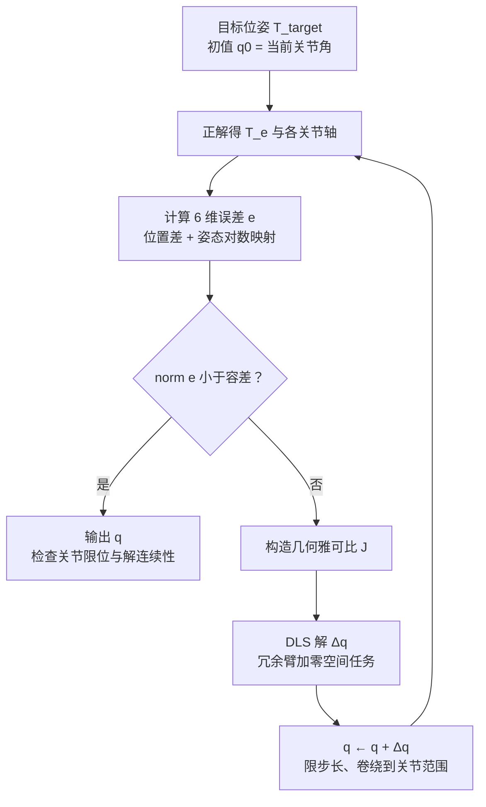

运动学是机械臂软件栈里最底层的一块地基：正解回答"关节角是这样时末端在哪"，逆解回答"想让末端到那里关节角该是多少"，雅可比回答"关节速度和末端速度怎么换算"。规划器、笛卡尔伺服、力控、示教再现，全都建立在这三个问题的答案之上。

本文按依赖顺序推导这三块：先把位姿和齐次变换说清楚，然后用 DH 参数把串联机构参数化，再构造雅可比并讨论奇异性，最后对比解析逆解与数值逆解。

## 1. 位姿与齐次变换

刚体在空间中的位姿由位置 $\mathbf p \in \mathbb R^3$ 和姿态 $\mathbf R \in SO(3)$ 组成，合写成齐次变换矩阵：

$$
\mathbf T = \begin{bmatrix} \mathbf R & \mathbf p \\ \mathbf 0^\top & 1 \end{bmatrix} \in SE(3)
$$

它的好处是**复合就是矩阵乘法**：坐标系 $\{B\}$ 相对 $\{A\}$、$\{C\}$ 相对 $\{B\}$ 的位姿已知时，

$$
{}^A\mathbf T_C = {}^A\mathbf T_B \; {}^B\mathbf T_C
$$

串联机械臂正是一串这样的复合。逆变换也有闭式：

$$
\mathbf T^{-1} = \begin{bmatrix} \mathbf R^\top & -\mathbf R^\top \mathbf p \\ \mathbf 0^\top & 1 \end{bmatrix}
$$

姿态的参数化（欧拉角、轴角、四元数）各有取舍：欧拉角直观但有万向锁；四元数无奇异、插值方便（slerp），是运动规划中的默认选择；旋转矩阵则用于一切需要复合和求导的推导。工程上常见的错误几乎都发生在约定不清：内旋还是外旋、四元数 wxyz 还是 xyzw、角度还是弧度——这些约定错了，后面全错。

## 2. DH 参数：用 4 个数描述一个关节

串联机构相邻连杆之间的变换有 6 个自由度，但 Denavit 与 Hartenberg 发现：**只要坐标系按规则架设（z 轴取关节轴，x 轴取相邻两关节轴的公垂线），相邻连杆变换只需要 4 个参数**。

采用修正 DH（Modified DH，Craig 版约定），从坐标系 $\{i-1\}$ 到 $\{i\}$ 的变换为

$$
{}^{i-1}\mathbf T_i =
\mathbf R_x(\alpha_{i-1})\,
\mathbf D_x(a_{i-1})\,
\mathbf R_z(\theta_i)\,
\mathbf D_z(d_i)
$$

展开成矩阵：

$$
{}^{i-1}\mathbf T_i =
\begin{bmatrix}
\cos\theta_i & -\sin\theta_i & 0 & a_{i-1} \\
\sin\theta_i \cos\alpha_{i-1} & \cos\theta_i \cos\alpha_{i-1} & -\sin\alpha_{i-1} & -d_i \sin\alpha_{i-1} \\
\sin\theta_i \sin\alpha_{i-1} & \cos\theta_i \sin\alpha_{i-1} & \cos\alpha_{i-1} & d_i \cos\alpha_{i-1} \\
0 & 0 & 0 & 1
\end{bmatrix}
$$

四个参数的物理含义：

- $a_{i-1}$（连杆长度）、$\alpha_{i-1}$（连杆扭角）：由机械结构决定的常数；
- $\theta_i$（关节角）：转动关节的变量；
- $d_i$（连杆偏距）：移动关节的变量。

注意**标准 DH（Spong 版）与修正 DH 的下标和乘法顺序不同**，两套约定的参数表不能混用。看论文或者对接现成 URDF 时第一件事是确认约定；URDF 本身不用 DH，而是任意的 joint origin + axis，从 URDF 提取 DH 参数并不总是唯一的。

正运动学就是把 $n$ 个连杆变换连乘：

$$
{}^0\mathbf T_n(\mathbf q) = {}^0\mathbf T_1(q_1)\; {}^1\mathbf T_2(q_2) \cdots {}^{n-1}\mathbf T_n(q_n)
$$

这一步没有任何数值困难：给定 $\mathbf q$，答案唯一、计算是 $O(n)$ 次矩阵乘法。真正的难点全在反方向。

## 3. 微分运动学：几何雅可比

设末端线速度 $\mathbf v_e$、角速度 $\boldsymbol\omega_e$，堆叠成 6 维空间速度。雅可比矩阵 $\mathbf J(\mathbf q) \in \mathbb R^{6\times n}$ 定义了它与关节速度的线性映射：

$$
\begin{bmatrix} \mathbf v_e \\ \boldsymbol\omega_e \end{bmatrix} = \mathbf J(\mathbf q)\,\dot{\mathbf q}
$$

几何雅可比可以逐列构造，物理图像非常直接——**第 $i$ 列就是"只动第 $i$ 个关节、单位速度"时末端的空间速度**：

$$
\mathbf J_i =
\begin{cases}
\begin{bmatrix} \mathbf z_{i-1} \times (\mathbf p_e - \mathbf p_{i-1}) \\ \mathbf z_{i-1} \end{bmatrix} & \text{转动关节} \\[10pt]
\begin{bmatrix} \mathbf z_{i-1} \\ \mathbf 0 \end{bmatrix} & \text{移动关节}
\end{cases}
$$

其中 $\mathbf z_{i-1}$、$\mathbf p_{i-1}$ 分别是第 $i$ 个关节轴方向和轴上一点的位置（正解的中间结果，顺手就有）。转动关节那一列就是刚体力学里"绕轴转动时，离轴越远的点线速度越大"的叉积公式。

雅可比的用处远不止速度换算：

- **静力学对偶**：虚功原理给出 $\boldsymbol\tau = \mathbf J^\top \mathbf F$，末端力映射到关节力矩，力控和碰撞检测都靠它；
- **数值逆解**：见第 5 节；
- **奇异性分析**：见下面。

### 奇异性

当 $\mathbf J$ 丢秩时，末端在某些方向上瞬时失去运动能力，这就是**运动学奇异**。6 轴臂的典型奇异位形有三类：腕部奇异（4、6 轴共线，最常见）、肘部奇异（手臂完全伸直，即工作空间边界）、肩部奇异（腕心落在 1 轴轴线上）。

定量刻画用可操作度（manipulability）：

$$
w(\mathbf q) = \sqrt{\det\!\left(\mathbf J \mathbf J^\top\right)} = \sigma_1 \sigma_2 \cdots \sigma_6
$$

即奇异值之积，等于末端速度椭球的体积。接近奇异时最小奇异值 $\sigma_{min} \to 0$，后果不是"动不了"，而是反过来：**为了维持普通的末端速度，某些关节速度会飙向无穷**。笛卡尔伺服在奇异附近炸掉的根源就在这里，处理手段（阻尼、限速、任务重构）在第 5 节讨论。

## 4. 解析逆解：能用就用

逆运动学求解 $\mathbf T_{target} = {}^0\mathbf T_n(\mathbf q)$。它和正解有本质不对称性：解可能**不存在**（目标在工作空间外）、可能**有限多个**（6 轴臂一般位形最多 16 个，常见构型 8 个）、也可能**无穷多**（7 轴冗余臂）。

先看最小的能完整算清楚的例子——平面 2R 机械臂，目标末端位置 $(x, y)$：

由余弦定理直接得肘关节角：

$$
\cos\theta_2 = \frac{x^2 + y^2 - L_1^2 - L_2^2}{2 L_1 L_2}
$$

$|\cos\theta_2| > 1$ 即目标出界；否则 $\theta_2 = \pm\arccos(\cdot)$ 给出两个解，再解肩关节角：

$$
\theta_1 = \operatorname{atan2}(y, x) - \operatorname{atan2}\!\left(L_2 \sin\theta_2,\; L_1 + L_2 \cos\theta_2\right)
$$

_同一个目标点对应肘上、肘下两个构型；解的选择要看与当前构型的连续性，而不是任取一个_

工业 6 轴臂能写出解析逆解，靠的是 **Pieper 条件**：最后三个关节轴交于一点（球腕）。此时位置和姿态解耦——腕心位置 $\mathbf p_w = \mathbf p_e - d_6 \mathbf z_e$ 只由前三轴决定（几何法解出，含肩左右/肘上下 4 种组合），后三轴再从 ${}^3\mathbf R_6$ 中按欧拉角提取（腕翻转 2 解），共 8 组解。

解析解的优点是微秒级、可枚举全部分支：轨迹规划时可以对整条路径做全局的解分支选择，避免中途被迫翻腕。所以规则很简单：**构型满足 Pieper 条件就优先用解析解**（手写或用 IKFast 这类符号求解器生成）。

## 5. 数值逆解：把 IK 变成优化

构型不满足 Pieper 条件（很多协作臂有链偏置）、或 7 轴冗余臂，就用数值法。基本框架是牛顿迭代：定义位姿误差 6 维向量

$$
\mathbf e(\mathbf q) = \begin{bmatrix} \mathbf p_{target} - \mathbf p_e(\mathbf q) \\ \operatorname{log}\!\left(\mathbf R_{target}\, \mathbf R_e^\top(\mathbf q)\right)^\vee \end{bmatrix}
$$

姿态误差用旋转矩阵对数映射（轴角向量），比欧拉角差干净得多。一阶展开 $\mathbf e(\mathbf q + \Delta\mathbf q) \approx \mathbf e - \mathbf J \Delta\mathbf q$，每步解一个最小二乘：

$$
\Delta\mathbf q = \mathbf J^{+}\, \mathbf e
$$

伪逆在奇异附近病态（对应 $1/\sigma_{min}$ 爆炸），实用的选择是**阻尼最小二乘**（Damped Least Squares / Levenberg–Marquardt）：

$$
\Delta\mathbf q = \mathbf J^\top \left(\mathbf J \mathbf J^\top + \lambda^2 \mathbf I\right)^{-1} \mathbf e
$$

从奇异值角度看，DLS 把每个奇异方向的增益从 $\dfrac{1}{\sigma_i}$ 换成 $\dfrac{\sigma_i}{\sigma_i^2 + \lambda^2}$：$\sigma_i \gg \lambda$ 时接近伪逆，$\sigma_i \to 0$ 时增益平滑归零——用小的跟踪误差换取解的有界性。$\lambda$ 可以按 $\sigma_{min}$ 自适应调节，只在奇异邻域内起作用。

冗余臂（$n > 6$）的零空间是白送的自由度，投影算子

$$
\Delta\mathbf q = \mathbf J^{+}\mathbf e + \left(\mathbf I - \mathbf J^{+}\mathbf J\right)\nabla H(\mathbf q)
$$

第二项在不影响末端任务的前提下优化次级目标 $H$：远离关节限位、远离奇异（最大化 $w$）、避障。

数值法的两个固有弱点要心里有数：**只收敛到初值附近的一个解**（初值取当前关节角，天然保证解连续性，这在伺服场景反而是优点）；以及**局部极小**（目标不可达或初值太差时 $\mathbf e$ 无法收敛到零），批量求解时用多随机初值重启。

## 6. 工程对照表

| 问题 | 方法 | 复杂度 | 解的性质 |
| --- | --- | --- | --- |
| 正解 | 连乘 DH 变换 | $O(n)$，确定性 | 唯一 |
| 速度级 | 几何雅可比 | $O(n)$ 逐列构造 | 线性映射，奇异时丢秩 |
| 逆解（球腕） | 解析：几何 + 欧拉角提取 | 微秒级 | 8 组，可全局选支 |
| 逆解（一般/冗余） | DLS 迭代 + 零空间投影 | 每步一次 6×n 最小二乘 | 局部唯一，依赖初值 |

几条实践经验：

1. **实时笛卡尔伺服用速度级 IK**（直接积分 $\dot{\mathbf q} = \mathbf J^+ \dot{\mathbf x}$），不要每个周期做完整位置级 IK——前者天然连续，后者可能跳解分支；
2. **解的选择比解本身重要**：8 组解析解里选哪组，标准是与当前构型加权关节距离最小，且整条轨迹不换支；
3. 检查逆解库的**姿态误差定义**和**关节卷绕策略**，这两处不一致会表现为"偶发的关节大回转"，非常难排查；
4. 奇异不可怕，可怕的是没有处理策略就闯进去——限最小奇异值、DLS 阻尼、或者规划阶段直接把奇异邻域当障碍。

## 参考

- J. J. Craig. *Introduction to Robotics: Mechanics and Control*. Pearson.（修正 DH 约定出处）
- K. M. Lynch, F. C. Park. *Modern Robotics: Mechanics, Planning, and Control*. Cambridge University Press.（旋量视角，可与 DH 对照）
- B. Siciliano, L. Sciavicco, L. Villani, G. Oriolo. *Robotics: Modelling, Planning and Control*. Springer.
- S. R. Buss. *Introduction to Inverse Kinematics with Jacobian Transpose, Pseudoinverse and Damped Least Squares Methods*. 2004.（DLS 综述）
