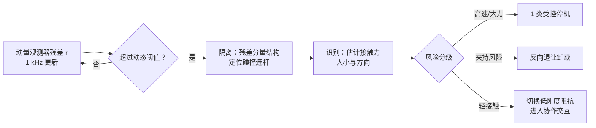

协作机器人的"协作"二字在法规意义上非常具体：人和机器人共享工作空间时，撞上了怎么办。这个问题分两层——**撞上之前**（检测与反应要快）和**撞上瞬间**（冲击本身要小于人体耐受限值）。前者是估计与控制问题，后者是标准与设计问题。本文两层都推到可计算的程度。

## 1. 检测：外力矩是个不能直接测的量

不加任何额外传感器，机械臂能感知碰撞吗？能——碰撞的外力矩 $\boldsymbol\tau_{ext}$ 会出现在[动力学方程](/posts/机械臂动力学/)里：

$$
\mathbf M(\mathbf q)\ddot{\mathbf q} + \mathbf C(\mathbf q,\dot{\mathbf q})\dot{\mathbf q} + \mathbf G(\mathbf q) + \boldsymbol\tau_f = \boldsymbol\tau_m + \boldsymbol\tau_{ext}
$$

电机力矩 $\boldsymbol\tau_m$ 从电流已知，模型各项可算，似乎移项就能解出 $\boldsymbol\tau_{ext}$：

$$
\hat{\boldsymbol\tau}_{ext} = \mathbf M\ddot{\mathbf q} + \mathbf C\dot{\mathbf q} + \mathbf G + \boldsymbol\tau_f - \boldsymbol\tau_m
$$

问题卡在 $\ddot{\mathbf q}$：没有加速度传感器，只能对编码器速度差分——**微分放大高频噪声**，1 kHz 下差分一次，毫弧度级的速度噪声变成不可用的加速度估计。下面仿真里的灰色曲线就是这条"朴素路线"的下场。

### 广义动量观测器：绕开加速度的妙手

De Luca 提出的方案基于广义动量 $\mathbf p = \mathbf M(\mathbf q)\dot{\mathbf q}$。对它求导：

$$
\dot{\mathbf p} = \mathbf M\ddot{\mathbf q} + \dot{\mathbf M}\dot{\mathbf q}
$$

用动力学方程替换 $\mathbf M\ddot{\mathbf q}$，并利用[结构性质](/posts/机械臂动力学/) $\dot{\mathbf M} = \mathbf C + \mathbf C^\top$（反对称性质的等价形式），得到一个**不含加速度**的动量流平衡：

$$
\dot{\mathbf p} = \boldsymbol\tau_m + \mathbf C^\top(\mathbf q,\dot{\mathbf q})\,\dot{\mathbf q} - \mathbf G(\mathbf q) - \boldsymbol\tau_f + \boldsymbol\tau_{ext}
$$

右边除 $\boldsymbol\tau_{ext}$ 外全部可算。构造观测器：把可算的部分积分出一个"理应的动量" $\hat{\mathbf p}$，与实测动量（$\mathbf M\dot{\mathbf q}$，只用速度！）的差放大 $\mathbf K_O$ 倍作为残差 $\mathbf r$，并把 $\mathbf r$ 也喂回积分器：

$$
\mathbf r = \mathbf K_O\left(\mathbf p - \int_0^t \left(\boldsymbol\tau_m + \mathbf C^\top\dot{\mathbf q} - \mathbf G - \boldsymbol\tau_f + \mathbf r\right)\mathrm d s\right)
$$

对它求导并代入动量流平衡，所有可算项对消，剩下一个干净的一阶系统：

$$
\dot{\mathbf r} = \mathbf K_O\left(\boldsymbol\tau_{ext} - \mathbf r\right)
$$

**残差以时间常数 $1/K_O$ 一阶跟踪外力矩**——不用加速度、不用逆 $\mathbf M$、每周期只多几次矩阵乘加。$K_O$ 越大跟踪越快，但速度测量噪声放大也越多，典型取 20~100 s⁻¹：

_1 kHz 仿真、含真实量级的测速噪声：朴素加速度法的噪声底完全淹没 6 N·m 的碰撞脉冲；动量观测器残差干净地复现外力矩，固定阈值下 36 ms 触发_

### 阈值：灵敏度和误报的交易

理想情况下无碰撞时 $\mathbf r = 0$，实际上模型误差（尤其[摩擦](/posts/机械臂关节硬件/)——它随温度、方向、速度漂移）让残差有一个运动相关的本底。阈值设计因此是统计问题：

- **静态阈值**：跑一批无碰撞的典型轨迹，取各关节残差包络加 20~30% 裕量。简单可靠，代价是灵敏度被最坏工况拖低；
- **动态阈值**：阈值随速度/加速度调制（摩擦误差正比于速度），高速段放宽、低速段收紧——低速恰恰是人机接触风险高、又最需要灵敏的区段，这个匹配非常合算；
- **学习残差包络**：拿真实运行数据回归"残差 = f(状态)"的包络模型，把模型误差的可预测部分再挤掉一层。

误报和漏报的代价不对称（误报停机损失产能，漏报伤人），阈值向哪边偏由应用定——这也是为什么阈值必须是**可配置且被安全评估覆盖**的参数，不是代码里的魔法数。

## 2. 撞在哪、多大力、然后呢：完整流水线

检测只是第一级。De Luca 的碰撞处理流水线值得完整过一遍：

**隔离（撞在哪个连杆）**：残差向量的结构自带答案——碰撞作用在第 $k$ 连杆时，外力只对关节 $1..k$ 产生力矩（力的作用线穿不过的关节才有力矩），**残差分量 $r_{k+1..n} \approx 0$**。从后往前找第一个非零分量即碰撞连杆。更进一步，联合多个分量可以反演接触点位置和接触力方向（可观测的部分）。

**识别（多大力）**：$\mathbf r$ 就是外力矩的滤波估计；已知接触点雅可比 $\mathbf J_c$ 时，$\hat{\mathbf F}_{ext} = (\mathbf J_c^\top)^+ \mathbf r$ 给出接触力估计——这也是拖动示教和[导纳外环](/posts/阻抗控制与力控/)不装力传感器的实现方式。

**反应（然后呢）**：按风险等级从硬到软：

- 0 类停机：立即断使能 + 抱闸——最快但最伤机器，且重力轴抱闸响应期间会掉一段；
- 1/2 类停机：受控减速到零（保持伺服），是协作场景默认；
- **反弹（retract）**：沿残差方向反向运动卸载接触力——夹住人手的场景里"停住"是错误答案，退开才对；
- **切换到零重力/柔顺模式**：检测到接触后转入[阻抗控制](/posts/阻抗控制与力控/)低刚度模式，把碰撞变成物理人机交互的入口（拖动引导就是这么开始的）。

## 3. 协作安全的定量化：ISO/TS 15066

上面是"撞了怎么办"，法规还管"允许撞多重"。ISO 10218 定义了四种协作模式：安全监控停止、手动引导、**速度与间距监控（SSM）**、**功率与力限制（PFL）**。前两种概念直白，后两种是定量工程。

**SSM**：机器人速度随人机间距缩放。最小保护间距由制动物理决定：

$$
S_p = \underbrace{v_h T_r}_{\text{反应时间内人的移动}} + \underbrace{v_r T_r + \frac{v_r^2}{2 a_{brake}}}_{\text{机器人反应 + 制动距离}} + \underbrace{C + Z}_{\text{测量不确定度}}
$$

用安全级激光扫描仪测间距，间距-速度曲线按上式反解。工程要点是 $T_r$ 必须计入**整条链路**（传感器帧率 + 处理 + 通信 + 伺服响应），漏一环整个公式失效。

**PFL**：允许接触，但接触的物理量不得超过人体耐受限值。TS 15066 附录给出了按身体部位（额头、胸骨、手背、大腿……29 个区域）的**最大接触力/压强表**，并区分两类接触：

- **瞬态接触**（自由碰撞，人可以退让）：限值较高，约束的是碰撞瞬间的能量交换。碰撞瞬间可以用双质量模型算：机器人在接触点方向的**有效质量**

$$
m_{eff} = \left[\mathbf u^\top \mathbf J\, \mathbf M^{-1}(\mathbf q)\, \mathbf J^\top \mathbf u\right]^{-1}
$$

（$\mathbf u$ 是接触方向单位向量——注意它就是任务空间惯量 $\boldsymbol\Lambda$ 沿 $\mathbf u$ 的标量投影，又一次用到[动力学](/posts/机械臂动力学/)）。能量守恒给出允许速度：

$$
v_{max} = \frac{F_{max}}{\sqrt{\mu\, k}}, \qquad \mu = \left(\frac{1}{m_{eff}} + \frac{1}{m_h}\right)^{-1}
$$

$k$ 是身体部位的等效刚度（标准附表给出），$m_h$ 是部位有效质量。**这个公式就是协作臂"看起来慢吞吞"的定量原因**：手背 $F_{max} = 140$ N、$k = 75$ kN/m，中型臂 $m_{eff} \sim 15$ kg 时 $v_{max}$ 只有 0.3~0.5 m/s 量级;

- **准静态接触**（夹持，人退不开）：限值折半，且是持续力约束——这正是"反弹"反应策略在标准里的对应物。

设计侧的启示很直接：$v_{max} \propto 1/\sqrt{m_{eff}}$，**降低有效质量与降低速度同样有效**——轻量化连杆、低[折算惯量](/posts/机械臂关节硬件/)的关节、避免用臂的"硬方向"（$\boldsymbol\Lambda$ 大的方向）接近人，都直接兑换成允许速度。圆角外壳和柔性蒙皮则是在改 $k$。

最后一个容易被绕过的问题：**观测器跑在普通控制器里，算不算安全功能？** 严格地说不算——安全完整性（PL d/SIL 2 等级）要求安全功能由认证的安全控制器/双通道架构执行。实际产品的分工是：安全级的电流/速度监控兜底（认证通道），动量观测器提供灵敏的功能性检测与柔性反应（性能通道）。两层各司其职，混为一谈会在认证环节付出代价。

## 4. 小结

1. 无传感器碰撞检测的核心是**绕开加速度**：广义动量观测器利用 $\dot{\mathbf M} = \mathbf C + \mathbf C^\top$ 把残差动力学化成 $\dot{\mathbf r} = \mathbf K_O(\boldsymbol\tau_{ext} - \mathbf r)$，只用电流和速度。
2. 残差的用途一鱼三吃：超阈值检测、分量结构隔离碰撞连杆、幅值识别接触力——后者顺手实现了无力矩传感器的拖动示教。
3. 阈值是统计设计：动态阈值随速度调制，恰好在低速高风险段最灵敏；灵敏度-误报的偏向是安全评估的一部分。
4. TS 15066 把安全变成算术：$v_{max} = F_{max}/\sqrt{\mu k}$——限速、减有效质量、软化外壳是同一个公式的三个抓手。
5. 功能性检测（观测器）和安全级监控（认证通道）是两层东西，产品架构里要分开。

## 参考

- A. De Luca, A. Albu-Schäffer, S. Haddadin, G. Hirzinger. *Collision Detection and Safe Reaction with the DLR-III Lightweight Robot Arm*. IROS 2006.
- S. Haddadin, A. De Luca, A. Albu-Schäffer. *Robot Collisions: A Survey on Detection, Isolation, and Identification*. IEEE T-RO, 2017.（流水线框架的权威综述）
- ISO 10218-1/-2:2011 与 ISO/TS 15066:2016.（协作模式与人体接触限值附表）
- S. Haddadin. *Towards Safe Robots: Approaching Asimov's 1st Law*. Springer, 2014.（碰撞生物力学与有效质量分析）
