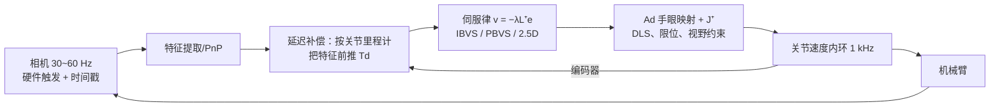

[标定那篇](/posts/机械臂标定/)的结尾算过一笔误差预算：内参、本体、TCP、手眼、检测，每层贡献零点几毫米，链条末端轻松累到毫米级。装配间隙 0.2 mm 的插接任务怎么办？答案不是把每层标到极致——那是和误差的军备竞赛——而是换范式：**把相机放进控制回路**。开环的"看一眼、算位姿、闭眼走过去"（look-then-move）升级为闭环的"边看边走"，标定误差从"直接进结果"变成"只影响收敛路径"。这就是视觉伺服（visual servoing）。

两大流派按误差定义在哪个空间划分：位姿空间的 PBVS 和图像空间的 IBVS。先把两者共用的数学地基打好。

## 1. 交互矩阵：图像特征怎么随相机运动而变

设相机以空间速度（twist）$\mathbf v_c = (\boldsymbol\upsilon, \boldsymbol\omega) \in \mathbb R^6$ 运动。一个静止三维点 $\mathbf P = (X, Y, Z)$ 在相机系下的坐标怎么变？点没动，是坐标系在动，所以点在相机系里"看起来"朝反方向运动——相机平移 $\boldsymbol\upsilon$ 让点坐标减 $\boldsymbol\upsilon$，相机旋转 $\boldsymbol\omega$ 让点绕原点反向转：

$$
\dot{\mathbf P} = -\boldsymbol\upsilon - \boldsymbol\omega \times \mathbf P
\qquad\text{展开成分量}\qquad
\begin{aligned}
\dot X &= -\upsilon_x - \omega_y Z + \omega_z Y \\
\dot Y &= -\upsilon_y - \omega_z X + \omega_x Z \\
\dot Z &= -\upsilon_z - \omega_x Y + \omega_y X
\end{aligned}
$$

该点的归一化图像坐标 $x = X/Z,\; y = Y/Z$（针孔投影除掉深度）。对时间求导（商法则）：

$$
\dot x = \frac{\dot X Z - X \dot Z}{Z^2} = \frac{\dot X}{Z} - x\frac{\dot Z}{Z}
$$

现在把分量表达式代进去，逐步整理。第一项，除以 $Z$ 并用 $Y = yZ$ 消掉三维量：

$$
\frac{\dot X}{Z} = -\frac{\upsilon_x}{Z} - \omega_y + \omega_z\, y
$$

第二项同理（用 $X = xZ$、$Y = yZ$）：

$$
\frac{\dot Z}{Z} = -\frac{\upsilon_z}{Z} - \omega_x\, y + \omega_y\, x
$$

相减：

$$
\dot x = -\frac{\upsilon_x}{Z} + x\frac{\upsilon_z}{Z} + xy\,\omega_x - (1 + x^2)\,\omega_y + y\,\omega_z
$$

注意整理过程中发生了两件有意义的事：**深度 $X, Y$ 全部被 $x, y$ 吸收，只剩一个 $Z$ 消不掉**（它只出现在平移项的分母上）；旋转项里出现了 $xy$ 和 $1+x^2$ 这样的**二次项**——图像边缘处旋转引起的光流比中心快，这正是广角镜头下旋转"拉扯"画面的数学形式。对 $y$ 重复同样三步，把两行按 $\mathbf v_c$ 的六个分量排成矩阵，就得到经典的**点特征交互矩阵**：

$$
\begin{bmatrix} \dot x \\ \dot y \end{bmatrix}
=
\underbrace{\begin{bmatrix}
-\dfrac{1}{Z} & 0 & \dfrac{x}{Z} & xy & -(1+x^2) & y \\[6pt]
0 & -\dfrac{1}{Z} & \dfrac{y}{Z} & 1+y^2 & -xy & -x
\end{bmatrix}}_{\mathbf L(x, y, Z)}
\mathbf v_c
$$

这六列每列都有物理直觉：前三列（平移）都带 $1/Z$——**点越远，同样的平移引起的图像运动越小**（这就是为什么平移伺服需要深度信息）；后三列（旋转）与 $Z$ 无关——旋转引起的图像流不依赖距离，其中绕光轴的第六列就是图像的旋转场 $(y, -x)$。

一个点给 2 行约束，控制 6 维相机运动至少要 3 个点（6 行），实用取 4 个以上冗余点抗噪。把各点的 $\mathbf L$ 堆叠成 $\mathbf L_s \in \mathbb R^{2N\times6}$，地基完工。

## 2. IBVS：在图像里定义误差

误差直接取特征当前位置与期望位置之差 $\mathbf e = \mathbf s - \mathbf s^*$。由 $\dot{\mathbf e} = \mathbf L_s \mathbf v_c$，想让误差指数收敛（$\dot{\mathbf e} = -\lambda\mathbf e$），控制律即

$$
\mathbf v_c = -\lambda\, \mathbf L_s^{+}\, \mathbf e
$$

伪逆解最小二乘意义下的相机速度。下面是完整仿真（四点特征、初始位姿带 40° 绕光轴旋转 + 平移偏移）：

_特征在图像平面内近似直线地滑向目标位置（IBVS 的招牌行为），误差范数严格指数下降——这是把 $\dot{\mathbf e} = -\lambda\mathbf e$ 直接写进控制律的后果_

交互矩阵里的 $Z$ 是每个特征的**未知深度**，工程处理分三档：用期望位形的深度 $Z^*$ 构造常矩阵 $\mathbf L_{s^*}$（最简单，远处行为稍差）；在线估计深度（结构光/双目直接给）；混合 $\tfrac12(\mathbf L_s + \mathbf L_{s^*})$（Chaumette 推荐的默认，收敛域和轨迹质量都更好）。

IBVS 的强项和弱项都来自"只看图像"：

- **强**：目标只要在视野里就能伺服，相机内外参误差只让收敛变慢变弯、**不影响收敛点**（收敛点由 $\mathbf s^*$ 定义，而 $\mathbf s^*$ 通常是拿真机在目标位姿拍一张示教出来的——标定误差被示教吸收）；特征天然倾向留在视野内；
- **弱**：笛卡尔轨迹不受控。图像里走直线，三维里可能画弧；最著名的病态是**相机后退问题**：目标纯绕光轴转 180° 时，特征的直线图像路径对应的三维运动是相机沿光轴退到无穷远再回来——伪逆给出的解在几何上"合法"却荒谬。此外大位移下可能落入局部极小（$\mathbf e \ne 0$ 但 $\mathbf L_s^+\mathbf e = 0$）。

## 3. PBVS：在位姿空间定义误差

另一条路：先用图像解出目标相对相机的位姿（PnP + 已知目标模型），误差定义在 $SE(3)$ 上（平移差 + [旋转对数映射](/posts/机械臂运动学/)），伺服律形式与 IBVS 相同但作用在位姿误差上。

强弱恰好与 IBVS 互补：**笛卡尔轨迹是可预测的直线/测地线**（适合有障碍、有轨迹要求的场合），全局渐近稳定（模型准确时）；但位姿估计把内参、目标模型误差**全额带进收敛点**——标定差多少，停的位置就偏多少；而且伺服过程中不控制特征的图像位置，目标可能中途滑出视野。

| | IBVS | PBVS |
| --- | --- | --- |
| 误差空间 | 图像 | SE(3) |
| 标定误差的影响 | 只影响过程，不影响终点 | 直接进终点 |
| 笛卡尔轨迹 | 不可控（可能怪异） | 直线，可预测 |
| 视野保持 | 天然较好 | 无保证 |
| 需要目标 3D 模型 | 否 | 是（PnP） |
| 病态 | 后退问题、局部极小 | 位姿估计噪声放大（远/小目标） |

**2.5D（混合）伺服**取两家之长：旋转误差用位姿（从单应/位姿分解取 $\mathbf R$），平移误差用图像特征——绕开后退问题，又保留 IBVS 的标定鲁棒性。工程上如果目标带高质量标志物（AprilTag/ArUco，位姿解稳定），PBVS 简单直接；自然特征、终点精度要求高，用 IBVS 或 2.5D。

## 4. 接到机械臂上：两个频率域的拼接

上面推的都是"相机速度"，真正的执行器是关节。眼在手上时相机 twist 通过手眼变换的伴随矩阵映射到末端 twist，再经[雅可比](/posts/机械臂运动学/)进关节空间：

$$
\dot{\mathbf q} = \mathbf J^{+}(\mathbf q)\; \mathbf{Ad}_{ {}^{e}\mathbf T_c}\; \mathbf v_c
$$

结构上这是一个**双环**：视觉外环 30~60 Hz，机器人内环（速度/位置伺服）250 Hz~1 kHz。两个频率域的拼接处藏着视觉伺服真正的工程难点——**延迟**：

- 从曝光到特征坐标可用，链路延迟（曝光 + 传输 + 检测）典型 30~80 ms，外环增益 $\lambda$ 受它压制：延迟 $T_d$ 下粗略的稳定上限是 $\lambda T_d \lesssim 1$，延迟 50 ms 意味着 $\lambda$ 超过 20 s⁻¹ 就要出问题，实际还要打对折。**想快，先压延迟，再谈增益**（全局快门相机、硬件触发、检测算法轻量化）；
- 标准补偿手段是**用关节里程计做预测**：图像是 $T_d$ 之前的世界，但这段时间机械臂自己怎么动的、编码器一清二楚——把测得的特征按机器人自运动前推 $T_d$（交互矩阵正好给出特征对相机运动的导数），等效延迟大幅缩小。动态目标再叠加对目标运动的 [KF 预测](/posts/卡尔曼滤波原理解析/)；
- 内环用速度接口而不是位置接口：外环每拍下发的是 $\dot{\mathbf q}$ 指令，两拍之间由内环保持——位置接口的"走-停-走"会把外环频率的锯齿直接刻在轨迹上。奇异与关节限位的处理沿用[数值 IK](/posts/机械臂运动学/) 的 DLS 与零空间手段。

收尾判据也要显式设计：误差范数连续 $N$ 帧低于阈值才认为到位（单帧判定会被噪声骗）；插接类任务在最后几毫米切换到[力控](/posts/阻抗控制与力控/)——视觉管"对准"，力觉管"入位"，两个传感器各干各的擅长。

## 5. 小结

1. 视觉伺服的价值主张：把标定误差从"直接进结果"降级为"只影响过程"——精度要求超过标定链预算时，闭环是比"标得更准"更便宜的路。
2. 交互矩阵一张表看懂：平移列带 $1/Z$（远目标平移不敏感、需要深度），旋转列与深度无关；深度未知用 $\mathbf L_{s^*}$ 或混合矩阵。
3. IBVS 终点准但三维轨迹野，PBVS 轨迹直但终点吃标定；大旋转用 2.5D 绕开后退问题。
4. 双环架构的命门是延迟：先压链路延迟，再用关节里程计前推补偿，增益最后调。
5. 最后一毫米交给力控——视觉和力觉的接力是插装类任务的标准打法。

## 参考

- F. Chaumette, S. Hutchinson. *Visual Servo Control, Part I: Basic Approaches / Part II: Advanced Approaches*. IEEE RAM, 2006/2007.（本领域最好的两篇教程，交互矩阵推导与病态分析出处）
- S. Hutchinson, G. D. Hager, P. I. Corke. *A Tutorial on Visual Servo Control*. IEEE T-RA, 1996.
- E. Malis, F. Chaumette, S. Boudet. *2.5D Visual Servoing*. IEEE T-RA, 1999.
- P. I. Corke. *Robotics, Vision and Control*. Springer.（含可运行的 MATLAB/Python 仿真）
