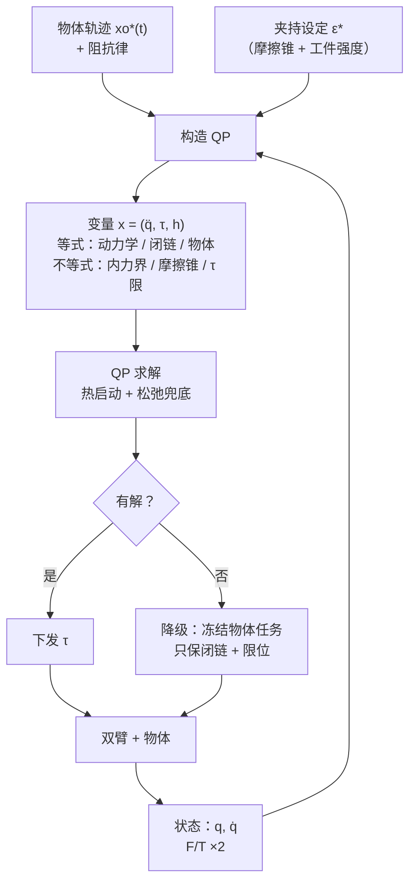

[双臂协同操作](/posts/双臂协同操作/)那篇给出的控制架构是分层的：物体级阻抗算旋量、抓取矩阵分配、内力回路管夹持。那套结构在物理上是对的，但落地时会立刻撞上一堵墙——**它没有地方写"不等式"**。

关节快到限位了怎么办？某条臂的力矩要饱和了怎么办？两臂快撞上了怎么办？夹持力必须落在摩擦锥内、又不能压碎工件，怎么办？这些约束全都是不等式，而零空间投影这套线性代数只能表达等式。

二次规划（QP）是目前的标准答案。本文把双臂协同完整地写成 QP，推导每一项的由来，并用实测数据回答三个最容易做错的问题：任务优先级用权重还是用硬约束、约束不可行时会发生什么、1 kHz 到底够不够。

数据仍来自[上一篇](/posts/双臂协同运动规划/)那套平面双臂闭链模型（8 关节、3 个闭链约束），求解器是 OSQP。

## 1. 从零空间投影到 QP

先看清楚旧方法的边界。多任务的零空间投影写法是

$$
\dot{\mathbf q} = \mathbf J_1^{+}\mathbf v_1 + \left(\mathbf I - \mathbf J_1^{+}\mathbf J_1\right)\mathbf J_2^{+}\mathbf v_2 + \cdots
$$

含义清楚：先满足任务 1，剩下的自由度给任务 2。它的三个硬伤：

1. **只能表达等式**。关节限位 $\mathbf q_{\min} \le \mathbf q \le \mathbf q_{\max}$ 无法写进去，实践中只能靠"接近限位就加一个排斥速度"这类启发式；
2. **不能表达饱和**。力矩上限、速度上限只能事后裁剪，而裁剪之后各任务的优先级关系就被破坏了；
3. **任务冲突时行为不可控**。低优先级任务被投影掉，但"投影掉多少"没有显式的度量。

QP 把同一件事重写成优化问题：**任务变成代价函数，约束变成约束**。

$$
\begin{aligned}
\min_{\mathbf x} \quad & \tfrac12 \mathbf x^\top \mathbf P \mathbf x + \mathbf c^\top \mathbf x \\
\text{s.t.} \quad & \mathbf l \le \mathbf A \mathbf x \le \mathbf u
\end{aligned}
$$

这个形式的表达力足够覆盖上面所有诉求，而且有成熟的实时求解器（OSQP、qpOASES、HPIPM、ProxQP）。剩下的工作是：**决定 $\mathbf x$ 是什么，然后把每个任务和约束翻译成 $\mathbf P, \mathbf c, \mathbf A, \mathbf l, \mathbf u$**。

## 2. 速度级 QP：最小可用的双臂协同控制器

### 2.1 决策变量与任务

取 $\mathbf x = \dot{\mathbf q} \in \mathbb R^{n}$（双臂 $n = 12$ 或 14）。所有任务都是"某个雅可比乘以关节速度等于某个期望值"的形式：

$$
\mathbf J_i\, \dot{\mathbf q} = \mathbf v_i^*
$$

写成最小二乘代价 $\|\mathbf J_i \dot{\mathbf q} - \mathbf v_i^*\|^2$，展开后并入 $\mathbf P$ 和 $\mathbf c$：

$$
\mathbf P = \sum_i w_i\, \mathbf J_i^\top \mathbf J_i + \lambda \mathbf I,
\qquad
\mathbf c = -\sum_i w_i\, \mathbf J_i^\top \mathbf v_i^*
$$

正则项 $\lambda \mathbf I$ 不是可选的：任务不足以确定全部自由度时 $\mathbf P$ 奇异，QP 的解不唯一，求解器会在零空间里游走，表现为关节缓慢漂移。$\lambda$ 取 $10^{-4}$ 量级，等价于给"关节速度尽量小"一个微弱的偏好，即[阻尼最小二乘](/posts/机械臂运动学/)的 QP 版本。

双臂协同至少要写三个任务：

**闭链约束任务。**这是双臂特有的，也是优先级最高的。约束残差 $F(\mathbf q)$ 不能只靠"初始时满足"来维持——数值积分、模型误差、外力都会让它漂移，必须主动镇定：

$$
\mathbf J_F\, \dot{\mathbf q} = -k_F\, F(\mathbf q)
$$

这是一个**一阶指数镇定律**：闭环下 $\dot F = -k_F F$，残差以时间常数 $1/k_F$ 收敛到零。$\mathbf J_F$ 就是[相对雅可比](/posts/双臂协同操作/)，$k_F$ 取 $50$ 量级（20 ms 时间常数）。

**物体位姿跟踪任务。**期望物体轨迹 $\mathbf x_o^*(t)$，用带前馈的比例律：

$$
\mathbf J_{obj}\, \dot{\mathbf q} = \dot{\mathbf x}_o^* + k_p\left(\mathbf x_o^* - \mathbf x_o\right)
$$

**姿态/冗余任务。**优先级最低，把剩余自由度用掉：远离关节限位（$\mathbf v^* = -k\,\nabla H$，$H$ 为限位势函数）、提高可操作度、保持"肘部朝外"这类构型偏好。

### 2.2 约束

**关节速度限。**直接是箱式约束 $-\dot{\mathbf q}_{\max} \le \dot{\mathbf q} \le \dot{\mathbf q}_{\max}$。

**关节位置限。**位置限是对 $\mathbf q$ 的，要转成对 $\dot{\mathbf q}$ 的。粗暴的写法 $\dot q_i \le (q_{i,\max} - q_i)/\Delta t$ 在贴近限位时给出极小的上界，会让控制器"撞墙式"急停。实用写法是加一段线性减速带：

$$
\dot q_i \le \dot q_{\max} \cdot \min\left(1,\; \frac{q_{i,\max} - q_i}{\delta}\right)
$$

$\delta$ 是缓冲宽度（0.1~0.2 rad）。在缓冲区外不起作用，进入缓冲区后允许速度线性衰减到零——这既保证了不越界，又不产生速度阶跃。

**避碰。**给一对连杆的最近距离 $d$ 做线性化，$\dot d = \mathbf J_d \dot{\mathbf q}$，约束写成

$$
\mathbf J_d\, \dot{\mathbf q} \ge -\xi\,\frac{d - d_{safe}}{\Delta t}
$$

含义是"距离可以减小，但减小的速度不能超过让它在若干周期后正好停在 $d_{safe}$ 的速率"，$\xi \in (0, 1]$ 是保守系数。双臂的臂间距离约束就用这个形式，这是零空间投影完全做不到、而 QP 天然支持的东西。

### 2.3 优先级：权重还是硬约束

这是实现中最关键、也最容易做错的一步。三种做法：

- **等权**：所有任务同权，冲突时各让一步；
- **加权优先**：高优先级任务权重放大 $10^3 \sim 10^4$ 倍，近似严格优先级；
- **硬约束**：把高优先级任务写成等式约束，放进 $\mathbf A$。

哪种对？我把同一个控制器的四种写法跑了同一段指令——让物体以 0.35 m/s 匀速上行，**故意开出可达工作空间**，看它们各自怎么崩：


_(a) 约 1.6 s 后指令不可达，四种写法的物体高度都饱和在 0.75~0.80 m。(b) 代价完全不同：等权写法的闭链残差被牺牲，换算成内力峰值 1429 N；其余三种全程不超过 4 N。(c) 加权优先的求解耗时是硬等式的 7 倍（大权重导致病态）；把物体任务也写成硬约束则有 1011/2600 步无解_

三条结论，每条都有代价：

**等权是错的，而且错得很贵。**物体任务不可达时，QP 只能在"跟不上物体"和"破坏闭链"之间分摊误差。它选择牺牲了 14.3 mm 的闭链残差——按[上一篇](/posts/双臂协同操作/)的串联刚度模型 $F_{int} = k_{eff}\,\delta$（$k_{eff} = 10^5$ N/m）换算就是 **1429 N**。物体只差了 0.31 m 没跟上，代价是两臂用一千多牛顿在互相较劲。**闭链约束和物体任务从来不是平级的**：跟不上物体只是任务失败，破坏闭链是设备损坏。

**加权优先有效，但要为条件数付账。**权重 $10^4$ 把内力压回 3.9 N，代价是 $\mathbf P$ 的条件数同步恶化——OSQP 的中位求解时间从 0.029 ms 涨到 0.219 ms（7 倍）。在 1 kHz 预算下这仍然够用，但如果堆四五级优先级、权重跨越 $10^8$，求解器会先变慢再变得数值不可靠。

**硬约束干净，但会让 QP 无解。**闭链写成等式约束时效果和加权优先一样好（4.1 N），求解还快（0.029 ms）——因为它是围绕**已满足**的约束做镇定，$\dot{\mathbf q} = \mathbf 0$ 总是可行解，所以不会不可行。但如果**把物体跟踪任务也写成硬约束**，指令一旦不可达，箱式约束与等式约束直接冲突：实测 2600 步里有 1011 步 QP 报告无解，控制器只能输出零速度——**僵死在半路**。

所以工程上的定式是：

> 物理约束（限位、饱和、避碰）和已满足的闭链镇定 → 硬约束；
> 任务目标（物体跟踪、姿态优化）→ 带权重的代价项，永远不要写成硬约束。

### 2.4 松弛变量：给硬约束留退路

即便如此，硬约束之间仍可能互相冲突（避碰要求往左、限位不许往左）。工业级实现的通用保险是给每条可能冲突的硬约束加**松弛变量**：

$$
\begin{aligned}
\min_{\dot{\mathbf q},\, \mathbf s} \quad & \tfrac12 \|\cdots\|^2 + \rho\, \|\mathbf s\|^2 \\
\text{s.t.}\quad & \mathbf J_d \dot{\mathbf q} \ge -\xi \frac{d - d_{safe}}{\Delta t} - \mathbf s, \qquad \mathbf s \ge \mathbf 0
\end{aligned}
$$

$\rho$ 取得远大于任务权重（$10^6$ 量级）。这样 QP **永远有解**：正常情况下 $\mathbf s = \mathbf 0$，约束严格满足；冲突时用最小的违反量换取一个可用的解。代价是问题规模变大、以及"违反了多少"必须被监控上报——松弛变量长期非零意味着任务本身设计有问题。

## 3. 力矩级 QP：把内力变成决策变量

速度级 QP 管不到力。要同时管运动和内力（这正是双臂协同的核心诉求），就要把变量升级到力矩级——这也是人形机器人全身控制（WBC）的标准形式。

决策变量三块拼起来：

$$
\mathbf x = \begin{bmatrix} \ddot{\mathbf q} \\ \boldsymbol\tau \\ \mathbf h \end{bmatrix} \in \mathbb R^{n + n + 12}
$$

$\mathbf h$ 是两臂末端施加给物体的力旋量（12 维）。约束逐条来：

**刚体动力学**（等式，$n$ 行）——[机械臂动力学](/posts/机械臂动力学/)方程，外力项通过雅可比转置进入：

$$
\mathbf M(\mathbf q)\ddot{\mathbf q} + \mathbf C(\mathbf q,\dot{\mathbf q})\dot{\mathbf q} + \mathbf G(\mathbf q) = \boldsymbol\tau + \mathbf J^\top \mathbf h
$$

**闭链加速度约束**（等式，6 行）——对 $\mathbf J_F \dot{\mathbf q} = \mathbf 0$ 再求导一次，注意 $\dot{\mathbf J}_F$ 项不能丢：

$$
\mathbf J_F \ddot{\mathbf q} + \dot{\mathbf J}_F \dot{\mathbf q} = -k_d\,\mathbf J_F\dot{\mathbf q} - k_p F(\mathbf q)
$$

右边是二阶镇定项，作用同速度级的 $-k_F F$，只是变成 PD 形式。

**物体动力学**（等式，6 行）——被抓物体也要满足牛顿-欧拉方程，把 $\mathbf h$ 和物体加速度联系起来（$\mathbf G$ 为[抓取矩阵](/posts/双臂协同操作/)）：

$$
\mathbf G\, \mathbf h - \mathbf h_{grav} = \boldsymbol\Lambda_o\, \dot{\mathbf v}_o
$$

**内力上下界**（不等式，6 行）——用零空间投影从 $\mathbf h$ 中提取内力分量并加界：

$$
\boldsymbol\varepsilon_{\min} \le \mathbf N^{+}\mathbf h \le \boldsymbol\varepsilon_{\max}
$$

下界由摩擦/防滑决定（抓稳需要多大夹持），上界由工件强度决定（多大会压碎）。**这一条是双臂力矩级 QP 存在的全部理由**——它把"抓稳且不压碎"从一个需要手工调参的力回路，变成了优化问题里两行不等式。

**摩擦锥**（不等式）——非刚性抓取（吸盘、平行爪）时接触力必须落在摩擦锥内。二次锥用多面体线性化（4~8 边）后仍是 QP：

$$
\left|f_t\right| \le \mu f_n
\quad\longrightarrow\quad
\pm f_{t,1} \le \tfrac{\mu}{\sqrt2} f_n,\;\; \pm f_{t,2} \le \tfrac{\mu}{\sqrt2} f_n,\;\ldots
$$

**执行器限**（不等式）$\boldsymbol\tau_{\min} \le \boldsymbol\tau \le \boldsymbol\tau_{\max}$。

代价函数则是物体加速度跟踪（对应[物体级阻抗](/posts/双臂协同操作/)）、内力跟踪、以及 $\boldsymbol\tau$ 与 $\ddot{\mathbf q}$ 的正则项。

对两条 7 轴臂，变量数 $14 + 14 + 12 = 40$，约束数 60 上下——这个规模的稠密 QP 在现代 CPU 上 100~300 μs 可解，1 kHz 有余量。



## 4. 实时性：让它真的跑在 1 kHz

QP 能不能进控制环，取决于四件事：

**热启动（warm start）。**相邻控制周期的解几乎一样。把上一拍的原始-对偶解作为这一拍的初值，OSQP/qpOASES 的迭代次数通常降到个位数，提速 5~10 倍。注意：只有**结构不变**（$\mathbf A$ 的稀疏模式固定）时才能热启动——所以约束要预分配成固定行数，用"把不激活的约束放宽到 $\pm\infty$"代替动态增删行。

**问题结构固定。**每个周期只更新 $\mathbf P, \mathbf c, \mathbf l, \mathbf u$ 的**数值**，不重建矩阵、不重新分配内存、不重新符号分解。上面那张图里我为了公平对比是每步重建求解器的，所以耗时数字（0.03~0.22 ms）是**没有热启动的悲观值**；生产实现应该显著更快。

**最坏情况而非平均。**实时系统看的是 99.9 分位而不是中位。要给求解器设**迭代次数上限**，超限就返回当前的次优解并上报，绝不能让某一拍无限迭代——这条和[实时 Linux](/posts/实时Linux与EtherCAT/) 那篇的"抖动预算"是同一个原则：可预期比快更重要。

**求解失败的降级路径。**无解、超时、数值失败都必须有确定行为。合理的降级顺序是：丢掉最低优先级任务重解 → 只保留闭链镇定与限位 → 保持上一拍指令并减速停机。**绝不能输出零速度就完事**——闭链系统里突然的零速度指令本身就是一个冲击。

条件数也要盯着：任务权重跨越太多数量级会让 $\mathbf P$ 病态，表现为求解变慢（前面实测的 7 倍）和解的抖动。缓解手段是把各任务的雅可比按特征长度**无量纲化**（位置除以 1 m、角度除以 1 rad），让不同任务的数值尺度接近，再谈权重。

## 5. 严格分层（HQP）：什么时候值得

加权优先只是严格优先级的近似。真正的严格分层（Hierarchical QP，Kanoun/Escande 方法）是逐级求解：第 $k$ 级在前 $k-1$ 级**最优残差保持不变**的约束下优化自己的目标。

$$
\begin{aligned}
\text{Level } k:\quad \min_{\mathbf x,\,\mathbf w_k} \; & \|\mathbf w_k\|^2 \\
\text{s.t.}\; & \mathbf A_k \mathbf x - \mathbf b_k \le \mathbf w_k \\
& \mathbf A_j \mathbf x - \mathbf b_j \le \mathbf w_j^*, \quad j < k
\end{aligned}
$$

它给出数学上严格的优先级：低优先级任务**绝不可能**以任何权重影响高优先级任务。代价是要解 $K$ 个 QP（$K$ 为层数），耗时大致线性增长，实现复杂度也高得多。

工程上的判断标准很直接：**层数少（2~3 层）、权重跨度在 $10^4$ 以内，用加权 QP**——一次求解、数值稳定、代码简单，这是绝大多数双臂协同的情形。人形机器人全身控制那种任务栈（接触约束 → 质心 → 姿态 → 手臂 → 舒适度，五六层起步）才值得上严格 HQP。

## 6. 一段可读的实现

把速度级 QP 的核心写出来，看清每一项对应上面的哪个公式：

```python
def dual_arm_qp(q, x_des, v_des, dt=1e-3, w_chain=1e4, lam=1e-4,
                k_F=50.0, k_p=8.0):
    JF = constraint_jac(q)                      # 闭链雅可比 (m x n)
    Jo = object_task_jac(q)                     # 物体任务雅可比 (6 x n)

    b_F = -k_F * constraint(q)                  # 闭链镇定：F 指数收敛到 0
    b_o = v_des + k_p * pose_error(x_des, object_pose(q))

    # 代价：加权最小二乘 + 正则（正则项不可省，否则零空间漂移）
    P = w_chain * (JF.T @ JF) + Jo.T @ Jo + lam * np.eye(len(q))
    c = -(w_chain * JF.T @ b_F + Jo.T @ b_o)

    # 约束：速度限 ∩ 位置限（带减速带）∩ 避碰
    lo, hi = velocity_bounds(q, dt)
    A_rows, l_rows, u_rows = [np.eye(len(q))], [lo], [hi]
    for Jd, d in link_pair_distances(q):        # 臂间与臂-环境
        A_rows.append(Jd)
        l_rows.append(np.array([-XI * (d - D_SAFE) / dt]))
        u_rows.append(np.array([np.inf]))

    qdot, ok = solve_qp(P, c, np.vstack(A_rows),
                        np.concatenate(l_rows), np.concatenate(u_rows))
    return (qdot, True) if ok else (fallback_policy(q), False)
```

值得强调的是这段代码的**可扩展性**：想加一条新的能力（比如"末端保持水平"），就是多一个 $\mathbf J_i$ 和 $\mathbf v_i^*$ 加进 $\mathbf P, \mathbf c$；想加一条新的限制（比如"力矩不超过 80%"），就是多几行 $\mathbf A, \mathbf l, \mathbf u$。零空间投影写法每加一个任务都要重新推导投影链，QP 不用——**这才是它取代零空间投影的真正原因**，不是性能。

## 7. 小结

1. QP 相对零空间投影的核心优势是能表达**不等式**：关节限位、力矩饱和、避碰、内力上下界、摩擦锥，这些恰好是双臂协同真正的难点所在。
2. 速度级 QP 的三个任务（闭链镇定、物体跟踪、冗余优化）加三类约束（速度、位置带减速带、避碰线性化）就是一个可用的协同控制器；正则项 $\lambda \mathbf I$ 不能省。
3. 优先级的实测结论：等权写法在指令不可达时牺牲闭链，内力峰值 **1429 N**；加权优先降到 3.9 N 但求解慢 7 倍；闭链作硬等式效果最好且不引入不可行——因为它围绕已满足的约束镇定。
4. **任务目标永远不要写成硬约束**：把物体跟踪也设为硬约束后，指令不可达时 1011/2600 步 QP 无解，控制器僵死。硬约束之间的冲突用松弛变量兜底。
5. 力矩级 QP 把 $(\ddot{\mathbf q}, \boldsymbol\tau, \mathbf h)$ 一起优化，内力上下界与摩擦锥变成两行不等式——这是双臂上力矩级 QP 唯一无可替代的地方。
6. 实时化靠四件事：热启动、结构固定、迭代上限、明确的降级路径；并且盯住条件数，先无量纲化再谈权重。

## 参考

- O. Kanoun, F. Lamiraux, P.-B. Wieber. *Kinematic Control of Redundant Manipulators: Generalizing the Task-Priority Framework to Inequality Task*. IEEE T-RO, 2011.（不等式任务与严格分层）
- A. Escande, N. Mansard, P.-B. Wieber. *Hierarchical Quadratic Programming: Fast Online Humanoid-Robot Motion Generation*. IJRR, 2014.
- A. Dietrich, C. Ott, A. Albu-Schäffer. *An Overview of Null Space Projections for Redundant, Torque-Controlled Robots*. IJRR, 2015.（零空间方法的边界在哪）
- B. Stellato, G. Banjac, P. Goulart, A. Bemporad, S. Boyd. *OSQP: An Operator Splitting Solver for Quadratic Programs*. Mathematical Programming Computation, 2020.
- S. Kuindersma et al. *Optimization-Based Locomotion Planning, Estimation, and Control Design for the Atlas Humanoid Robot*. Autonomous Robots, 2016.（力矩级 QP 全身控制的工程范本）
