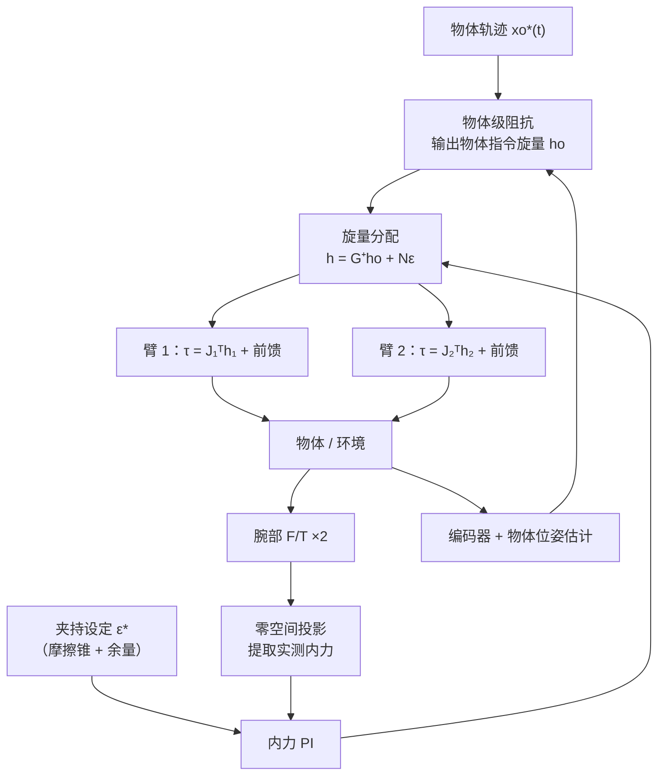

人形机器人和双臂工作站把一个老问题重新推到了台前：**两条机械臂共同抓着一个物体时，控制问题和单臂有本质区别**。区别不是"变成两倍"，而是变了性质——两臂通过物体连成一个**闭运动链**，此后任何一臂的指令错误都不再表现为位置误差，而是变成看不见的**内力**，大到可以捏碎工件或者触发力矩保护。

前面单臂的地基——[运动学](/posts/机械臂运动学/)、[动力学](/posts/机械臂动力学/)、[力控](/posts/阻抗控制与力控/)——在这里全都要用上，但要先补一块双臂特有的数学：协同任务空间和抓取矩阵。本文把这块补齐，每一步推导都走完。

## 1. 先算一笔自由度账

双臂协同分两档，难度完全不同：

- **松耦合**（goal-coordinated）：两手各拿各的零件去装配、一手扶一手拧。两臂只共享工作空间，不构成闭链——难点在规划（维度翻倍、臂间避碰），控制上仍是两个独立单臂；
- **紧耦合**（bimanual，物理耦合）：两手刚性共抓同一个物体。这是本文的主题。

紧耦合难在哪，一笔自由度账就能看出来。两台 6 轴臂共 **12 个驱动自由度**；被抓物体是刚体，只有 **6 个运动自由度**。刚性抓取意味着两个末端的位姿都被物体位姿完全决定——12 个末端速度坐标被压进一个 6 维子空间里。那么剩下的 $12 - 6 = 6$ 个自由度去哪了？

**它们没有消失，而是从"运动"变成了"力"**：6 个对物体运动毫无贡献、只在闭链内部互相较劲的力旋量方向——**内力**（internal wrench）。双臂控制的全部特殊性就浓缩在这 6 个维度上：用得好，它是夹持力，帮你抓稳物体；控不住，它是两台机器人在拔河。下面把这句话变成可计算的数学。

## 2. 协同任务空间：换一组坐标描述任务

最朴素的描述是两个末端位姿 $(\mathbf x_1, \mathbf x_2)$ 各自给轨迹。问题在于任务语义和这组坐标是**拧着的**："把箱子搬到那边"约束的是两手的共同运动，"别把箱子捏碎、别把它撕开"约束的是两手的相对运动——每一条任务约束都同时牵扯 $\mathbf x_1$ 和 $\mathbf x_2$。

Uchiyama 与 Dauchez 提出的对称式（symmetric formulation）换了一组坐标，让任务语义与坐标一一对应：

- **绝对位姿** $\mathbf x_a$：物体（或两末端连线中点）在世界系下的位姿——"搬到哪去"住在这里；
- **相对位姿** $\mathbf x_r$：末端 2 在末端 1 坐标系下的位姿——"捏多紧、会不会撕开"住在这里。刚性共抓时它理应恒定，**它的任何变化都意味着物体变形或抓取滑动**。

_把 12 维的两末端坐标换成 6+6 的绝对/相对坐标：搬运任务只写在绝对坐标上，夹持约束只写在相对坐标上_

### 相对速度的推导

相对位姿的平移部分是 $\mathbf p_r = \mathbf R_1^\top (\mathbf p_2 - \mathbf p_1)$（世界系差矢量转到末端 1 系）。求导需要 $\mathbf R_1^\top$ 的导数：由姿态运动学 $\dot{\mathbf R}_1 = [\boldsymbol\omega_1]_\times \mathbf R_1$ 转置得 $\dot{\mathbf R}_1^\top = -\mathbf R_1^\top [\boldsymbol\omega_1]_\times$（反对称矩阵转置变号）。乘积法则：

$$
\dot{\mathbf p}_r
= \dot{\mathbf R}_1^\top (\mathbf p_2 - \mathbf p_1) + \mathbf R_1^\top (\dot{\mathbf p}_2 - \dot{\mathbf p}_1)
= \mathbf R_1^\top \left[ (\dot{\mathbf p}_2 - \dot{\mathbf p}_1) - \boldsymbol\omega_1 \times (\mathbf p_2 - \mathbf p_1) \right]
$$

多出来的 $-\boldsymbol\omega_1 \times (\mathbf p_2 - \mathbf p_1)$ 一项说明：**末端 1 自转也会让"末端 2 相对我"的位置变化**，即使两者在世界系里都没有平移——观察者转身了。姿态部分 $\mathbf R_r = \mathbf R_1^\top \mathbf R_2$，同样求导并用恒等式 $\mathbf R^\top [\mathbf a]_\times \mathbf R = [\mathbf R^\top \mathbf a]_\times$ 整理：

$$
\dot{\mathbf R}_r = \mathbf R_1^\top \left( [\boldsymbol\omega_2]_\times - [\boldsymbol\omega_1]_\times \right) \mathbf R_2
= \left[ \mathbf R_1^\top (\boldsymbol\omega_2 - \boldsymbol\omega_1) \right]_\times \mathbf R_r
\quad\Longrightarrow\quad
\boldsymbol\omega_r = \mathbf R_1^\top (\boldsymbol\omega_2 - \boldsymbol\omega_1)
$$

把两式按 $\mathbf v_i = (\dot{\mathbf p}_i, \boldsymbol\omega_i)$ 堆叠，记 $\mathbf p_{21} = \mathbf p_2 - \mathbf p_1$：

$$
\mathbf v_r =
\underbrace{\begin{bmatrix} -\mathbf R_1^\top & \mathbf R_1^\top [\mathbf p_{21}]_\times \\ \mathbf 0 & -\mathbf R_1^\top \end{bmatrix}}_{\boldsymbol\Psi_1}
\mathbf v_1
+
\underbrace{\begin{bmatrix} \mathbf R_1^\top & \mathbf 0 \\ \mathbf 0 & \mathbf R_1^\top \end{bmatrix}}_{\boldsymbol\Psi_2}
\mathbf v_2
$$

代入各臂的[几何雅可比](/posts/机械臂运动学/) $\mathbf v_i = \mathbf J_i \dot{\mathbf q}_i$，就得到**相对雅可比**：

$$
\mathbf v_r = \mathbf J_r \begin{bmatrix} \dot{\mathbf q}_1 \\ \dot{\mathbf q}_2 \end{bmatrix},
\qquad
\mathbf J_r = \begin{bmatrix} \boldsymbol\Psi_1 \mathbf J_1 & \boldsymbol\Psi_2 \mathbf J_2 \end{bmatrix} \in \mathbb R^{6 \times 12}
$$

这个 $6\times 12$ 的矩阵是双臂版的"雅可比"：插装、开瓶盖、双手掰弯钢筋这类**只关心相对运动**的任务，直接对 $\mathbf x_r$ 做闭环（伺服律、DLS、零空间处理全部照搬单臂数值 IK 的那套），12 个关节自动分工。主从控制（leader-follower）是它的退化形式——冻结 $\dot{\mathbf q}_1$ 当领导，只用后 6 列解随动臂。

## 3. 闭链的两面：运动约束与抓取矩阵

现在让两手刚性抓住同一个刚体，闭链正式形成。它在速度侧和力侧各有一个表达，而且互为对偶。

### 速度侧：末端 twist 被物体 twist 决定

物体系原点（取质心）的 twist 为 $\mathbf v_o = (\dot{\mathbf p}_o, \boldsymbol\omega)$，抓取点 $i$ 相对质心的臂矢量为 $\mathbf r_i$。刚性抓取时末端与物体是同一个刚体，末端速度由刚体速度场给出（与[雅可比列公式](/posts/机械臂运动学/)是同一个公式）：抓取点线速度 $= \dot{\mathbf p}_o + \boldsymbol\omega \times \mathbf r_i$，角速度直接等于 $\boldsymbol\omega$。用 $\boldsymbol\omega \times \mathbf r_i = -[\mathbf r_i]_\times \boldsymbol\omega$ 写成矩阵：

$$
\mathbf v_i = \mathbf W_i\, \mathbf v_o,
\qquad
\mathbf W_i = \begin{bmatrix} \mathbf I & -[\mathbf r_i]_\times \\ \mathbf 0 & \mathbf I \end{bmatrix},
\qquad i = 1, 2
$$

两个末端共 12 个速度坐标，全部由 6 维的 $\mathbf v_o$ 决定——第 1 节那笔自由度账的速度侧兑现。

### 力侧：抓取矩阵从力平衡推出来

两臂经抓取点施加给物体的力旋量为 $\mathbf h_i = (\mathbf f_i, \mathbf m_i)$。对物体写牛顿-欧拉平衡：合力是两个力直接相加；对质心的合力矩除了 $\mathbf m_i$ 还有力的搬移项 $\mathbf r_i \times \mathbf f_i$：

$$
\mathbf h_o =
\begin{bmatrix} \mathbf f_1 + \mathbf f_2 \\ \mathbf m_1 + \mathbf m_2 + \mathbf r_1 \times \mathbf f_1 + \mathbf r_2 \times \mathbf f_2 \end{bmatrix}
=
\underbrace{\begin{bmatrix} \mathbf I & \mathbf 0 & \mathbf I & \mathbf 0 \\ [\mathbf r_1]_\times & \mathbf I & [\mathbf r_2]_\times & \mathbf I \end{bmatrix}}_{\mathbf G \,\in\, \mathbb R^{6\times 12}}
\begin{bmatrix} \mathbf f_1 \\ \mathbf m_1 \\ \mathbf f_2 \\ \mathbf m_2 \end{bmatrix}
= \mathbf G\, \mathbf h
$$

$\mathbf G$ 就是**抓取矩阵**（grasp matrix）。对照速度侧会发现 $\mathbf G = [\mathbf W_1^\top \; \mathbf W_2^\top]$（注意 $[\mathbf r]_\times^\top = -[\mathbf r]_\times$），这不是巧合，是虚功原理的要求：功率在两种描述下必须相等，

$$
\mathbf h_o^\top \mathbf v_o = \mathbf h^\top \begin{bmatrix} \mathbf v_1 \\ \mathbf v_2 \end{bmatrix} = \mathbf h^\top \mathbf G^\top \mathbf v_o
\quad \text{对一切 } \mathbf v_o \text{ 成立}
\quad\Longrightarrow\quad
\mathbf h_o = \mathbf G \mathbf h
$$

**速度用 $\mathbf G^\top$ 正着分发，力用 $\mathbf G$ 反着汇总**——和单臂的 $\boldsymbol\tau = \mathbf J^\top \mathbf F$ 是同一种对偶。

### 零空间：内力的显式形状

$\mathbf G$ 是 $6 \times 12$ 且行满秩，零空间维数 $12 - 6 = 6$——第 1 节那笔账的力侧兑现。零空间里的 $\mathbf h$ 满足 $\mathbf G \mathbf h = \mathbf 0$：**对物体的合力合力矩皆零，物体运动完全感觉不到它**。它甚至可以写出显式参数化：取任意 $(\mathbf f, \mathbf m) \in \mathbb R^6$，

$$
\mathbf h_{int}(\mathbf f, \mathbf m) =
\begin{bmatrix} \mathbf f \\ \mathbf m \\ -\mathbf f \\ -\mathbf m - (\mathbf r_1 - \mathbf r_2) \times \mathbf f \end{bmatrix}
$$

代入验证：合力 $\mathbf f - \mathbf f = \mathbf 0$；合力矩 $\mathbf m + \mathbf r_1 \times \mathbf f - \mathbf m - (\mathbf r_1 - \mathbf r_2) \times \mathbf f - \mathbf r_2 \times \mathbf f = \mathbf 0$。两个特例值得记住：$\mathbf f$ 沿两抓取点连线、$\mathbf m = \mathbf 0$，是**对挤**（夹持）；$\mathbf f = \mathbf 0$、$\mathbf m$ 任意，是**对扭**（一手正拧一手反拧）。

于是任何一组末端力旋量都可以唯一分解为"干活的"和"较劲的"两部分：

$$
\mathbf h = \underbrace{\mathbf G^{+} \mathbf h_o}_{\text{运动有效分量}} + \underbrace{\mathbf N \boldsymbol\varepsilon}_{\text{内力分量}}
$$

其中 $\mathbf N$ 的列张成 $\operatorname{null}(\mathbf G)$，$\boldsymbol\varepsilon \in \mathbb R^6$ 是内力坐标。伪逆解 $\mathbf G^{+}\mathbf h_o$ 是欧氏最小范数解，与零空间正交——**它是"完成同样的物体运动，内力为零"的那组分配**。

_(a) 最小范数分配恰好平衡重力、内力为零；(b) 叠加零空间对力后合外力不变，多出的是纯夹持。摩擦抓取（吸盘、夹爪没夹死）时必须主动加内力才抓得住——内力不是敌人，失控的内力才是_

一个诚实的脚注：$\mathbf h$ 里力（N）和力矩（N·m）单位不齐，"最小范数"依赖度量选择，伪逆分配在力矩维度上可能给出不符合直觉的结果（Erhart & Hirche 对此有系统分析）。工程上常用几何意义明确的**虚杆法**（virtual sticks）或加权伪逆代替裸伪逆，但"有效 + 内力"的分解结构不变。

## 4. 内力从哪来、能有多大

理想世界里两臂指令完全一致，内力全程可控。真实世界里，**任何让两臂"对物体形状的理解"不一致的因素，都在闭链里转化为内力**：

- **基座互标定误差**：两臂各自的运动学都准，但 $^{B_1}\mathbf T_{B_2}$ 差一点，两手就朝着差一点的两个位姿使劲——这是最大头，见[标定](/posts/机械臂标定/)；
- **时钟不同步**：两个控制器插补时刻错开 $\Delta t$，搬运速度 $v$ 下等效相对误差 $v \Delta t$——1 m/s 下错 5 ms 就是 5 mm，比标定误差还大，所以双臂必须共主站或用[分布式时钟](/posts/实时Linux与EtherCAT/)；
- **轨迹生成不一致**：两臂各自做笛卡尔插补，中间点的姿态插值路径不同（四元数 slerp 与欧拉角插值的差异就够了）；
- 物体并非完全刚性、抓取微滑——这些反而是天然的"减压阀"。

量一下有多大。设每臂笛卡尔刚度 $k$（位置环很硬的工业臂典型 $10^5 \sim 10^6$ N/m），两臂夹着刚性物体、指令相对误差 $\delta$：物体不可拉伸，两臂各让一半，各自偏离指令 $\delta/2$，内力

$$
F_{int} = k \cdot \frac{\delta}{2} = \frac{k_1 k_2}{k_1 + k_2}\,\delta \;\Big|_{k_1 = k_2 = k}
$$

取 $k = 2 \times 10^5$ N/m、$\delta = 2$ mm：$F_{int} = 200$ N——足以压弯薄壁件、让吸盘脱开、或触发[碰撞检测](/posts/碰撞检测与协作安全/)急停。**纯位置控制的双臂刚性共抓在工程上不成立**，这不是调参能解决的，是结构问题。

出路和[力控那篇](/posts/阻抗控制与力控/)的结论一致：在相对方向上放弃刚度。最简单的版本是给其中一臂加**相对导纳**——测得内力 $F$ 后让参考位置以 $\dot x_{off} = F / D$ 退让。代入 $F = k_{eff}(\delta - x_{off})$ 得一阶闭环：

$$
\dot F = k_{eff}\left(\dot\delta - \frac{F}{D}\right)
\quad\Longrightarrow\quad
\tau = \frac{D}{k_{eff}}, \qquad F_{steady} = D\,\dot\delta
$$

时间常数 $\tau$ 由导纳阻尼与闭链刚度之比决定；稳态内力只正比于**误差的增长速度**而不是误差本身。同样 2 mm 的误差斜坡，$D = 2000$ N·s/m 时内力峰值约 2 N，比纯位置控制低两个数量级：

_同样 2 mm 的相对指令误差：纯位置控制的内力爬到 200 N 并永久保持；相对方向加导纳后内力被压在个位数，误差停止增长后自动泄掉。注意纵轴是对数_

## 5. 组装：物体级阻抗 + 内力控制

把前面的零件拼成完整控制器。业界主流是**物体级阻抗**（object-level impedance）加**内力回路**的分层结构，思路是把[单臂阻抗控制](/posts/阻抗控制与力控/)整体提升一个层级——受控的"末端"从法兰变成被抓物体：

**第一层：物体阻抗。**给物体规划轨迹 $\mathbf x_o^*(t)$，让物体对环境呈现期望阻抗：

$$
\boldsymbol\Lambda_d \Delta\dot{\mathbf v}_o + \mathbf D_d \Delta\mathbf v_o + \mathbf K_d \Delta\mathbf x_o = \mathbf h_{env}
$$

由物体的牛顿-欧拉方程反解出两臂需要共同施加的旋量 $\mathbf h_o^{cmd}$（含物体重力与惯性前馈——物体质量属性可以让双臂自己辨识，方法同[动力学参数辨识](/posts/机械臂动力学/)）。

**第二层：旋量分配。**用第 3 节的分解合成各臂指令：

$$
\mathbf h^{cmd} = \mathbf G^{+} \mathbf h_o^{cmd} + \mathbf N \boldsymbol\varepsilon^{cmd}
$$

$\boldsymbol\varepsilon^{cmd}$ 由内力回路给出：从两个腕部力传感器读数中投影出实测内力（用 $\mathbf I - \mathbf G^{+}\mathbf G$ 投影到零空间），对夹持设定值做 PI——摩擦抓取时设定值由摩擦锥算出（吸盘/平行爪需要多大正压力才不滑），刚性工装夹持时设定为小的正值防松。

**第三层：单臂执行。**力矩控制臂直接 $\boldsymbol\tau_i = \mathbf J_i^\top \mathbf h_i^{cmd} + \text{动力学前馈}$；只有位置接口的臂退化为导纳实现（第 4 节），性能差一档但结构相同。

这套结构的美妙之处在于**关注点分离**：搬运精度归物体阻抗层管，抓取安全归内力层管，两层通过 $\mathbf G$ 的值域/零空间正交分解互不打架——正是第 1 节那笔自由度账在控制架构上的投影。

## 6. 工程清单

理论之外，双臂系统还有几件必须做对的事：

- **基座互标定**：让两臂末端互相接触共同的标定球/规，或共同观测同一标定板，解 $^{B_1}\mathbf T_{B_2}$（数学同[手眼标定的 AX=XB](/posts/机械臂标定/)）。精度预算直接从内力反推：想把纯位置段的内力压在 20 N 以下、闭链刚度 $10^5$ N/m，互标定就要好于 0.2 mm——**比单臂应用的标定要求高一个档次**，这也是"共享躯干的人形构型更容易做协同"的原因之一（两臂外参变成同一条运动学链的一部分，但躯干柔性会顶替它成为新误差源）；
- **同步**：两臂必须在同一实时域里插补——同一控制进程，或 [EtherCAT 分布式时钟](/posts/实时Linux与EtherCAT/)下的同一主站。"两台各自跑 TCP 通信的控制柜"做不了紧耦合协同；
- **臂间避碰**：规划空间从 6 维变 12 维，[采样式规划](/posts/采样式路径规划/)照常工作但自碰撞检查对数暴涨，臂-臂对要用扫掠体或距离场加速；在线层面用两臂距离触发速度尺度化兜底；
- **负载分摊**：$\mathbf G^{+}$ 默认均摊，接近奇异或力矩饱和的那条臂应该少扛——把伪逆换成加权伪逆 $\mathbf G_W^{+} = \mathbf W^{-1}\mathbf G^\top (\mathbf G \mathbf W^{-1} \mathbf G^\top)^{-1}$，权重取各臂的可操作度或力矩余量。

## 7. 小结

1. 双臂紧耦合的全部特殊性来自一笔自由度账：12 个驱动自由度对 6 个物体自由度，多出的 6 维不是运动而是**内力**。
2. 协同任务空间把任务语义对齐到坐标上：绝对位姿管搬运，相对位姿管夹持；相对雅可比 $[\boldsymbol\Psi_1\mathbf J_1 \;\; \boldsymbol\Psi_2\mathbf J_2]$ 让 12 个关节对相对任务自动分工。
3. 抓取矩阵 $\mathbf G$ 从力平衡推出、与速度约束 $\mathbf G^\top$ 虚功对偶；其 6 维零空间就是内力空间，可显式参数化、可投影测量、可闭环控制。
4. 纯位置双臂共抓在结构上不成立：毫米级标定误差 × 闭链刚度 = 数百牛内力。相对方向必须有柔性，导纳是最低配置。
5. 完整方案 = 物体级阻抗（管运动）+ 零空间内力 PI（管夹持）+ $\mathbf G$ 的正交分解（保证两者不打架）。

## 参考

- M. Uchiyama, P. Dauchez. *A Symmetric Hybrid Position/Force Control Scheme for the Coordination of Two Robots*. ICRA 1988.（对称式协同任务空间的出处）
- P. Chiacchio, S. Chiaverini, B. Siciliano. *Direct and Inverse Kinematics for Coordinated Motion Tasks of a Two-Manipulator System*. ASME JDSMC, 1996.
- F. Caccavale, M. Uchiyama. *Cooperative Manipulation*. Springer Handbook of Robotics, 2nd ed., ch. 39.（本领域最好的综述）
- A. Erhart, S. Hirche. *Internal Force Analysis and Load Distribution for Cooperative Multi-Robot Manipulation*. IEEE T-RO, 2015.（内力分解的度量问题）
- C. Smith et al. *Dual Arm Manipulation — A Survey*. RAS, 2012.
