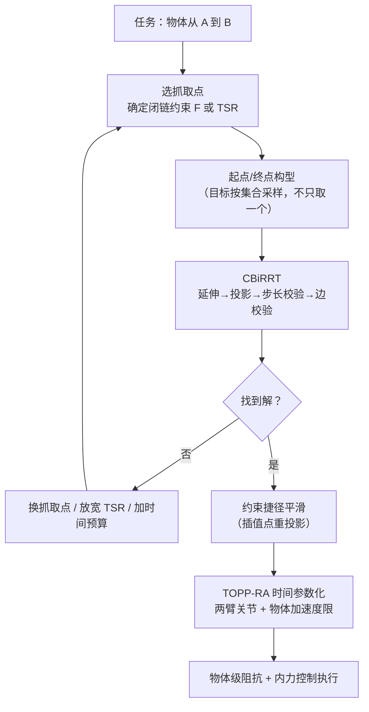

[上一篇](/posts/双臂协同操作/)讲清了双臂闭链的力学：抓取矩阵、内力、物体级阻抗。但它回避了一个更前置的问题——**两臂共抓着物体，从 A 到 B 的那条无碰路径，是怎么算出来的？**

答案不是"把[单臂 RRT](/posts/采样式路径规划/) 的维数从 6 改成 12"。闭链约束会让标准采样式规划器的成功率**精确地等于零**——不是低，是零。本文推导为什么，以及绕开它的两类算法。

文中所有数字都来自一套可复现的平面双臂实现（两条 4R 平面臂，连杆 $[0.34, 0.28, 0.20, 0.14]$ m，基座 $\pm 0.50$ m，共抓一根 $0.30$ m 的杆，两个圆形障碍）。构型维数 $n = 8$，闭链约束 $m = 3$，所以约束流形是 5 维的。

## 1. 为什么标准 RRT 会失效

刚性共抓的约束写成等式：末端 2 的位姿必须等于末端 1 的位姿右乘一个常量变换。写成残差形式

$$
F(\mathbf q) =
\begin{bmatrix}
\mathbf p_2(\mathbf q_2) - \mathbf p_1(\mathbf q_1) - \mathbf R_1(\mathbf q_1)\,{}^{1}\mathbf p_{12} \\[2pt]
\log\!\left(\mathbf R_1^\top(\mathbf q_1)\,\mathbf R_2(\mathbf q_2)\,{}^{1}\mathbf R_{12}^\top\right)^\vee
\end{bmatrix}
= \mathbf 0
\;\in\; \mathbb R^{m}
$$

空间双臂 $m = 6$，平面 $m = 3$。满足它的构型集合

$$
\mathcal M = \{\mathbf q \in \mathcal Q : F(\mathbf q) = \mathbf 0\}
$$

是构型空间里的一个 $(n-m)$ 维**子流形**。而采样式规划器的每一步都建立在"随机采一个 $\mathbf q$，它以正概率有用"之上——对低维子流形，这个前提崩了：$\mathcal M$ 在 $\mathcal Q$ 中的勒贝格测度为零，随机采样落在上面的概率是 $0$。

这不是理论洁癖。在上面那套平面双臂上做 12 万次均匀采样，用 $10^{-3}$ 的容差判定"落在流形上"：


_(a) 12 万次均匀采样，命中 0 次；整批样本里最接近的一个残差还有 0.050，离容差差着两个数量级。(b) 同一批点做牛顿投影，40/40 全部落上流形，中位 6 次迭代。残差为位置（m）与角度（rad）的混合范数_

所以路线只有一条：**不要指望采样落在流形上，要有办法把任意一点搬到流形上去**。

## 2. 投影算子：把点搬到流形上

### 2.1 推导

给定任意 $\mathbf q$，要找附近满足 $F(\mathbf q) = \mathbf 0$ 的点。这是个非线性方程组，用牛顿法。一阶展开

$$
F(\mathbf q + \Delta\mathbf q) \approx F(\mathbf q) + \mathbf J_F(\mathbf q)\,\Delta\mathbf q,
\qquad
\mathbf J_F = \frac{\partial F}{\partial \mathbf q} \in \mathbb R^{m \times n}
$$

令右边为零：$\mathbf J_F \Delta\mathbf q = -F(\mathbf q)$。这是**欠定**方程组（$m < n$），解不唯一；取最小范数解就是伪逆，于是迭代格式为

$$
\boxed{\;\mathbf q \leftarrow \mathbf q - \mathbf J_F^{+}\, F(\mathbf q)\;}
$$

取最小范数解有明确的几何含义：$\mathbf J_F^{+}$ 的值域与 $\operatorname{null}(\mathbf J_F)$ 正交，而 $\operatorname{null}(\mathbf J_F)$ 正是流形的切空间——**每一步修正都垂直于流形走，不在流形方向上乱跑**，所以投影点落在原点附近而不是被甩到远处。

这里的 $\mathbf J_F$ 不是新东西：$F$ 就是相对位姿误差，它的雅可比正是[上一篇推导的相对雅可比](/posts/双臂协同操作/) $\mathbf J_r = [\boldsymbol\Psi_1 \mathbf J_1 \;\; \boldsymbol\Psi_2 \mathbf J_2]$（差一个符号约定）。**力学篇里推的那个矩阵，在规划篇里变成了投影算子的核心**。

近奇异时 $\mathbf J_F$ 丢秩，伪逆爆炸，实现上一律用[阻尼最小二乘](/posts/机械臂运动学/)代替：

$$
\Delta\mathbf q = -\mathbf J_F^\top\left(\mathbf J_F \mathbf J_F^\top + \lambda^2 \mathbf I\right)^{-1} F(\mathbf q)
$$

$\lambda^2$ 取 $10^{-6}$ 量级即可——它不影响正常情况的二次收敛，只在丢秩时把步长压住。

```python
def project(q, tol=1e-6, max_iter=60, damping=1e-6):
    """Newton projection onto {q : F(q) = 0}."""
    for _ in range(max_iter):
        F = constraint(q)
        if np.linalg.norm(F) < tol:
            return q, True
        JF = constraint_jac(q)                      # m x n
        # damped least squares: minimum-norm step, safe at rank loss
        dq = JF.T @ np.linalg.solve(JF @ JF.T + damping * np.eye(len(F)), F)
        q = q - dq
    return q, np.linalg.norm(constraint(q)) < tol
```

上图 (b) 就是这段代码的实测：牛顿法的二次收敛在对数坐标上表现为**斜率越来越陡**的下坠，典型 5~8 次迭代把残差从 $10^0$ 打到 $10^{-10}$ 以下。单次投影的成本是 $k$ 次（正解 + 雅可比 + 一个 $m\times m$ 求解），$m$ 很小（3 或 6），所以投影很便宜——这是整套方法可行的前提。

### 2.2 一个必须做的检查：步长上限

投影收敛不等于结果可用。牛顿法只保证"找到流形上的某个点"，不保证"找到的点离出发点近"：初值不好时它可能沿着流形滑出很远。如果直接把这样的点连到树上，这条边表示的运动**在流形上根本不是一条短路径**，后续插值执行时会撞上没检查过的区域。

所以投影后必须验一道：

$$
\|\mathbf q_{new} - \mathbf q_{near}\| \le \kappa \cdot \epsilon
\qquad (\kappa \approx 2)
$$

超了就丢弃这次延伸。这一步在文献里叫 projection step limit，是 CBiRRT 实现里最容易漏掉、漏掉之后表现为"规划出来的路径执行时莫名其妙撞了"的经典坑。


_三步走：定长延伸到流形外，牛顿投影拉回流形，再检查落点没被甩远。切空间 $\mathrm{null}(J_F)$ 是另一类算法（切空间法）的采样空间_

## 3. CBiRRT：把投影塞进双向 RRT

有了投影算子，剩下的是把它嵌进 RRT 的骨架。Berenson 等人的 CBiRRT2 是事实标准，核心只改了 `extend` 一个函数：

```python
def extend(tree, q_target, eps, cap=2.0):
    q_near = tree.nearest(q_target)
    q_new = steer(q_near, q_target, eps)        # ① 定长延伸（可能离开流形）
    q_new, ok = project(q_new)                  # ② 投影回流形
    if not ok:
        return None                             #    投影发散
    if norm(q_new - q_near) > cap * eps:
        return None                             # ③ 落点被甩太远，丢弃
    if not edge_valid(q_near, q_new):
        return None                             # ④ 沿边插值逐点检查
    return tree.add(q_new, parent=q_near)
```

其余部分——双向生长、交替扩展、连接判据——和普通 [RRT-Connect](/posts/采样式路径规划/) 完全一样。三个实现细节决定成败：

**边校验必须逐点重投影。**`edge_valid` 在关节空间做线性插值，插值点**不在流形上**（流形是弯的），必须每个点重新投影再做碰撞检测：

```python
def edge_valid(qa, qb, res=0.04):
    n = max(2, ceil(norm(qb - qa) / res))
    for s in np.linspace(0, 1, n + 1):
        q, ok = project(qa + s * (qb - qa))     # 插值点先回流形
        if not ok or not collision_free(q):
            return False
    return True
```

这也解释了为什么约束规划比无约束规划慢一个量级：碰撞检测的每一次调用前面都挂着一次投影。

**连接判据要配合投影容差。**普通 RRT-Connect 判断两棵树接上用的是"距离小于 $\epsilon$"，而这里每个节点都被投影扰动过，判据太严会导致明明已经接上却认不出来。我第一版把阈值设成 $10^{-3}$，结果是 4000 次迭代、1174 个节点、**一次都没连上**；放宽到 $10^{-2}$ 后同一个问题 283 次迭代就解出来了。这个坑值得单独记一笔。

**采样域仍然是全空间。**采样点本来就不需要在流形上——它只用来提供一个"往哪长"的方向，投影会负责把结果拉回来。

在前面那套平面双臂上跑这个规划器（起点物体在障碍下方、终点在上方，两障碍之间的缝隙是唯一通道），20 个随机种子的结果：**成功率 20/20，中位耗时 0.59 s（最快 0.17 s，最慢 6.58 s），中位 335 次迭代**。耗时的长尾分布是采样式规划的固有特征——它是概率完备算法，不是确定性算法。


_(a) 求得的解：物体从下方穿过障碍间隙到上方，两臂各自绕过障碍外侧。(b) 自运动：物体位姿完全锁死（全程漂移 7 nm）时，两臂仍能重构——这是 5 维流形比 3 维物体位姿多出来的那 2 个自由度_

## 4. 约束不总是等式：TSR

刚性共抓是等式约束，但真实任务的约束大多是**带区间的**：端一杯水要求杯口朝上（roll、pitch 必须为零），但绕竖直轴转多少无所谓；两手抬一块板允许板在手里有几毫米的相对滑动。

Task Space Regions（TSR）用一个盒子把这类约束参数化。约束由三元组 $({}^{0}\mathbf T_w,\; {}^{w}\mathbf T_e,\; \mathbf B_w)$ 描述：$w$ 是任务参考系，$\mathbf B_w \in \mathbb R^{6\times 2}$ 给出六个自由度各自的上下界。距离函数就是"位姿偏差被裁剪到盒子外的部分"：

$$
\mathbf d(\mathbf q) = \operatorname{clamp}\big(\mathbf x_w(\mathbf q),\; \mathbf B_w\big),
\qquad
\operatorname{clamp}(x_i) =
\begin{cases}
x_i - B_{i,\min} & x_i < B_{i,\min} \\
0 & B_{i,\min} \le x_i \le B_{i,\max} \\
x_i - B_{i,\max} & x_i > B_{i,\max}
\end{cases}
$$

投影迭代原封不动地用 $\mathbf d$ 代替 $F$——**盒子内部残差为零，牛顿法自然不动它**。代价是约束流形变成了带厚度的"约束集"，$\mathcal M$ 不再是零测集，采样命中率也不再为零（但通常仍然极低，投影依旧是主力）。

这个表示的实用价值在于统一：刚性共抓是所有界都取零的 TSR；单臂抓取的绕轴自由是一个界放开的 TSR；"末端保持在桌面上方 10 cm 内"是位置界的 TSR。规划器只认 $\mathbf d(\mathbf q)$ 和 $\partial \mathbf d/\partial \mathbf q$，任务语义全部塞进 $\mathbf B_w$。

## 5. 另一条路：切空间法

投影法的浪费在于"先走出去再拉回来"，靠近流形高曲率区时投影迭代次数上升、落点被甩远的概率也上升。切空间法（AtlasRRT、TangentBundleRRT）反过来：**先在切空间里走，再做一次小的回缩**。

在当前点 $\mathbf q_k$ 上取切空间基 $\mathbf U_k$（$\mathbf J_F$ 的零空间正交基，$n\times(n-m)$，SVD 顺手得到），在这个 $(n-m)$ 维**欧氏**空间里采样方向 $\mathbf u$，走一步再回缩：

$$
\mathbf q_{tan} = \mathbf q_k + \epsilon\, \mathbf U_k \mathbf u,
\qquad
\mathbf q_{new} = \operatorname{retract}(\mathbf q_{tan})
$$

两者的权衡很清楚：

| | 投影法（CBiRRT） | 切空间法（Atlas/TB-RRT） |
|---|---|---|
| 实现复杂度 | 低，改一个 `extend` | 高，要维护图集与切片边界 |
| 单步成本 | 一次牛顿迭代（5~8 步） | 一次 SVD + 一两步回缩 |
| 高曲率区 | 投影失败率上升 | 切片变小、图集变密，仍稳定 |
| 采样均匀性 | 偏向低曲率区 | 在流形上更均匀 |
| 工程现状 | OMPL、OpenRAVE 默认 | 研究成熟、工程用得少 |

对绝大多数双臂任务，投影法够用且实现成本低得多——这也是它成为事实标准的原因。切空间法的价值在流形曲率大、投影频繁失败的场景（例如带闭链的多指手内操作）。

## 6. 冗余、自运动与目标构型的选择

约束流形的维数是 $n - m$，而物体位姿只有 6 维（平面 3 维）。两条 7 轴臂共抓时 $14 - 6 = 8 > 6$：**流形上还剩 2 个自由度，它们不改变物体位姿，只改变手臂的姿态**。这就是上面图 (b) 展示的自运动——物体锁死在原地（7 nm 漂移），两臂仍在重构。

自运动方向由两个雅可比同时定义：既要留在流形上（$\mathbf J_F \dot{\mathbf q} = \mathbf 0$），又要物体不动（$\mathbf J_{obj}\dot{\mathbf q} = \mathbf 0$）：

$$
\dot{\mathbf q} \in \operatorname{null}\!\left(\begin{bmatrix} \mathbf J_F \\ \mathbf J_{obj} \end{bmatrix}\right),
\qquad \dim = n - m - 6
$$

这个自由度是白送的资源，规划阶段有三个用法：**远离关节限位**（长距离搬运中途手臂会走到限位附近，自运动可以"倒手"而不动物体）；**远离奇异**（提高可操作度，让[后续的力控](/posts/阻抗控制与力控/)有余量）；**避开臂间自碰**。

它还带来一个容易被忽略的后果：**目标构型不唯一**。给定目标物体位姿，满足它的构型是一个 $(n-m-6)$ 维连续集合，外加多个 IK 分支。只挑一个当目标，会让双向 RRT 的目标树退化成一个点；正确做法是**把目标当成集合采样**——每次需要目标构型时，从这个集合里随机取一个种子做 IK。这在难题上的成功率差异往往是数量级的。

## 7. 双臂特有的碰撞检测

单臂规划的碰撞检测是"臂 vs 环境"；双臂多出两块，而且都不便宜：

- **臂间自碰**：两臂各 $n_l$ 个连杆，$n_l^2$ 对；加上物体与两臂、物体与环境。相邻抓取的末端连杆对要在允许碰撞矩阵（ACM）里屏蔽掉，否则它们永远"碰撞"；
- **连续碰撞**：两臂相向运动时相对速度可以是单臂的两倍，离散插值的漏检风险随之翻倍。要么把插值分辨率取得足够细（我的实现取关节空间 0.04 rad），要么用扫掠体/保守推进（conservative advancement）做连续检测。

加速的通用手段：胶囊体近似连杆（点-线段距离有闭式解，比网格 BVH 快一到两个数量级）、按包围球先做粗筛、把"上一次最近的一对连杆"缓存下来做时序相干性剪枝。

## 8. 后处理：平滑与时间参数化

RRT 输出的是锯齿状折线，不能直接执行。约束下的捷径平滑（shortcut）和单臂版本只差一点，但那一点是关键：

```python
def shortcut(path, rounds=200):
    for _ in range(rounds):
        i, j = sorted(random.sample(range(len(path)), 2))
        if j - i < 2:
            continue
        if edge_valid(path[i], path[j]):        # 内部逐点重投影
            path = path[:i + 1] + path[j:]
    return path
```

差别就在 `edge_valid` 里那次重投影：**捷径的两端在流形上，中间的直线插值不在**，不重投影就会得到一条"看起来更短、执行时脱离闭链"的假捷径。在我的实现上，220 轮捷径把 36 个路点压到 5 个，关节空间路径长度从 6.05 rad 降到 4.40 rad（−27%），加密后 112 个构型全部无碰、最大约束残差 $8.7\times10^{-7}$。

平滑后交给 [TOPP-RA](/posts/TOPP-RA-原理解析/) 做时间参数化——注意速度/加速度限制要**同时**加在两臂的关节上，还要考虑物体的加速度限制（端一杯水时 $\ddot{\mathbf x}_o$ 有上界）。最后由[上一篇](/posts/双臂协同操作/)的物体级阻抗控制器执行，规划器留下的毫米级约束残差由内力回路吸收。



## 9. 什么时候不需要这套东西

诚实地说：**如果两臂都不冗余、抓取固定、IK 分支不需要切换，直接在物体位姿空间（6 维）里规划、再对每个路点求闭链 IK，就够了**，而且快得多。此时约束流形恰好被物体位姿全局参数化，等价于在 $SE(3)$ 里做普通规划。

需要动用流形规划的是这几种情况：两臂冗余（7 轴，流形维数大于 6，自运动是可用资源甚至必需品）；长距离搬运中途必须切换 IK 分支或"倒手"；关节限位/自碰让某些物体位姿只在特定构型分支下可达（这正是本文算例的情形——物体位姿相同，有的构型能过缝、有的过不去）；约束是 TSR 而非等式。

判断方法很简单：先试解耦法，把它的失败率量出来；失败集中在"IK 找不到无碰解"而不是"物体路径找不到"时，就该上流形规划。

## 10. 小结

1. 闭链把可行集压成零测子流形，均匀采样命中率**精确为零**（实测 0/120000），这是标准 RRT 失效的根因，不是调参问题。
2. 投影算子 $\mathbf q \leftarrow \mathbf q - \mathbf J_F^{+}F(\mathbf q)$ 是整套方法的支点；取最小范数解使修正垂直于流形，用 DLS 保证近奇异时不炸。$\mathbf J_F$ 就是力学篇的相对雅可比。
3. CBiRRT 只改 `extend`，但三个细节必须做对：投影步长上限、边校验内部重投影、连接判据配合投影容差（实测这一项就是"永远连不上"与"283 次迭代解出"的区别）。
4. TSR 把等式约束推广成带界的约束集，让"杯口朝上但可绕轴转"这类任务用同一套投影代码处理。
5. 流形维数 $n-m$ 通常大于物体位姿维数，多出来的自运动是规划期可用的资源（避限位、避奇异、避自碰），并且意味着**目标构型是集合而非点**。
6. 后处理的捷径平滑必须在插值点重投影，否则得到的是脱离闭链的假捷径。

## 参考

- D. Berenson, S. Srinivasa, D. Ferguson, J. Kuffner. *Manipulation Planning on Constraint Manifolds*. ICRA 2009.（CBiRRT 与 TSR 的出处）
- D. Berenson, S. Srinivasa, J. Kuffner. *Task Space Regions: A Framework for Pose-Constrained Manipulation Planning*. IJRR, 2011.
- L. Jaillet, J. M. Porta. *Path Planning under Kinematic Constraints by Rapidly Exploring Manifolds*. IEEE T-RO, 2013.（AtlasRRT）
- B. Kim, T. T. Um, C. Suh, F. C. Park. *Tangent Bundle RRT*. IJRR, 2016.
- Z. Kingston, M. Moll, L. E. Kavraki. *Sampling-Based Methods for Motion Planning with Constraints*. Annual Review of Control, Robotics, and Autonomous Systems, 2018.（最好的综述，把各家方法统一到"约束流形"框架下）
