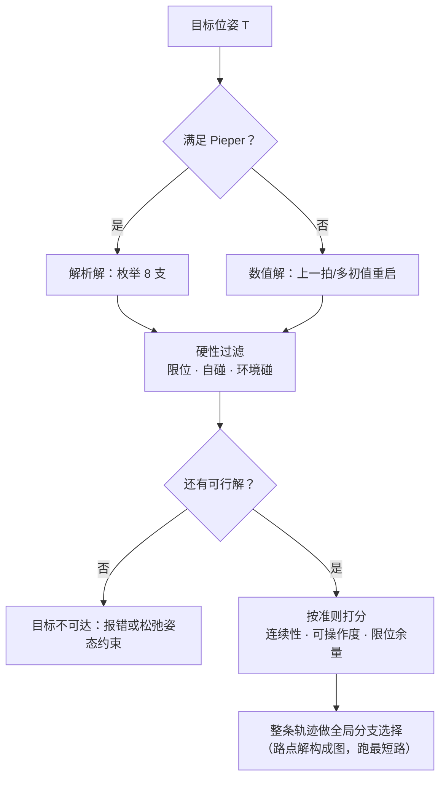

[运动学那篇](/posts/机械臂运动学/)把逆解压缩在两节里讲完了，留下不少"结论给了但没推"的地方：8 组解到底怎么来的、数值法为什么会收敛到一个用不了的构型、阻尼系数该怎么选。这篇把逆运动学单独摊开，每一步代数都走完。

正解 $\mathbf T = f(\mathbf q)$ 是把关节角代进去连乘矩阵，没有任何选择余地。逆解 $\mathbf q = f^{-1}(\mathbf T)$ 是解一个**非线性方程组**，它和正解有三处本质不对称：

- **解可能不存在**：目标在工作空间外，或者姿态可达但位置不可达；
- **解通常不唯一**：6 轴臂一般位形下最多 16 组解，球腕构型 8 组，7 轴冗余臂无穷多组；
- **解不连续依赖于目标**：目标位姿连续变化时，某一支解可能突然消失或跳变。

这三条决定了逆解的工程形态：**它不是一个函数，而是一次带选择的搜索**。

本文所有数据来自一套可复现的 6R 球腕臂实现（标准 DH：$d_1{=}0.33$、$a_2{=}0.43$、$a_3{=}0.02$、$d_3{=}0.15$、$d_4{=}0.43$、$d_6{=}0.08$，含肩部偏置）。

## 1. Pieper 条件：为什么"最后三轴交于一点"如此重要

6 个未知数、6 个方程，直接硬解是一个 6 元非线性方程组，一般情况下没有闭式解。**Pieper 条件**给出了有闭式解的充分条件：相邻三个关节轴交于一点，或三轴平行。工业臂几乎清一色采用前者——最后三个轴交于一点，构成**球腕**。

球腕为什么能救命？因为它让**位置和姿态解耦**。设末端位姿为 $\mathbf T = \begin{bmatrix} \mathbf R & \mathbf p \\ \mathbf 0 & 1\end{bmatrix}$，腕心（三轴交点）位置为

$$
\mathbf p_w = \mathbf p - d_6\,\mathbf z_e
$$

其中 $\mathbf z_e = \mathbf R\,\hat{\mathbf e}_3$ 是末端 z 轴，$d_6$ 是腕心到法兰的距离。这个式子的关键性质是：**$\mathbf p_w$ 只由目标位姿决定，与关节角无关**；同时，关节 4、5、6 的转动**不改变腕心位置**（它们都绕过腕心的轴转动）。

于是 6 元方程组裂成两个 3 元问题：

$$
\underbrace{\mathbf p_w = g(q_1, q_2, q_3)}_{\text{位置子问题}}
\qquad\Longrightarrow\qquad
\underbrace{\mathbf R_3^6 = (\mathbf R_0^3)^\top \mathbf R}_{\text{姿态子问题}}
$$

先由腕心解出前三个关节，再把前三关节造成的姿态"除掉"，剩下的姿态全部交给腕部三轴。下面逐个击破。

## 2. 位置子问题：解出前三个关节

### 2.1 $q_1$：肩部偏置带来的两支

如果机器人没有肩部偏置，$q_1 = \operatorname{atan2}(y_w, x_w)$ 就完了。但真实工业臂几乎都有偏置 $d_3$（本文模型取 0.15 m），它让手臂平面**偏离基座回转轴**，$q_1$ 的求解也随之复杂一档。

先看几何。关节 1 转动后，$z_1$ 轴的方向是水平的、垂直于手臂平面的径向：

$$
\mathbf z_1 = (-\sin q_1,\; \cos q_1,\; 0)
$$

腕心的位置可以分解成"沿径向走 $R$，再沿 $\mathbf z_1$ 偏移 $d_3$，加上竖直分量"：

$$
\begin{aligned}
x_w &= R\cos q_1 - d_3 \sin q_1 \\
y_w &= R\sin q_1 + d_3 \cos q_1
\end{aligned}
$$

两式平方相加，交叉项消掉，得到一个只含 $R$ 的关系：

$$
x_w^2 + y_w^2 = R^2 + d_3^2
\qquad\Longrightarrow\qquad
R = \pm\sqrt{x_w^2 + y_w^2 - d_3^2}
$$

**正负号就是"左手/右手"（lefty/righty）两个肩部分支**。再把上面两式看成一个旋转关系——$(x_w, y_w)$ 是 $(R, d_3)$ 绕原点转过 $q_1$ 的结果，所以辐角相减：

$$
\boxed{\;q_1 = \operatorname{atan2}(y_w,\, x_w) - \operatorname{atan2}(d_3,\, R)\;}
$$

顺带得到两个重要推论：根号内为负（$x_w^2 + y_w^2 < d_3^2$）时**无解**——腕心落进了半径为 $d_3$ 的"死区圆柱"里；根号为零时两支合并，这就是**肩部奇异**。

### 2.2 $q_2, q_3$：平面 2R 子问题

选定 $q_1$ 和 $R$ 的符号后，问题降维到手臂平面内的一个 2R 问题。平面内的坐标是

$$
r' = R - a_1, \qquad s = z_w - d_1
$$

两段"连杆"分别是大臂 $a_2$ 和**折线前臂**——注意前臂由 $a_3$ 和 $d_4$ 两段垂直的偏置组成，等效长度和固有偏角为

$$
l_2 = \sqrt{a_3^2 + d_4^2},
\qquad
\phi = \operatorname{atan2}(a_3,\, d_4)
$$

对这个 2R 用余弦定理。设肘部夹角为 $\beta$（大臂与等效前臂的夹角），腕心到肩部的距离平方为 $\rho^2 = r'^2 + s^2$：

$$
\cos\beta = \frac{\rho^2 - a_2^2 - l_2^2}{2\,a_2\,l_2}
$$

$|\cos\beta| > 1$ 说明腕心超出可达范围（太远或太近），该分支无解。否则

$$
\beta = \pm\arccos(\cdot)
$$

**这个正负号就是"肘上/肘下"两个分支**。有了 $\beta$，肩部角由两部分组成——目标方向的仰角 $\gamma$，减去大臂相对目标连线的夹角 $\delta$：

$$
\gamma = \operatorname{atan2}(s,\, r'),
\qquad
\delta = \operatorname{atan2}\big(l_2 \sin\beta,\; a_2 + l_2\cos\beta\big)
$$

$\delta$ 的形式来自把等效前臂投影到"垂直/平行于大臂"两个方向。最后按本文 DH 的正方向约定（$\alpha_1 = -90°$ 使得关节 2 的正转方向与平面内的仰角反号）：

$$
\boxed{\;q_2 = -(\gamma - \delta),\qquad q_3 = -\Big(\beta - \phi + \tfrac{\pi}{2}\Big)\;}
$$

$q_3$ 里的 $-\phi + \pi/2$ 是把"等效前臂方向"换算回"关节 3 的零位定义"的常数修正——它只依赖 DH 参数，与目标无关。

到这里位置子问题结束，共 $2 \times 2 = 4$ 组 $(q_1, q_2, q_3)$。

## 3. 姿态子问题：腕部三轴

前三关节确定后，$\mathbf R_0^3$ 是已知的，于是

$$
\mathbf R_3^6 = \left(\mathbf R_0^3\right)^\top \mathbf R
$$

现在要把这个已知旋转矩阵分解成三次关节转动。对本文的 DH（$\alpha_4 = +90°,\ \alpha_5 = -90°,\ \alpha_6 = 0$）：

$$
\mathbf R_3^6 = \mathbf R_z(q_4)\,\mathbf R_x(90°)\,\mathbf R_z(q_5)\,\mathbf R_x(-90°)\,\mathbf R_z(q_6)
$$

中间那段是一个**共轭**：$\mathbf R_x(90°)\mathbf R_z(q_5)\mathbf R_x(-90°)$ 表示"把绕 $z$ 的转动搬到绕 $\mathbf R_x(90°)\hat{\mathbf z} = -\hat{\mathbf y}$ 的转动"，即 $\mathbf R_y(-q_5)$。所以

$$
\mathbf R_3^6 = \mathbf R_z(q_4)\,\mathbf R_y(-q_5)\,\mathbf R_z(q_6)
$$

**这是一个标准 ZYZ 欧拉分解**，中间角为 $-q_5$。展开 ZYZ 的矩阵元（记 $\mathbf R_3^6$ 的元素为 $R_{ij}$，$i,j$ 从 0 计）：

$$
R_{22} = \cos q_5,\quad
R_{02} = -\cos q_4 \sin q_5,\quad
R_{12} = -\sin q_4 \sin q_5,\quad
R_{20} = \sin q_5\cos q_6,\quad
R_{21} = -\sin q_5 \sin q_6
$$

由第三列的前两个元素得 $\sin q_5$ 的模长 $\;s_5 = \sqrt{R_{02}^2 + R_{12}^2}$，取符号 $\epsilon = \pm 1$：

$$
\boxed{
\begin{aligned}
q_4 &= \operatorname{atan2}(-\epsilon R_{12},\; -\epsilon R_{02}) \\
q_5 &= \operatorname{atan2}(\epsilon\, s_5,\; R_{22}) \\
q_6 &= \operatorname{atan2}(-\epsilon R_{21},\; \epsilon R_{20})
\end{aligned}}
$$

**$\epsilon$ 的两个取值就是"腕翻转"两个分支**：$(q_4, q_5, q_6)$ 与 $(q_4 + \pi,\, -q_5,\, q_6 + \pi)$ 给出同一个姿态。

当 $s_5 \to 0$ 时是**腕部奇异**：$q_4$ 和 $q_6$ 绕同一根轴转，只有和 $q_4 + q_6$ 是确定的，单独取值不定。此时必须走单独的分支（通常固定 $q_4$ 为当前值以保证连续性，再由 $R_{10}, R_{00}$ 解出 $q_6$），否则 `atan2(0, 0)` 会产生跳变。

## 4. 八组解：$2 \times 2 \times 2$

三处符号选择相乘，得到球腕 6R 臂的全部 **8 组解**：

$$
\underbrace{\pm\sqrt{\cdot}}_{\text{肩：左/右}} \;\times\;
\underbrace{\pm\arccos(\cdot)}_{\text{肘：上/下}} \;\times\;
\underbrace{\epsilon = \pm 1}_{\text{腕：正/翻}}
$$

把上面的推导实现出来，在 300 个随机可达位姿上做往返测试（随机 $\mathbf q \to \mathbf T \to$ 逆解），结果是 **300/300 恢复出原构型，且每次恰好返回 8 组解**——与理论完全一致。


_八组解对应八个物理上不同的手臂姿态。注意红点（腕心）在八张图里位置完全相同——这正是球腕解耦的几何含义：腕心只由目标位姿决定，前三关节负责把腕心放到那儿，后三关节负责调姿态_

顺带一个容易忽略的细节：**如果没有肩部偏置（$d_3 = 0$），"肩左/肩右"两支在物理上是同一个姿态**，只是用 $q_1$ 与 $q_1 + \pi$ 两套参数表示，此时 8 组解只对应 4 个不同的机械构型。偏置的存在才让八支真正分开。

## 5. 数值解：把 IK 变成迭代

不满足 Pieper 条件的构型（很多协作臂有链偏置）、或 7 轴冗余臂，只能用数值法。

### 5.1 迭代格式

定义 6 维位姿误差。位置部分直接相减，姿态部分**必须用对数映射**而不是欧拉角之差：

$$
\mathbf e(\mathbf q) =
\begin{bmatrix}
\mathbf p_{des} - \mathbf p(\mathbf q) \\
\log\!\left(\mathbf R_{des}\,\mathbf R^\top(\mathbf q)\right)^\vee
\end{bmatrix}
$$

对数映射给出的是"从当前姿态转到目标姿态"的轴角向量，它在 $SO(3)$ 上是良定义的、没有万向锁、且模长就是转角。用欧拉角差会在接近 $\pm\pi$ 时给出错误的方向。

一阶展开 $\mathbf e(\mathbf q + \Delta\mathbf q) \approx \mathbf e - \mathbf J \Delta\mathbf q$，令其为零得牛顿步 $\Delta\mathbf q = \mathbf J^{-1}\mathbf e$。但 $\mathbf J$ 在奇异附近病态，实用格式一律是[阻尼最小二乘](/posts/机械臂运动学/)：

$$
\Delta\mathbf q = \mathbf J^\top\left(\mathbf J\mathbf J^\top + \lambda^2 \mathbf I\right)^{-1}\mathbf e
$$

### 5.2 阻尼的两面性：固定 $\lambda$ 会停在半路

阻尼的作用在 SVD 下看得最清楚：每个奇异方向的增益从 $1/\sigma_i$ 变成 $\sigma_i/(\sigma_i^2 + \lambda^2)$。好处是 $\sigma_i \to 0$ 时增益不再爆炸，坏处也在同一个式子里——**$\sigma_i$ 小时增益也趋于零，那个方向的误差几乎不再下降**。

这不是理论顾虑。我用固定 $\lambda = 10^{-2}$ 在一个偏近奇异的目标上迭代，残差降到 $10^{-6}$ 附近就**彻底停滞**，加到 400 次迭代也过不了 $10^{-8}$ 的判据。

修正办法是 Levenberg–Marquardt 式的自适应阻尼：**步子有效就减小阻尼（趋近纯牛顿，恢复二次收敛），步子无效就加大阻尼（趋近梯度下降，保证稳健）**。

```python
def ik_numeric(T_des, q0, lam=1e-2, max_iter=200, tol=1e-8, step_cap=0.4):
    q = np.array(q0, dtype=float)
    err = np.linalg.norm(pose_error(fk(q), T_des))
    for k in range(max_iter):
        if err < tol:
            return q, True, k
        e = pose_error(fk(q), T_des)
        J = jacobian(q)
        dq = J.T @ np.linalg.solve(J @ J.T + lam ** 2 * np.eye(6), e)
        n = np.linalg.norm(dq)
        if n > step_cap:                      # 限步：一阶展开只在小步长内可信
            dq *= step_cap / n
        q_new = q + dq
        err_new = np.linalg.norm(pose_error(fk(q_new), T_des))
        if err_new < err:                     # 成功：减阻尼，加速收敛
            q, err = q_new, err_new
            lam = max(lam * 0.7, 1e-7)
        else:                                 # 失败：加阻尼，缩步长
            lam = min(lam * 2.5, 1e2)
    return q, err < tol, max_iter
```

除了自适应阻尼，`step_cap` 也是必需的：牛顿步基于一阶展开，步长过大时展开失效，迭代会在远处乱跳。限步把它变成一个**信赖域**方法。

### 5.3 吸引盆：初值决定你落到哪一支

数值法只会返回**一个**解，返回哪一个完全由初值决定。把初值 $(q_1^0, q_2^0)$ 在 $[-\pi, \pi]^2$ 上扫描（其余关节初值固定为零），记录每个初值收敛到八支中的哪一支：


_(a) 每种颜色是一个解的吸引域。边界高度不规则、伴随细碎的交错结构，这是非线性方程组牛顿法的典型特征——初值差之毫厘，落到的分支谬以千里；灰色是 200 次迭代内未收敛的 3.3%。(b) 越靠近腕部奇异（$\sigma_{min}\to 0$），伪逆所需的关节速度线性发散，阻尼最小二乘则在 $1/2\lambda$ 处封顶_

这张图是"数值 IK 不可预测"这句话的精确形态。四个可以直接用的结论：

1. **吸引域面积极不均匀**：本例中最大的一支占 39%，最小的只占 0.9%。某些解你几乎永远随机不到；
2. **边界是分形式的**：靠近边界处，初值的微小扰动会改变收敛结果。这意味着"上一拍的解当这一拍的初值"在目标跨越某些区域时会突然跳支；
3. **有不收敛区**：3.3% 的初值在 200 次迭代内没收敛。生产代码必须有迭代上限和失败处理；
4. **连续性靠初值维持**：笛卡尔伺服里用上一拍关节角作初值，本质就是**强迫解停留在同一个吸引域内**——这是最便宜也最有效的分支连续性保证。

## 6. 实测对比：解析法赢在哪

在 400 个随机可达位姿上对比两种方法（解析法枚举全部八支，数值法从单个随机初值出发）：


_(a) 解析法 400/400 找到解且总有至少一支落在关节限位内；数值法 382/400 收敛，但其中只有 154 次（40%）的解满足关节限位——它根本不知道限位存在。(b) 八支解里平均只有 4.89 支在限位内，接近一半不可用_

这组数字里最值得记住的是 **40%**。数值 IK 收敛了不等于成功：它对关节限位、自碰撞、构型偏好一无所知，收敛到哪一支纯看初值。工程上处理这件事只有两条路：**要么用解析解枚举全部分支再按准则挑**，要么给数值法做多初值重启并逐个校验（TRAC-IK 就是同时跑一个 KDL 式的牛顿求解器和一个带限位的非线性优化求解器，谁先返回可行解用谁）。

耗时方面，这套纯 Python/NumPy 实现里解析法 0.46 ms（一次返回全部八支）、数值法 8.4 ms（中位 22 次迭代）。绝对值没有意义——C++ 实现（IKFast 生成的解析解通常在**微秒**量级）会快两三个数量级——但**十几倍的比值是结构性的**：解析法是有限次三角函数运算，数值法是几十次"正解 + 雅可比 + $6\times6$ 求解"。

所以选择准则很清楚：

| 情形 | 推荐做法 |
|---|---|
| 满足 Pieper 条件（球腕） | 解析解（手写或 IKFast 生成），枚举八支后按准则选 |
| 一般 6R（无球腕） | 一般最多 16 解，可用 Raghavan–Roth 消元求全解；工程上多用 IKFast |
| 7 轴冗余臂 | 固定臂角参数后退化为 6 轴解析解，或直接数值法 + 零空间优化 |
| 在线笛卡尔伺服 | 数值法，以上一拍关节角为初值（天然保证连续性） |
| 规划器内部大量调用 | 解析解，否则 IK 会成为规划的瓶颈 |

## 7. 分支选择：逆解真正的工程问题

拿到 8 组解之后选哪一个，这才是实际系统里最花心思的部分。常见准则按优先级排：

1. **硬性可行**：关节限位、自碰撞、与环境碰撞——先过滤，本文实测平均会滤掉 3 支；
2. **连续性**：与当前构型的关节空间距离最小，$\min_k \|\mathbf q_k - \mathbf q_{cur}\|_W$（加权范数，大关节权重更大，因为它们动起来慢且惯量大）；
3. **远离奇异**：可操作度 $w = \sqrt{\det(\mathbf J\mathbf J^\top)}$ 大者优先，给下游的[笛卡尔伺服](/posts/视觉伺服/)留余量；
4. **远离限位**：各关节到限位的余量最小值最大者优先。

有一个陷阱值得单独说：**逐点贪心地选"离当前最近的解"，在整条轨迹上不一定最优**。轨迹中段可能出现某一支解消失（越限或碰撞）的情况，贪心走到那里就被迫翻腕——而翻腕意味着腕关节要转 $\pi$，在轨迹中途做这件事既慢又危险。

正确做法是**对整条路径做全局分支选择**：把每个路点的可行解看成图的节点，相邻路点的解之间连边（边权为关节空间距离，不可行的转移不连边），然后跑一次最短路。这样能提前发现"这条路径无论如何都要翻腕"，从而在规划阶段就换一条路径或换一个分支起点。



## 8. 小结

1. 逆解与正解的三处不对称——可能无解、通常多解、不连续依赖目标——决定了它是"一次带选择的搜索"而不是一个函数。
2. 球腕（Pieper 条件）的价值是把 6 元方程组解耦成"腕心定前三轴、剩余姿态定后三轴"两个 3 元问题；关键恒等式 $\mathbf p_w = \mathbf p - d_6 \mathbf z_e$ 只依赖目标位姿。
3. 八组解来自三处符号选择：$R = \pm\sqrt{x_w^2+y_w^2-d_3^2}$（肩）、$\beta = \pm\arccos$（肘）、$\epsilon = \pm1$（腕翻）。没有肩部偏置时肩的两支物理上重合。
4. 腕部分解的本质是 $\mathbf R_3^6 = \mathbf R_z(q_4)\mathbf R_y(-q_5)\mathbf R_z(q_6)$ 的 ZYZ 欧拉提取；$s_5 \to 0$ 是腕部奇异，必须单独处理。
5. 数值法的两个必需品：**自适应阻尼**（固定 $\lambda$ 会在 $10^{-6}$ 停滞）和**限步**（把牛顿法变成信赖域法）。
6. 吸引盆结构说明数值法返回哪一支完全由初值决定，且边界呈分形；实测最大分支占 39%、最小占 0.9%、3.3% 不收敛。
7. 最该记住的一个数字：数值解收敛后**只有 40% 落在关节限位内**。收敛 ≠ 可用，分支选择必须显式做，最好在整条轨迹上全局做。

## 参考

- D. L. Pieper. *The Kinematics of Manipulators Under Computer Control*. PhD thesis, Stanford, 1968.（球腕解耦的出处）
- J. J. Craig. *Introduction to Robotics: Mechanics and Control*. 4th ed.（第 4 章逆运动学的标准教材推导）
- M. Raghavan, B. Roth. *Inverse Kinematics of the General 6R Manipulator and Related Linkages*. ASME JMD, 1993.（一般 6R 的 16 解）
- H.-Y. Lee, C.-G. Liang. *A New Vector Theory for the Analysis of Spatial Mechanisms*. Mechanism and Machine Theory, 1988.
- P. Beeson, B. Ames. *TRAC-IK: An Open-Source Library for Improved Solving of Generic Inverse Kinematics*. Humanoids 2015.（双求解器并行的工程方案）
- S. R. Buss. *Introduction to Inverse Kinematics with Jacobian Transpose, Pseudoinverse and Damped Least Squares Methods*. 2004.
