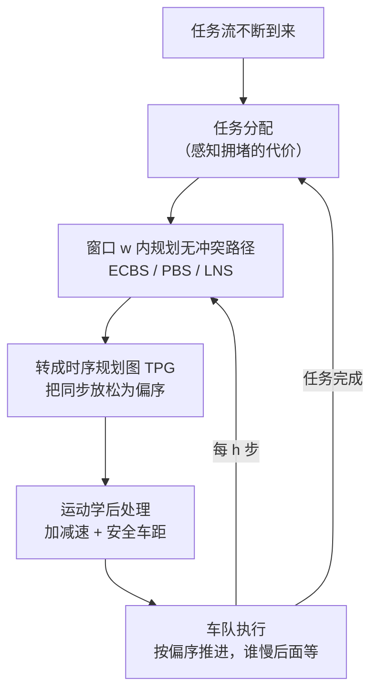

[采样式路径规划那篇](/posts/采样式路径规划/)解决的是"一个机器人怎么绕过障碍"。把机器人换成一千台在仓库里跑的 AGV，问题的性质就变了：**障碍会动，而且它们也在规划**。这就是多智能体路径规划（Multi-Agent Path Finding，MAPF）。

它是亚马逊仓库里数千台 Kiva 机器人、自动化码头的集装箱车队、无人机编队背后的同一个数学问题。本文从问题定义推起，把冲突基搜索（CBS）的最优性证明写完，然后用实测数据回答三个问题：**它为什么会爆炸、快速算法牺牲了什么、离散解怎么落到实机上**。

文中所有数据来自一套自己实现的 CBS 与优先级规划（时空 A* 低层、四连通网格、独立的解校验器）。

## 1. 问题定义

给定无向图 $G = (V, E)$（网格地图最常见，四连通）和 $k$ 个智能体。智能体 $a_i$ 有起点 $s_i \in V$ 和目标 $g_i \in V$。时间是**离散的**：在每个时间步，每个智能体要么移动到相邻顶点，要么原地等待（$\text{wait}$ 也算一个时间步）。

一个**解**是 $k$ 条路径 $\pi_1, \dots, \pi_k$，满足两类无冲突条件：

$$
\text{点冲突：}\;\exists t:\; \pi_i(t) = \pi_j(t)
\qquad
\text{边冲突：}\;\exists t:\; \pi_i(t) = \pi_j(t{+}1) \;\wedge\; \pi_i(t{+}1) = \pi_j(t)
$$

点冲突就是两个智能体同时站在同一格；边冲突（也叫交换冲突）是两个智能体同时对穿一条边——在物理上它们会撞在通道中央，而单看"每个时刻的位置"是发现不了的，必须单独检查。


_(a) 一个 3 智能体实例的最优解。注意智能体 1 在 $(2,2)$ 等了一步、智能体 2 绕到 $(1,3)$ 让路——**等待和绕行是 MAPF 唯一的两种妥协方式**。(b)(c) 两类冲突的定义_

代价函数有两个标准选择，它们**不能同时最优化**：

$$
\text{SOC（sum of costs）} = \sum_{i=1}^{k} T_i,
\qquad
\text{makespan} = \max_{i} T_i
$$

$T_i$ 是智能体 $i$ 到达目标并从此停留的时间。SOC 关心总能耗/总吞吐，makespan 关心最后一个完成的时刻。仓储场景通常优化 SOC（吞吐量导向），编队/同步任务优化 makespan。本文统一用 SOC。

还有几个建模选择在工程上很要紧，读论文时要留意：

- **智能体到达目标后是否消失**？消失（"disappear at target"）会让问题简单不少，但真实机器人不会消失，它会停在目标上继续挡路。本文和主流文献都采用"停留"模型；
- **是否允许跟随（following）**？$a_i$ 在 $t$ 时刻进入 $a_j$ 在 $t$ 时刻刚离开的格子。离散模型通常允许，但实机上如果两车速度不同就会追尾，所以执行层要么禁止跟随，要么用后面第 8 节的鲁棒化手段；
- **旋转循环（rotation）**：一圈智能体首尾相接同时转动，没有点冲突也没有边冲突，但在实机上要求所有车完美同步。

## 2. 难在哪：一个精确的复杂度对照

朴素想法是把 $k$ 个智能体当成一个"超级智能体"，在联合状态空间 $V^k$ 里做 A*。这条路的死因很具体：状态空间大小 $|V|^k$，而且**分支因子是 $5^k$**（每个智能体 5 个动作的笛卡尔积）。$k = 20$ 时单次扩展就要生成 $5^{20} \approx 10^{14}$ 个后继。

理论上的结论比直觉更精细，而且这组对照值得记住：

| 问题 | 复杂度 |
|---|---|
| **判定是否存在解**（可行性） | **多项式时间**（Kornhauser 等，1984） |
| 最小化 SOC 或 makespan 的**最优解** | **NP-hard**（Yu & LaValle，2013；Surynek，2010） |
| 常数因子近似 makespan | 仍是 NP-hard |

"有没有解"容易、"最好的解"难——这个落差决定了整个领域的形态：既然最优解注定要指数时间，那么算法研究的主战场就是**在最优、有界次优、快速可行三者之间选位置**。

顺带说一句可行性的判定为什么容易：它可以归约到"图上的令牌重排"问题（类似华容道/十五数码的可解性判定），用图的连通性与置换的奇偶性就能判断，甚至能给出 $O(|V|^3)$ 步数的构造性解。规则式算法（Push-and-Rotate、BIBOX）就是这条路线的产物：**保证完备但解的质量没有保证**。

## 3. 优先级规划：最快的做法，以及它为什么不完备

工业界最常见的做法是优先级规划（Prioritized Planning，PP）：给智能体排个序，逐个规划，**先规划者的整条路径变成后规划者的动态障碍**。

```python
def prioritised_planning(grid, starts, goals, order):
    constraints = []
    paths = [None] * len(starts)
    for a in order:
        paths[a] = space_time_astar(grid, starts[a], goals[a], constraints)
        if paths[a] is None:
            return None                      # 失败：被先规划者堵死
        # 把这条路径冻结成后续所有智能体的约束（含到达目标后的停留）
        for later in order[order.index(a) + 1:]:
            freeze(constraints, later, paths[a])
    return paths
```

它的复杂度只是 $k$ 次单智能体时空 A*，快得离谱（本文实验里 $k=24$ 时约 0.09 s，而最优 CBS 已经超时）。代价是**它不完备**：即使实例有解，PP 也可能失败。

这不是罕见的边界情况。下面这个 6 格实例是我能构造的最小反例：

```
. . .        智能体 1：(0,0) → (0,2)
# . #        智能体 2：(0,2) → (0,0)
```

一条 3 格的单宽走廊，中间格下方挂一个凹槽 $(1,1)$。实例显然有解——一个智能体钻进凹槽让另一个过去。但**两种优先级顺序 PP 都失败**：先规划者走最短路并永久停在对方的起点上，后规划者从第一步就被堵死（它连"离开自己的起点"都做不到，因为唯一的邻格在关键时刻被占，且对穿会触发边冲突）。

我的实现实测：顺序 $[1,2]$ 失败于智能体 2，顺序 $[2,1]$ 失败于智能体 1；而 CBS 用 11 次扩展找到 SOC = 7 的最优解——智能体 1 先等一步，智能体 2 钻进凹槽，等对方过去再出来。

失败的根源是**PP 从不回退**：先规划者的路径一旦定下就是硬约束，而"为了别人短暂让路"这种行为在它自己的最短路里没有动机。改进方向有两个：随机重启换优先级顺序（便宜但没保证），或者把优先级本身也纳入搜索——这就是 PBS（Priority-Based Search），在优先级偏序上做树搜索，比 PP 完备性好但仍不保证最优。

## 4. CBS：把冲突变成约束，把约束变成搜索

冲突基搜索（Conflict-Based Search，Sharon 等 2015）是最优 MAPF 的主力算法。它的核心洞察是：

> 不要在 $5^k$ 的联合动作空间里搜索，而是在**约束的组合**上搜索。绝大多数智能体对之间根本不冲突，所以真正需要枚举的约束组合远比联合状态空间小。

CBS 是两层结构。

### 4.1 低层：单智能体时空 A*

低层为**单个**智能体规划，把其他智能体完全忽略，只服从加在自己头上的约束。约束有两种形式：

$$
\langle a_i, v, t\rangle:\ a_i\ \text{不得在}\ t\ \text{时刻位于}\ v
\qquad
\langle a_i, u, v, t\rangle:\ a_i\ \text{不得在}\ t\ \text{时刻从}\ u\ \text{移动到}\ v
$$

搜索状态是**时空对** $(v, t)$ 而不是 $v$——同一个格子在不同时刻是不同的状态，这是整套方法能表达"等待"和"错时通过"的前提。每步代价 1（等待也算），所以 $g = t$，启发式用**目标点的真实距离场**（对网格做一次 BFS 得到，比曼哈顿距离紧得多，尤其在有障碍时）。

有一个极易写错的细节：**目标条件不能只是 $v = g_i$**。因为智能体到达目标后要一直停在那里，如果目标格在未来某个时刻还有约束，这条路径就是非法的。正确的终止条件是

$$
v = g_i \quad\wedge\quad t > \max\{\,t' : \langle a_i, g_i, t'\rangle \in \text{constraints}\,\}
$$

也就是必须晚于"目标格上最后一条约束"才算到达。漏掉这一条，CBS 会返回带冲突的解，而且这类 bug 只在**目标冲突**（一个智能体停在目标上，另一个后来要经过那里）的实例上才暴露。

### 4.2 高层：约束树

高层在**约束树**（Constraint Tree，CT）上做最佳优先搜索。每个 CT 节点 $N$ 包含：

- 约束集合 $\text{constraints}(N)$；
- 解 $\text{paths}(N)$：每个智能体在自己约束下的**最短**路径（由低层给出）；
- 代价 $\text{cost}(N) = \text{SOC}(\text{paths}(N))$。

根节点约束集为空，所以它的解就是"每个智能体各走各的最短路"，代价是整个问题 SOC 的下界。

算法主循环：

```
while 开放表非空:
    N ← 取出代价最小的节点
    C ← 在 paths(N) 中检测第一个冲突
    if C 不存在:
        return paths(N)                      # 这就是最优解
    # 冲突涉及 a_i 和 a_j，分裂出两个子节点
    for a in (a_i, a_j):
        N' ← N 的副本，约束集加上"禁止 a 参与该冲突"
        重规划 a 的路径（低层），更新 cost(N')
        把 N' 放进开放表
```

关键在于**分裂规则**：一个冲突产生**两个**子节点，而不是指数多个。这是 CBS 的全部效率来源。


_上图实例的完整约束树：根节点代价 16（各自最短路之和，SOC 的下界），每层解决一个冲突、代价单调上升，在代价 19 处找到无冲突解。共生成 15 个节点、展开 8 个——注意每次分裂只产生 2 个孩子_

### 4.3 最优性与完备性的证明

CBS 的正确性建立在两条引理上，都不难但都必须成立。

**引理 1（代价是下界）。** 对任意 CT 节点 $N$，任何满足 $\text{constraints}(N)$ 的**无冲突**解 $S$ 都有 $\text{SOC}(S) \ge \text{cost}(N)$。

*证明*：$\text{paths}(N)$ 中每条路径都是该智能体在其约束下的最短路，所以 $S$ 里每个智能体的路径长度都 $\ge$ 对应的 $\text{paths}(N)$ 中的长度。逐项求和即得。注意这里**不要求** $\text{paths}(N)$ 本身无冲突——它通常是有冲突的，这正是需要继续分裂的原因。

**引理 2（分裂不丢解）。** 设节点 $N$ 的解中存在冲突 $\langle a_i, a_j, v, t\rangle$。那么任何满足 $\text{constraints}(N)$ 的无冲突解 $S$，必然满足两个子节点之一的约束集。

*证明*：$S$ 无冲突，所以 $a_i$ 与 $a_j$ 不可能同时在 $t$ 时刻占据 $v$。于是要么 $S$ 中 $a_i$ 不在 $(v,t)$——满足左子节点新增的约束 $\langle a_i, v, t\rangle$；要么 $a_j$ 不在 $(v,t)$——满足右子节点。两个子节点的其余约束与 $N$ 相同，故 $S$ 至少满足其中一个。$\square$

**定理（最优性）。** CBS 返回的第一个无冲突节点的解是最优解。

*证明*：设 CBS 弹出无冲突节点 $N^*$ 并返回 $\text{paths}(N^*)$，其代价为 $\text{cost}(N^*)$。反设存在更优解 $S$，$\text{SOC}(S) < \text{cost}(N^*)$。$S$ 满足根节点的空约束集；由引理 2 反复应用，从根出发总能找到一条下降路径，使得 $S$ 满足路径上每个节点的约束集——这条路径要么走到某个仍在开放表里的节点 $N'$，要么走到一个已展开的无冲突节点（但那会与"$N^*$ 是第一个"矛盾）。对开放表中的 $N'$ 用引理 1：$\text{cost}(N') \le \text{SOC}(S) < \text{cost}(N^*)$。这与"$N^*$ 是开放表中代价最小者被弹出"矛盾。$\square$

完备性同理：如果实例有解，那么沿引理 2 的下降链总有节点可扩展，CT 的深度有限（约束数量有上界），所以 CBS 终会找到解。

值得注意的是**反面**：如果实例**无解**，朴素 CBS 不保证能判定出来——它会一直分裂下去。我的实现在单宽走廊里两个智能体强制交换的实例上就是这样：每个智能体单独都能到达目标，CBS 于是不停加约束直到超时。工程上要么先用多项式的可行性判定过一遍，要么设代价上界（$\text{SOC}$ 超过某个界就宣告无解）。

### 4.4 边冲突的分裂要小心

点冲突的分裂是对称的。边冲突则不然：冲突 $\langle a_i, a_j, u, v, t\rangle$ 中，$a_i$ 走 $u \to v$，$a_j$ 走 $v \to u$。分裂时必须**各禁各自的方向**：

$$
\text{左子}: \langle a_i, u, v, t\rangle
\qquad
\text{右子}: \langle a_j, v, u, t\rangle
$$

如果两边都加同一个方向的约束，就会漏掉合法解（引理 2 不再成立），CBS 的最优性随之失效。

## 5. CBS 为什么会爆炸：对称性

CBS 在多数实例上表现很好，但它有一类系统性的死穴——**对称性冲突**：许多代价相同的路径两两冲突，CBS 只能一条一条地禁止，每次分裂只排除掉一个组合。

最干净的例子是**走廊对称**：两个智能体必须反向穿过同一条单宽走廊。正确的解是其中一个在走廊外等着，但 CBS 发现这件事之前，要把"在走廊第 1 格相遇""在第 2 格相遇"……逐一否掉。

我把走廊长度 $L$ 从 1 扫到 12，测量 CBS 展开的节点数：


_实测结果精确等于 $2^{L+2}$：走廊每加一格，搜索规模翻一倍；而最优解本身只是线性变长（$\mathrm{SOC} = 3L + 8$）。$L=12$ 时已需 16,384 个节点、8.6 秒——**问题的"难度"和解的"复杂度"完全脱钩**_

这个精确的 2 的幂次不是巧合：走廊里每个格子都提供一次二选一的分裂，$L$ 个格子就是 $2^L$ 量级的组合。同类现象还有**矩形对称**（两个智能体在开阔区域同向斜穿，各有指数多条等价最短路）和**目标对称**（一个智能体的目标在另一个的必经之路上）。

现代 CBS 的主要改进都在攻这一点：

- **对称性破除约束**（Li 等，2019/2020）：识别走廊/矩形/目标对称的结构，一次性加入一条更强的约束（例如"$a_i$ 在 $[t_1, t_2]$ 区间内不得进入整条走廊"），把指数多次分裂压成一次。这是近年最有效的单项改进；
- **冲突优先级分类**：用多值决策图（MDD，编码一个智能体所有等代价最短路的紧凑结构）判断冲突是 **cardinal**（两个子节点代价都必然上升）、**semi-cardinal** 还是 **non-cardinal**。优先解决 cardinal 冲突，因为它们能立刻推高下界；
- **高层启发式**（CBSH 系列）：把智能体两两之间的依赖关系建成图，用最小顶点覆盖（CG 启发式）、依赖图（DG）、带权依赖图（WDG）算出**高层代价的可采纳下界**，让高层 A* 从"均匀代价搜索"变成有启发的 A*。WDG 通常能把节点数再降一个量级；
- **绕过冲突**（bypassing）：如果某个子节点代价没上升且冲突数减少了，直接用它替换父节点，不做分裂。

## 6. 实用算法谱系：放弃最优能换到什么

工业系统几乎不用最优 MAPF。放弃的方式分两档。

**有界次优**：保证解不超过最优的 $w$ 倍。代表是 **ECBS**（Enhanced CBS）和 **EECBS**。做法是把两层的最佳优先搜索都换成 **focal search**：维护一个"代价不超过 $w \cdot f_{\min}$"的候选集合（focal list），在这个集合里按**另一个启发式**（例如冲突数最少）挑节点。这样既有 $w$ 的质量保证，又能优先走"看起来更容易解决冲突"的方向。$w = 1.2$ 通常能带来数量级的加速。

**无界次优但快**：

- **PBS**（Priority-Based Search）：在优先级偏序上做树搜索，冲突时尝试两种优先级顺序。比 PP 完备性好、比 CBS 快得多；
- **PIBT**：一步一步走，用优先级继承 + 回溯保证每步都不死锁。它是**在线**算法（不预先规划整条路径），适合上千智能体的实时场景，但解质量一般；
- **MAPF-LNS / LNS2**：先用任意快速方法拿一个解，然后反复"拆掉一小部分智能体的路径重规划"（大邻域搜索）。LNS2 甚至可以从**带冲突的解**出发逐步修复。这是目前大规模实例上综合表现最好的一类方法。

**归约法**：把 MAPF 编译成 SAT / ILP / CP 交给成熟求解器。SAT 类方法（MDD-SAT）在 makespan 最优、智能体密度极高的小图上很强；分支切割定价（BCP）在 SOC 最优上是当前最强之一。它们的优势是可以直接复用几十年的求解器工程。

## 7. 实测：地图结构比智能体数量更决定难度

把自己实现的 CBS 与 PP 放在两种地图上跑：一张 $20\times20$、10% 随机障碍的地图（359 个空格），一张 $13\times17$ 的**仓库地图**（货架块 + 单宽通道，125 个空格）。每个 $k$ 跑 20 个随机实例，超时 10 秒。


_(a) 随机地图上 CBS 撑到 $k{=}24$ 还有 50% 成功率；换成仓库地图，$k{=}12$ 就掉到 40%、$k{=}16$ 全部超时。(b) 同一个 $k$ 下 CBS 耗时跨越四个数量级——重尾分布是 NP-hard 问题的典型指纹。(c) 优先级规划的次优程度：随机地图约 6%，仓库地图升到 15%_

三条实测结论，都直接对应工程决策：

1. **地图结构的影响远大于智能体数量。**仓库地图的空格数只有随机地图的三分之一，但 CBS 的可解规模从 $k{=}24$ 掉到 $k{=}12$。原因就是第 5 节的走廊对称——仓库的单宽通道是对称性冲突的温床。**所以"我的场景有多少台车"根本不足以判断难度，必须看通道拓扑**；
2. **耗时是重尾的。**同一个 $k$、同样的地图，最快和最慢的实例差四个数量级。这意味着**平均耗时是个没用的指标**，实时系统必须按分位数设预算并准备超时降级路径；
3. **PP 的不完备性只在结构化地图上现形。**随机地图上 PP 240 个实例全部成功；仓库地图上开始出现"被先规划者堵死"的失败（100 个实例里 3 例）。而 PP 的次优代价也从 6% 涨到 15%。**用随机地图做的评测会系统性地高估 PP**——这是选型时最容易踩的坑。

## 8. 从离散解到实机执行

MAPF 的解是"第 $t$ 个时间步在哪个格子"，而真实机器人有加减速、转弯耗时、定位误差、电量差异。直接把离散解当轨迹下发，第一个走慢的机器人就会破坏所有同步假设，然后连环相撞。

这中间需要一层转换，主流有三种思路：

**时序规划图（Temporal Plan Graph, TPG）。**把 MAPF 解转成一个偏序图：节点是"智能体 $i$ 到达位置 $p$"这一事件，边表示先后关系（同一智能体的路径顺序，以及不同智能体经过同一格子的先后次序）。执行时机器人只需保证**偏序**被满足，不需要保证绝对时刻——谁慢了，后面的等它就行。这把"同步执行"放松成"按序执行"，鲁棒性提升巨大，而且可以证明不会死锁（原图无环即可）。

**MAPF-POST 与运动学后处理。**在 TPG 基础上给每条边配上时间下界（由最大速度、加减速能力决定），解一个线性程序得到一条满足运动学的带时间轨迹。这一步和单机器人的[时间参数化](/posts/TOPP-RA-原理解析/)是同一类问题，只是约束里多了智能体间的先后关系。

**$k$-鲁棒 MAPF。**在规划阶段就留余量：要求任意智能体延迟不超过 $k$ 个时间步时解仍然无冲突。实现上把点约束从"同一时刻"扩展到"$\pm k$ 个时刻窗口"。代价是解会变长，但换来了对执行扰动的免疫。

工程上还有一条常被忽略的：**禁止跟随**。离散模型允许 $a_i$ 进入 $a_j$ 刚离开的格子，但实机上前车稍慢就会追尾。要么在规划时加约束禁止，要么在执行层保持安全车距（等价于 1-鲁棒）。

## 9. 终身 MAPF：仓库的真实形态

前面讨论的是"一次性"MAPF：给定起点终点，规划一次结束。真实仓库是**终身**的（Lifelong MAPF / Multi-Agent Pickup and Delivery，MAPD）：机器人送完一个货架，立刻被分配下一个任务，任务流永不停止。

直接的做法是每来新任务就重新规划全部智能体——但 MAPF 是 NP-hard，重规划跟不上任务到达的速度。主流解法是 **RHCR**（Rolling-Horizon Collision Resolution，Li 等 2021）：

- 只规划未来 $w$ 个时间步内的无冲突路径（窗口内保证无碰）；
- 每 $h < w$ 步重规划一次（滚动前移）；
- 窗口外的路径只作参考，不保证无冲突。

这是典型的**用有限视野换计算量**：$w$ 小则快但容易陷入局部死锁，$w$ 大则慢但更全局。它和[模型预测控制](/posts/阻抗控制与力控/)的滚动优化是同一个思想。

终身场景还引入一个新的耦合：**任务分配与路径规划相互影响**。把任务分给"离得近"的机器人可能造成局部拥堵，反而不如分给远一点但路线通畅的。完全联合优化不现实，实用做法是让任务分配感知拥堵（用当前路径的占用密度做代价修正）。



## 10. 小结

1. MAPF 的两类冲突（点、边）和两个目标（SOC、makespan）构成问题定义；建模选择（到达后是否停留、是否允许跟随）会显著改变难度，读论文时必须先看清。
2. 复杂度对照值得记住：**可行性判定是多项式的，最优化是 NP-hard**。这个落差决定了整个领域在"最优 / 有界次优 / 快速可行"三档上分布。
3. 优先级规划快到离谱但**不完备**——6 个格子、2 个智能体就能构造出所有优先级顺序都失败的反例，而 CBS 11 次扩展就解出来。
4. CBS 的效率来自"在约束组合而非联合动作空间上搜索"，每个冲突只分裂成两个子节点。最优性由两条引理支撑：节点代价是下界（引理 1），分裂不丢解（引理 2）。
5. 低层时空 A* 有两个必须做对的细节：状态是 $(v,t)$ 而非 $v$；目标条件必须晚于目标格上最后一条约束，否则会返回带冲突的解。
6. CBS 的系统性死穴是对称性冲突。走廊对称的实测是精确的 $2^{L+2}$：**走廊每加一格搜索翻倍，而解只线性变长**。现代改进（对称性破除、MDD 冲突分类、WDG 启发式）都在攻这一点。
7. 实测最反直觉的一条：**地图拓扑比智能体数量更决定难度**。仓库式单宽通道让 CBS 的可解规模腰斩，也让 PP 的不完备性和次优程度同时恶化——用随机地图评测会系统性高估快速算法。
8. 离散解不能直接下发。时序规划图把"同步执行"放松成"按序执行"，配合运动学后处理和 $k$-鲁棒规划，才是能上实机的形态。

## 参考

- G. Sharon, R. Stern, A. Felner, N. R. Sturtevant. *Conflict-Based Search for Optimal Multi-Agent Pathfinding*. Artificial Intelligence, 2015.（CBS 原始论文）
- D. Kornhauser, G. Miller, P. Spirakis. *Coordinating Pebble Motion on Graphs, the Diameter of Permutation Groups, and Applications*. FOCS 1984.（可行性的多项式判定）
- J. Yu, S. M. LaValle. *Structure and Intractability of Optimal Multi-Robot Path Planning on Graphs*. AAAI 2013.（NP-hard 证明）
- M. Barer, G. Sharon, R. Stern, A. Felner. *Suboptimal Variants of the Conflict-Based Search Algorithm*. SoCS 2014.（ECBS）
- J. Li, W. Ruml, S. Koenig. *EECBS: A Bounded-Suboptimal Search for Multi-Agent Path Finding*. AAAI 2021.
- J. Li, D. Harabor, P. J. Stuckey, H. Ma, S. Koenig. *Symmetry-Breaking Constraints for Grid-Based Multi-Agent Path Finding*. AAAI 2019.（对称性破除）
- J. Li et al. *Anytime Multi-Agent Path Finding via Large Neighborhood Search*. IJCAI 2021.（MAPF-LNS）
- K. Okumura et al. *Priority Inheritance with Backtracking for Iterative Multi-Agent Path Finding*. IJCAI 2019.（PIBT）
- W. Hönig et al. *Multi-Agent Path Finding with Kinematic Constraints*. ICAPS 2016.（MAPF-POST 与 TPG）
- J. Li, A. Tinka, S. Kiesel, J. W. Durham, T. K. S. Kumar, S. Koenig. *Lifelong Multi-Agent Path Finding in Large-Scale Warehouses*. AAAI 2021.（RHCR）
- R. Stern et al. *Multi-Agent Pathfinding: Definitions, Variants, and Benchmarks*. SoCS 2019.（术语与基准的统一，入门必读）
