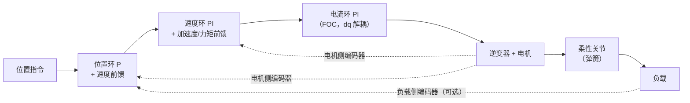
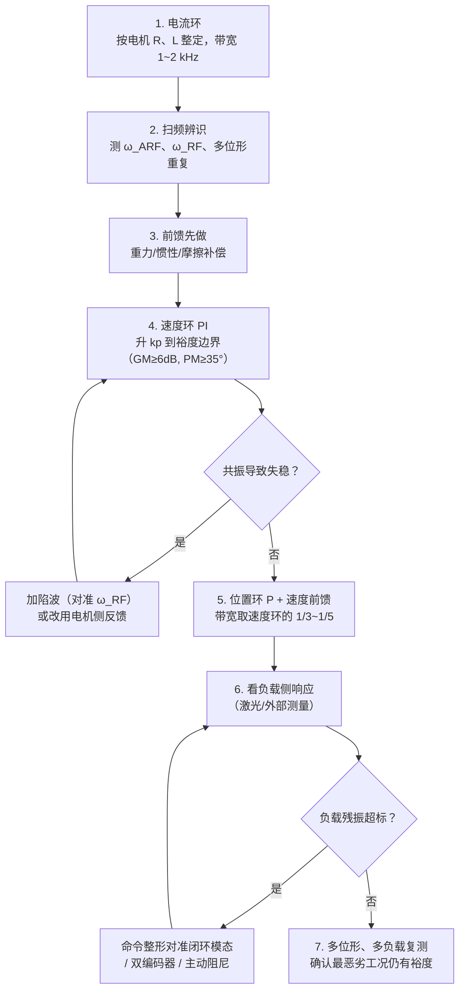

博客里已经有了[电流环（FOC）](/posts/FOC-原理解析/)、有[动力学前馈](/posts/机械臂动力学/)、有[阻抗力控外环](/posts/阻抗控制与力控/)，但中间缺了一大块：**速度环和位置环到底能调多快，被什么限住**。这块恰恰是实际调机器人时最耗时间的地方，也是"参数一样、换个负载就开始抖"的根源。

答案的核心是一件事：**关节不是刚体**。谐波减速器的扭转刚度是有限的，电机和负载之间挂着一根弹簧。这根弹簧带来的机械共振决定了伺服环路的天花板。本文把这个模型推完，然后用实测的频域和时域数据回答四个问题：共振频率由什么决定、电机侧和负载侧反馈差在哪、陷波器什么时候有用、负载振动该怎么治。

文中所有曲线都来自一套双质量模型的数值仿真（解析传递函数与状态空间实现交叉验证到 $10^{-10}$）。

## 1. 三环级联：为什么是套娃而不是一个大控制器

工业伺服的标准结构是三环级联，从内到外：**电流环 → 速度环 → 位置环**。

为什么不直接设计一个"位置到电压"的大控制器？三个理由，都很实际：

1. **带宽分离让每一环看到的对象都简单。**内环带宽远高于外环时，外环可以把内环近似成"理想的、瞬时的"。工程惯例是相邻环带宽差 **3~10 倍**：电流环 1~2 kHz，速度环 100~300 Hz（本文这个关节只到 21 Hz，后面会看到为什么），位置环 10~50 Hz。这个"10 倍法则"不是玄学，它保证内环的动态在外环的频段内可以忽略；
2. **限幅可以分层做。**电流环限电流保护功率器件，速度环限速度保护机械，位置环限位置保护工件。级联结构让每个限幅都落在物理量本身上；
3. **调试可分解。**内环调好后不再动它，外环出问题时排查范围明确。一个大控制器的参数是耦合的，改一个动全身。

代价是级联结构的总相位滞后会累加，所以**内环的相位裕度不是白拿的**——它会消耗外环的裕度预算。

## 2. 双质量模型：共振从哪来

把关节简化成两个惯量 + 一根扭簧（都折算到关节输出侧）：

$$
\begin{aligned}
J_m \ddot\theta_m &= \tau - K(\theta_m - \theta_l) - D(\dot\theta_m - \dot\theta_l) \\
J_l \ddot\theta_l &= K(\theta_m - \theta_l) + D(\dot\theta_m - \dot\theta_l)
\end{aligned}
$$

$J_m$ 是电机加减速器折算后的惯量，$J_l$ 是连杆与负载的惯量，$K$ 是减速器的扭转刚度（谐波减速器典型 $10^4 \sim 10^5$ N·m/rad，[关节硬件那篇](/posts/机械臂关节硬件/)讨论过它的来源），$D$ 是结构阻尼。

### 2.1 推导两个传递函数

拉普拉斯变换，记 $\omega_m = s\theta_m$、$\omega_l = s\theta_l$，把弹簧-阻尼的阻抗写成 $Z(s) = \dfrac{K + Ds}{s}$。两个方程变成

$$
J_m s\,\omega_m = \tau - Z(\omega_m - \omega_l),
\qquad
J_l s\,\omega_l = Z(\omega_m - \omega_l)
$$

从第二式解出 $\omega_l = \dfrac{Z}{J_l s + Z}\omega_m$，代回第一式消掉 $\omega_l$：

$$
\omega_m\left[J_m s + Z - \frac{Z^2}{J_l s + Z}\right] = \tau
$$

括号里通分，$Z^2$ 项相消，整理得

$$
\boxed{\;
G_m(s) = \frac{\omega_m}{\tau} = \frac{J_l s^2 + Ds + K}{s\left[J_m J_l s^2 + (J_m + J_l)(Ds + K)\right]}
\;}
$$

再回代得到负载侧：

$$
\boxed{\;
G_l(s) = \frac{\omega_l}{\tau} = \frac{Ds + K}{s\left[J_m J_l s^2 + (J_m + J_l)(Ds + K)\right]}
\;}
$$

**两个式子的分母相同，分子不同——这个差别就是本文后面一半内容的根源。**

### 2.2 共振与反共振

分母的二次因子给出**共振频率**（两个传递函数共有）：

$$
J_m J_l\,\omega^2 = (J_m + J_l) K
\quad\Longrightarrow\quad
\omega_{RF} = \sqrt{\frac{K}{J_{eq}}},
\qquad
J_{eq} = \frac{J_m J_l}{J_m + J_l}
$$

$J_{eq}$ 是两个惯量的**约化惯量**（像两体问题里的 reduced mass）。$G_m$ 的分子给出**反共振频率**：

$$
J_l\,\omega^2 = K
\quad\Longrightarrow\quad
\omega_{ARF} = \sqrt{\frac{K}{J_l}}
$$

两者的比值只由**惯量比** $R = J_l/J_m$ 决定：

$$
\boxed{\;\frac{\omega_{RF}}{\omega_{ARF}} = \sqrt{\frac{J_m + J_l}{J_m}} = \sqrt{1 + R}\;}
$$

物理图像很清楚。反共振是"负载在弹簧上自己晃"的频率——在这个频率上负载像一个吸振器，把电机的运动吸收掉，所以**电机侧看到的阻抗变得极大、幅值出现深谷**。共振是"电机和负载反相对晃"的频率，此时约化惯量最小，响应最大。

而 $G_l$ **没有反共振零点**：负载侧只有极点。这不是巧合——反共振的物理含义是"负载吸收电机的运动"，那是从电机侧看过去才有的现象。

取一组现实参数（$J_m = 0.5$、$J_l = 1.0$ kg·m²、$K = 2\times10^4$ N·m/rad、阻尼比 0.015）：

_反共振 23 Hz、共振 39 Hz，比值精确等于 $\sqrt{1+R} = 1.732$。关键在相位：**电机侧越过共振后回到 $-90°$**（零点先来 $+180°$、极点再来 $-180°$，净抵消），而**负载侧一路掉到 $-244°$**——因为没有零点可抵消_

_(a) $\omega_{ARF}$ 只由 $K/J_l$ 决定，不随 $R$ 变；$R$ 越大共振与反共振拉得越开，共振峰暴露得越彻底。轻负载（$R{=}0.5$）时两者几乎贴在一起、峰谷相消，这就是"空载调得好、装上负载就抖"的数学解释_

$R$ 的工程含义因此非常直接：**惯量比是选型时就定下的控制难度**。直驱/准直驱（$R$ 大）天生难调，大减速比（$R$ 小，因为 $J_m$ 折算后被放大 $n^2$ 倍）天生好调——这是[关节硬件篇](/posts/机械臂关节硬件/)里"减速比换控制带宽"那笔账的频域版本。

## 3. 速度环能调多快：三个候选限制

速度环通常用 PI：$C(s) = k_p\dfrac{T_i s + 1}{T_i s}$。比例增益决定带宽，积分保证零稳态误差。再串上数字控制的**半个采样周期延迟**（1 kHz 下 0.5 ms，用一阶 Padé 近似）。

我扫描 $k_p$，取满足增益裕度 $\ge 6$ dB 且相位裕度 $\ge 35°$ 的最大值，得到上图 (b) 的结果。三条结论都值得说清楚，其中一条和我原本的预期相反。

**电机侧反馈：限制不是共振，而是采样延迟。**实测可达带宽 21.2 Hz $\approx 0.55\,\omega_{RF}$。诊断增益穿越点发现它落在 314 Hz——**远高于共振**。原因在 $G_m$ 的结构：越过反共振之后，负载被"甩掉"了，电机只感受到自己的惯量，传递函数退化为 $1/(J_m s)$。$J_m < J_m + J_l$，所以**高频增益比刚性模型还高**，环路增益迟迟不衰减，穿越点被推到很高的频率，那里采样延迟已经把相位吃掉了。

**电机侧加陷波器几乎没用。**实测 21.2 → 21.4 Hz。既然限制不是共振，去削共振峰当然不解决问题。

**负载侧反馈：不加陷波器根本调不起来。**$G_l$ 的相位越过共振后停在 $-244°$，$-180°$ 的穿越无法避免。实测结果是**任何 $k_p$ 都不满足裕度要求**——不是带宽低，是无解。加 $-20$ dB 陷波后能到 9.5 Hz，$-30$ dB 陷波到 14.4 Hz。

所以陷波器的定位要说准确：**它是为了让原本不稳定的环路能闭上，而不是为了给已经稳定的环路提标**。这是实践中最常被误用的一件事。

### 陷波器的设计与代价

陷波（band-stop）的标准形式是一对零点压在一对极点上：

$$
H_{notch}(s) = \frac{s^2 + 2\zeta_n \omega_0 s + \omega_0^2}{s^2 + 2\zeta_d \omega_0 s + \omega_0^2},
\qquad \zeta_n < \zeta_d
$$

深度 $= 20\log_{10}(\zeta_n/\zeta_d)$ dB，宽度由 $\zeta_d$ 决定。三个工程要点：

- **中心频率必须准。**陷波带宽窄（$\zeta_d \approx 0.1\sim0.2$）时，$\omega_0$ 偏 10% 就基本失效。而 $\omega_{RF} = \sqrt{K/J_{eq}}$ 随负载变化——机械臂在不同位形下 $J_l$ 能变几倍，共振频率随之移动。所以要么按位形做增益/频率调度，要么用**自适应陷波**（在线辨识共振频率并跟踪）；
- **深度不是越深越好。**深陷波必然带来更大的相位扭曲，会吃掉穿越频率附近的裕度；
- **不要用低通代替。**实测里一阶低通（截止取 $0.5\omega_{RF}$）把电机侧带宽从 21.2 Hz 压到 —— 直接变成无可行增益。低通在整个高频段引入相位滞后，代价远大于陷波这种"只在一个窄带里动手"的手段。

## 4. 最要紧的一课：电机不振，不等于负载不振

前面所有分析都是"环路稳不稳"。但机器人真正要交付的是**末端精度**，而反馈量通常是电机侧编码器。这两件事可以差得很远。

用调好的电机侧速度环（$k_p = 1000$，裕度合格）做速度阶跃，同时看两个输出：

_(a) 电机侧（蓝）稳态后残余振荡峰峰值只有 2.7%，看起来完全可以交付；负载侧（红）却有 **21%** 的持续振荡——**差 8 倍**。这就是"示波器上电机很干净，工件在抖"的确切来源。(b) 闭环极点图揭示了第二件事：主导振荡模态在 **22.1 Hz**（$\zeta = 0.077$），而开环共振在 39 Hz——**反馈把极点搬走了**_

第二点特别容易踩坑：如果你按开环辨识出的 39 Hz 去设陷波器或整形器，会完全打不中实际在振的 22 Hz 模态。**要抑制的是闭环模态，不是开环共振。**

这也解释了我在实验中遇到的一个反直觉结果：在电机侧回路里加 $-25$ dB 陷波（中心在 39 Hz），负载残余振荡不但没降，还从 21.0% 略微升到 24.4%。原因是陷波降低了共振频率处的环路增益，而在电机侧反馈下**反馈本身在给共振提供主动阻尼**——把它削掉，等于把阻尼也削掉了。

## 5. 负载振动该怎么治

既然滤波器治不了负载振动，正确的工具是三类。

**（a）命令整形（input shaping）**——最便宜、最有效。ZV（Zero Vibration）整形器把指令拆成两个脉冲，间隔恰好半个模态周期：

$$
A_1 = \frac{1}{1+\kappa},\quad A_2 = \frac{\kappa}{1+\kappa},\quad
\kappa = e^{-\zeta\pi/\sqrt{1-\zeta^2}},\quad
\Delta t = \frac{\pi}{\omega_n\sqrt{1-\zeta^2}}
$$

原理是**让第二个脉冲激起的振动与第一个的反相抵消**：半个周期后第一个脉冲的振动正好相位翻转，用衰减系数 $\kappa$ 配好幅值即可完全相消。

实测用闭环模态（22.1 Hz、$\zeta = 0.077$）参数设计 ZV 整形器：

_(b) 负载残余振荡：阶跃指令 12.88% → **ZV 整形 0.06%**，降了两百倍，代价是 22.7 ms（半个模态周期）的延迟。对照组很有意思：20 ms 上升的 S 曲线只降到 10.52%——**光"把指令变平滑"没用，平滑的时间尺度必须和模态周期匹配**（该模态周期 45 ms，20 ms 的上升沿照样激励它）_

这也给[Ruckig 那类在线轨迹生成](/posts/Ruckig-原理解析/)一个新的解读角度：jerk 限制之所以有用，本质是限制了指令频谱在高频的能量。但它是"钝器"——要真正打掉某个特定模态，还是要靠对准了频率的整形器。

**（b）双编码器 / 负载侧反馈。**把负载纳入环内是最根本的解法，代价是第 3 节算过的：负载侧反馈没有反共振零点，必须配陷波器，而且带宽只能到 $0.25\sim0.4\,\omega_{RF}$。实践中常用**双反馈**折中：高频用电机侧编码器（保证环路稳定），低频用负载侧编码器（消除减速器背隙与柔性造成的静态误差），中间用互补滤波交接——和[ESKF 那篇](/posts/ESKF与IMU姿态估计/)里互补滤波的思路完全一致。

**（c）主动阻尼。**把弹簧的形变速率（可由两侧编码器之差得到，或由力矩传感器测出）反馈回力矩指令，等价于给结构增加阻尼 $D$。这就是[阻抗控制](/posts/阻抗控制与力控/)在关节层的形式，也是串联弹性驱动（SEA）能做力控的基础。

## 6. 前馈：把带宽花在该花的地方

反馈带宽贵，前馈便宜。所有已知的量都应该走前馈，不要让反馈去"发现"它们：

$$
\tau_{cmd} = \underbrace{\hat{\mathbf M}(\mathbf q)\ddot{\mathbf q}_d + \hat{\mathbf C}\dot{\mathbf q}_d + \hat{\mathbf G}(\mathbf q_d)}_{\text{动力学前馈}}
\;+\;\underbrace{\hat{K}_f\,\dot q_d + \hat{\tau}_{fric}(\dot q_d)}_{\text{摩擦/阻尼前馈}}
\;+\;\underbrace{K_p e + K_d \dot e}_{\text{反馈}}
$$

前馈的价值在于它**不消耗稳定裕度**：它是开环项，不参与环路的 Nyquist 分析。所以工程上的顺序永远是"先把前馈做准，再谈调高反馈增益"。[动力学参数辨识](/posts/机械臂动力学/)的全部意义就在这里——辨识出来的 $\hat{\mathbf M}, \hat{\mathbf G}$ 直接变成前馈精度。

位置环的两个惯例也可以从这个角度理解：

- **位置环用 P 而不是 PID。**积分已经在速度环里了，位置环再加积分会引入第二个低频极点，把相位裕度吃掉，还容易积分饱和；
- **速度前馈必须加。**没有速度前馈时，位置环靠比例项产生速度指令，跟踪斜坡必然有稳态滞后 $e = \dot q_d / K_p$。加了前馈这项直接归零。

## 7. 怎么测出共振频率

前面所有设计都依赖 $\omega_{RF}$ 的准确值。实测手段是**扫频激励 + 频响估计**：给力矩指令注入对数扫频（chirp，例如 2 Hz → 400 Hz、持续几秒），同时记录力矩和速度，用互谱估计频响

$$
\hat H(\omega) = \frac{P_{yu}(\omega)}{P_{uu}(\omega)}
$$

上图 (a) 是这个流程的仿真（含 2% 测量噪声）：估计出的共振 39.1 Hz，真值 39.0 Hz。三个实操要点：

- **激励幅值要够大但不能进非线性区**。太小则信噪比不足（图中 1000 rad/s 以上估计就开始发散），太大则摩擦、背隙、力矩饱和引入非线性，估计出的"频响"不可信；
- **对数扫频优于线性扫频**，因为它在每个频程内驻留的时间相同，低频段的信噪比不会被牺牲；
- **必须在多个位形、多个负载下重复测**。$\omega_{RF}$ 随 $J_l$ 变化，机械臂伸直和蜷起时可能差一倍以上。要么取最恶劣的那个来设计，要么做增益调度。

## 8. 一个可执行的整定顺序

第 6 步最容易被跳过，而它恰恰是第 4 节那张图的教训：**只看反馈量的响应，你不知道负载在干什么**。哪怕只是临时架一个激光位移计或加速度计测一次，也比一直盯着电机编码器强。

## 9. 小结

1. 三环级联的意义是让每一环看到简单对象、限幅落在物理量上、调试可分解；代价是相位滞后累加，内环裕度会消耗外环预算。
2. 双质量模型给出两个关键频率：$\omega_{RF} = \sqrt{K/J_{eq}}$（约化惯量）和 $\omega_{ARF} = \sqrt{K/J_l}$，比值恰为 $\sqrt{1+R}$。**惯量比在选型阶段就决定了控制难度**。
3. 电机侧与负载侧传递函数**分母相同、分子不同**：电机侧有反共振零点，相位越过共振后回到 $-90°$；负载侧没有，一路掉到 $-244°$。
4. 实测的三条带宽结论：电机侧可达 $0.55\,\omega_{RF}$，限制是采样延迟而非共振；电机侧加陷波几乎无用；**负载侧不加陷波则任何增益都不满足裕度**——陷波器是为了让环路能闭上，不是给稳定的环路提标。
5. 最重要的一课：电机侧残振 2.7% 时负载侧可以有 21%。而且要抑制的是**闭环模态（22 Hz）**，不是开环共振（39 Hz）——反馈会把极点搬走。
6. 负载振动靠命令整形治，不靠滤波器：ZV 整形把残振从 12.88% 打到 0.06%，代价是半个模态周期的延迟；而"把指令变平滑"若时间尺度不匹配模态周期（20 ms 对 45 ms），几乎没用。
7. 前馈不消耗稳定裕度，所以顺序永远是"先把前馈做准，再调高反馈"。

## 参考

- G. Ellis. *Control System Design Guide*. 4th ed., Butterworth-Heinemann, 2012.（伺服整定与共振抑制的工程圣经，双质量模型一章尤其好）
- K. Szabat, T. Orlowska-Kowalska. *Vibration Suppression in a Two-Mass Drive System Using PI Speed Controller and Additional Feedbacks*. IEEE T-IE, 2007.
- N. C. Singer, W. P. Seering. *Preshaping Command Inputs to Reduce System Vibration*. ASME JDSMC, 1990.（输入整形的出处）
- W. Singhose. *Command Shaping for Flexible Systems: A Review of the First 50 Years*. IJPEM, 2009.
- M. Ruderman, M. Iwasaki. *Observer of Nonlinear Friction Dynamics for Motion Control*. IEEE T-IE, 2015.（摩擦前馈）
- A. Albu-Schäffer, C. Ott, G. Hirzinger. *A Unified Passivity-Based Control Framework for Position, Torque and Impedance Control of Flexible Joint Robots*. IJRR, 2007.（柔性关节的无源性控制框架）
