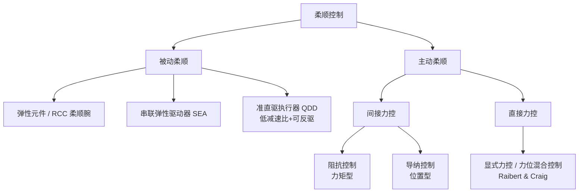
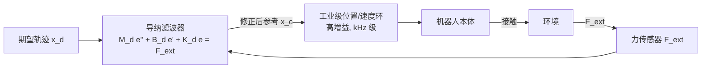
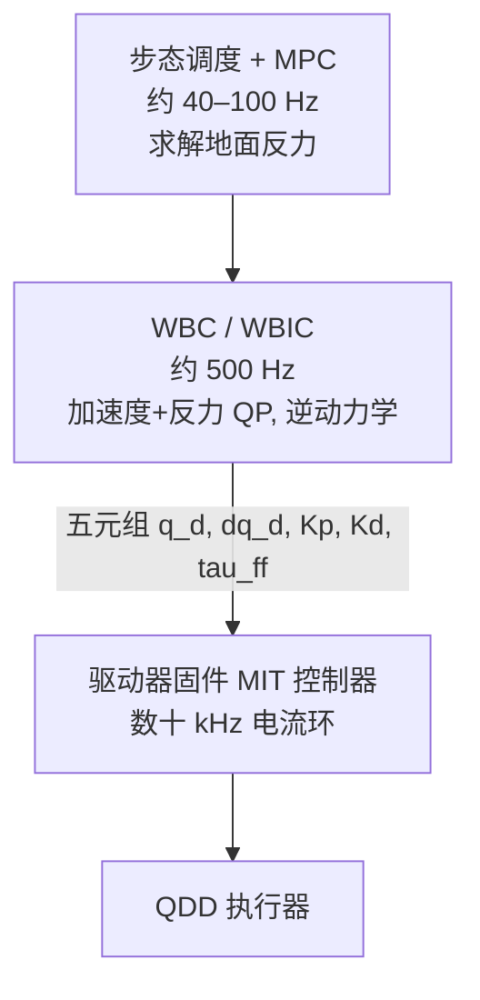

在机器人与环境发生物理交互的场景中（打磨、装配、人机协作、四足机器人落地缓冲），纯位置控制是不够的：位置环刚度极高，环境的毫米级偏差就会产生数百牛的接触力，轻则工件报废，重则损坏机器人或伤人。为此发展出了一系列"让机器人变软"的控制方法。本文从交互动力学出发，系统梳理四个常被混淆的概念——**柔顺控制、阻抗控制、导纳控制、MIT 控制器**——并给出严格的推导、稳定性分析与工程选型依据。

## 1. 问题的物理本质：为什么不能同时控制力和位置

### 1.1 因果性约束

机器人与环境构成一个耦合动力系统。在接触点上，力 $F$ 与运动 $x$ 由**机器人和环境共同决定**，二者不能被同一个控制器独立指定：

- 若环境是刚性墙面（运动被约束），机器人只能决定施加多大的力；
- 若环境是自由空间（力恒为零），机器人只能决定怎么运动。

Hogan 在 1985 年的三部曲论文中用网络理论的语言表述了这一点：任何物理交互端口上，一侧表现为**阻抗**（impedance：接受"流"即速度，输出"势"即力），另一侧就必须表现为**导纳**（admittance：接受力，输出运动）。典型环境（刚性约束、惯性负载）在低频段表现为导纳，因此**机器人侧应当被塑造成阻抗**——这正是"阻抗控制"名称的由来。

### 1.2 机械阻抗的定义

对线性系统，机械阻抗定义为力对速度的传递函数：

$$
Z(s) = \frac{F(s)}{\dot{X}(s)}
$$

一个"质量-弹簧-阻尼"系统的阻抗为 $Z(s) = M s + B + K/s$。阻抗控制的目标不是跟踪某个力或某条轨迹，而是**让机器人在交互端口上呈现出指定的 $Z(s)$**。这是它与力控制、位置控制在控制目标层面的根本区别。

## 2. 预备：机器人动力学与任务空间形式

后续推导基于标准的 $n$ 自由度刚体动力学模型：

$$
M(q)\ddot{q} + C(q,\dot{q})\dot{q} + g(q) = \tau + J^{\top}(q) F_{ext}
$$

其中 $M(q)$ 为惯量矩阵，$C(q,\dot{q})\dot{q}$ 为科氏/离心项，$g(q)$ 为重力项，$J(q)$ 为末端雅可比，$F_{ext}$ 为环境作用于末端的外力旋量。

通过 $\dot{x} = J\dot{q}$ 将其投影到任务空间（设 $J$ 满秩），得到任务空间动力学：

$$
\Lambda(q)\ddot{x} + \mu(q,\dot{q})\dot{x} + p(q) = F_{\tau} + F_{ext}
$$

其中 $\Lambda = (J M^{-1} J^{\top})^{-1}$ 是任务空间惯量矩阵，$F_{\tau} = J^{+\top}\tau$ 是关节力矩等效到末端的广义力。这个形式让"末端表现为什么样的二阶系统"变得一目了然。

## 3. 柔顺控制：分类学而非算法

柔顺（compliance）是刚度的倒数，指系统受力后顺应产生位移的能力。**柔顺控制是一个目标层面的总称**，其分类如下：

- **被动柔顺**：由机械结构提供。带宽不受控制器采样率限制（对冲击的响应是"物理即时"的），天然无源，但特性固定。SEA 通过在电机与负载间串联弹簧，把力控问题转化为弹簧形变的位置控制问题；准直驱（QDD）则以低减速比换取可反驱性，是 MIT Cheetah 路线的基础。
- **主动柔顺**：由控制算法合成。**间接力控**不闭合力误差环，而是调节力与运动的动态关系（阻抗/导纳控制均属此类）；**直接力控**在受约束方向上显式闭合力反馈环（力位混合控制在约束方向控力、自由方向控位置）。

因此，"阻抗控制与柔顺控制的区别"这一问法本身不成立——阻抗控制是实现主动柔顺的一种手段。下文重点比较同属间接力控的阻抗与导纳这对"镜像"方法。

## 4. 阻抗控制：把机器人塑造成受控的弹簧-阻尼-质量系统

### 4.1 目标阻抗

设期望轨迹为 $x_d(t)$，定义误差 $\tilde{x} = x - x_d$。阻抗控制希望闭环系统满足：

$$
M_d \ddot{\tilde{x}} + B_d \dot{\tilde{x}} + K_d \tilde{x} = F_{ext}
$$

其中 $M_d, B_d, K_d \succ 0$ 为期望惯量、阻尼、刚度矩阵。外力为零时误差按二阶系统收敛到零；有外力时末端像一个锚定在 $x_d$ 上的弹簧-阻尼-质量系统一样让步。

### 4.2 完整实现：反馈线性化 + 惯量整形

将目标阻抗代入任务空间动力学，解出所需的控制力：

$$
F_{\tau} = \Lambda \ddot{x}_d + \mu \dot{x} + p
- \Lambda M_d^{-1}\left(B_d \dot{\tilde{x}} + K_d \tilde{x}\right)
+ \left(\Lambda M_d^{-1} - I\right) F_{ext}
$$

关节力矩为 $\tau = J^{\top} F_{\tau}$（冗余机器人再叠加零空间力矩 $\left(I - J^{\top}J^{+\top}\right)\tau_0$ 做姿态优化）。注意最后一项：**只要期望惯量 $M_d \neq \Lambda$，就必须测量 $F_{ext}$ 并反馈**。这就是"惯量整形需要力传感器"的由来。

### 4.3 工程简化：不整形惯量

令 $M_d = \Lambda(q)$（放弃指定惯量，接受机器人自然的任务空间惯量），外力反馈项消失，控制律退化为：

$$
\tau = J^{\top}\left(-K_d \tilde{x} - B_d \dot{\tilde{x}}\right) + g(q) \; (+\, C\dot q + \text{前馈项})
$$

这就是绝大多数实际系统采用的**无力传感器阻抗控制**：重力补偿 + 任务空间 PD。它牺牲了惯量整形能力（高频冲击下机器人呈现的仍是自身反射惯量），换来了结构简单和无条件无源性。Franka、iiwa 的默认笛卡尔阻抗模式即属此类。

### 4.4 无源性与接触稳定性

阻抗控制最重要的理论性质是**无源性**（passivity）。取储能函数

$$
V = \tfrac{1}{2}\dot{\tilde{x}}^{\top} M_d \dot{\tilde{x}} + \tfrac{1}{2}\tilde{x}^{\top} K_d \tilde{x}
$$

沿闭环轨迹求导得 $\dot{V} = -\dot{\tilde{x}}^{\top} B_d \dot{\tilde{x}} + \dot{\tilde{x}}^{\top} F_{ext} \le \dot{\tilde{x}}^{\top} F_{ext}$，即闭环系统从交互端口看是无源的。由无源性定理，**它与任意无源环境（几乎所有物理环境）互联都稳定**——这解释了为什么阻抗控制接触刚性墙面、碰撞、被人推搡都不易失稳。工程上破坏无源性的因素主要是：力矩传递不理想（摩擦、齿隙）、采样保持引入的相位滞后、以及试图整形惯量时的力反馈误差。

### 4.5 硬件前提与短板

- **前提**：执行器必须是好的力矩源。直驱/准直驱电机、带关节力矩传感器闭环的谐波减速关节（iiwa 方案）满足；大减速比 + 无力矩传感的传统工业臂不满足——电流环推算的力矩会被减速器摩擦（常占额定力矩的 10–30%）淹没。
- **短板**：自由空间跟踪精度差。稳态误差 $\tilde{x}_{ss} = K_d^{-1} F_{dist}$，摩擦和模型误差都算 $F_{dist}$；刚度设得低，误差就大。这是"用位置偏差换柔顺"的必然代价。

## 5. 导纳控制：给位置环包一层"虚拟动力学"外壳

### 5.1 结构

导纳是阻抗的倒数：$Y(s) = Z^{-1}(s)$，输入力、输出运动。导纳控制不改造底层控制器，而是在成熟的高刚度位置环**外面**再包一环：

外环以传感器测得的 $F_{ext}$ 驱动一个虚拟二阶系统：

$$
M_d \ddot{e} + B_d \dot{e} + K_d e = F_{ext}, \qquad x_c = x_d + e
$$

解出的 $x_c$ 作为内环位置指令。只要内环跟踪足够快、足够准，机器人对外表现出的动力学就近似等于这个虚拟系统。

### 5.2 离散实现要点

导纳外环通常运行在 250 Hz–1 kHz。工程实现有三个绕不开的细节：

1. **离散化**。对每个方向的标量导纳 $\frac{E(s)}{F(s)} = \frac{1}{M_d s^2 + B_d s + K_d}$ 做 Tustin 变换得到二阶差分方程递推，比显式欧拉积分数值性质好得多；
2. **力信号处理**。六维力传感器信号需去皮重（工具重力随姿态变化的补偿）、低通滤波（截止频率典型 20–50 Hz）并设死区，否则噪声会被 $M_d^{-1}$ 放大成参考轨迹的抖动；
3. **限幅**。对 $\dot{e}$、$\ddot{e}$ 限幅，防止碰撞瞬间的力尖峰命令出超出机器人能力的运动。

### 5.3 接触稳定性：导纳控制的阿喀琉斯之踵

导纳控制的稳定性问题与阻抗控制**互补**。定性地看：内环是一个带宽有限（相位滞后）的高刚度位置源，接触刚度为 $K_e$ 的环境时，环路增益正比于 $K_e$；环境越硬，穿越频率越高，越吃进内环的相位滞后区，越容易振荡。经典结果（Lawrence, 1988）表明：**导纳控制与刚性环境接触存在增益上限，超过即失稳**；而阻抗控制在理想力矩源假设下对任意无源环境稳定。缓解手段包括增大虚拟阻尼 $B_d$、检测接触后在线降低导纳带宽、以及在力信号路径上加相位超前补偿——但都以牺牲交互响应速度为代价。

### 5.4 适用面

- 改造存量工业机械臂做打磨、装配、拖动示教：腕部装六维力传感器 + 导纳外环，不动底层伺服，是成本最低的力控路线；
- 人机物理协作中的拖动引导（hand-guiding）：人手是软环境，导纳控制表现极佳；
- 康复机器人、外骨骼中低频人机交互。

## 6. 对偶性：一个统一框架

Ott 等（2010）给出了统一视角：阻抗控制与导纳控制是**同一个期望动力学的两种因果实现**，性能沿"环境刚度"轴互补：

| 维度 | 阻抗控制 | 导纳控制 |
|---|---|---|
| 因果方向 | 运动偏差 → 输出力 | 测量力 → 输出运动 |
| 机器人角色 | 力源（阻抗端口） | 位置源（导纳端口） |
| 内环 | 电流/力矩环 | 位置/速度环 |
| 传感器 | 可无力传感器（不整形惯量时） | 必须有力/力矩传感器 |
| 刚性接触 | 无源 ⇒ 稳定 | 环路增益 ∝ 环境刚度 ⇒ 易失稳 |
| 自由空间/软环境 | 受摩擦与模型误差影响，精度差 | 内环高增益压制扰动，精度高 |
| 可实现的阻抗范围 | 低刚度容易，高刚度受力矩带宽限制 | 高刚度容易（内环本身就硬），低惯量/低阻尼难 |
| 典型硬件 | Franka、iiwa、准直驱腿足机器人 | 高减速比工业臂 + 腕部六维力传感器 |

"可实现阻抗范围"一行值得展开：阻抗控制往"硬"调受限于力矩环带宽与结构共振（Z-width 概念）；导纳控制往"软"调受限于力传感器噪声与内环跟踪能力。两者覆盖的阻抗谱恰好互补，因此高端系统（如 DLR 的机器人）会做**阻抗/导纳在线切换或混合**：自由空间与软接触用导纳模式保精度，检测到刚性接触切回阻抗模式保稳定。

## 7. MIT 控制器：关节空间阻抗控制的工程化范本

### 7.1 它是什么

"MIT 控制器"不是教科书概念，而是随 MIT Cheetah 3 / Mini Cheetah 开源生态流行起来的叫法，指嵌入在电机驱动器固件里的这条控制律：

$$
\tau = \tau_{ff} + K_p(q_d - q) + K_d(\dot{q}_d - \dot{q})
$$

主控通过 CAN 总线以数百 Hz 到 1 kHz 向每个关节下发五元组 $\{q_d, \dot{q}_d, K_p, K_d, \tau_{ff}\}$，驱动器在本地以电流环速率（数十 kHz）执行 PD + 前馈，输出 q 轴电流指令。对照第 4 节可以直接看出：**这就是关节空间、无惯量整形的阻抗控制**——$K_p$ 是虚拟刚度，$K_d$ 是虚拟阻尼，$\tau_{ff}$ 承载上层算出的动力学力矩。

### 7.2 为什么这个架构成立：执行器先行

MIT 路线的前提是**准直驱执行器（QDD）**。Mini Cheetah 执行器采用大直径外转子无刷电机 + 6:1 单级行星减速：

- 减速比低 ⇒ 反射惯量小（∝ 减速比平方）、摩擦小、可反驱；
- 电流环带宽高（kHz 级）且摩擦损耗小 ⇒ **q 轴电流 × 力矩常数 ≈ 输出力矩**，无需关节力矩传感器即可开环出力矩；
- 冲击载荷经低减速比传到电机侧被大幅衰减，落地碰撞不打坏减速器。

换句话说，MIT 控制器是"执行器设计把力矩源问题解决在硬件层，控制律因此可以简单"的典型案例。在减速比 100:1 的谐波减速关节上照抄这条控制律，$\tau_{ff}$ 会被摩擦吃掉大半，效果完全不同。

### 7.3 为什么 PD 放在驱动器本地

把 PD 环从主控下沉到驱动器，是这个架构里最关键的工程决策：

- **消除总线延迟对阻尼项的破坏**。$K_d \dot{\tilde q}$ 对延迟极其敏感，1 ms 的往返延迟足以让高增益阻尼变成激振源；本地执行则延迟仅电流环一拍；
- **主控降频**。主控只需以 MPC/WBC 的自然频率（500 Hz 左右）更新五元组，无需承担 20 kHz 的硬实时；
- **模式连续可调**。同一接口通过增益取值覆盖整个谱系：$K_p = K_d = 0$ 为纯前馈力矩模式；小增益 + 前馈为柔顺模式；大增益为准位置模式。腿足机器人在一个步态周期内就会用到多种组合。

### 7.4 在运动控制栈中的位置

以 Mini Cheetah/Cheetah 3 的软件栈为例：

- **支撑相**：MPC 求出的地面反力经 $\tau = J^{\top}F$ 变成 $\tau_{ff}$ 为主，PD 增益较低——腿是"力源"，这正是阻抗控制的用法；
- **摆动相**：跟踪摆线轨迹，$K_p, K_d$ 调高、前馈为逆动力学力矩——偏向位置跟踪；
- **触地瞬间**：低增益 PD 自然充当缓冲弹簧，无需显式的碰撞检测与模式切换。这是"用阻抗控制天然应对非预期接触"的教科书级示范。

### 7.5 与经典阻抗控制的差异边界

1. **作用空间**：MIT 控制器在关节空间逐关节独立执行，不做笛卡尔空间解耦；末端表现出的笛卡尔刚度是 $K_x \approx J^{-\top} K_p J^{-1}$，随构型变化且各向异性。经典笛卡尔阻抗控制则直接指定 $K_d$ 于任务空间；
2. **无惯量整形**：呈现的惯量就是执行器与连杆的自然惯量（QDD 已把它做小，所以可接受）；
3. **理论到工程的取舍**：省去了 $\Lambda, \mu$ 的在线计算与力反馈，换来驱动器固件级的简单可靠。动力学补偿全部折叠进上层算出的 $\tau_{ff}$。

## 8. 选型指南

按硬件条件与任务需求走这棵决策树：

1. **执行器是可信的力矩源吗**（QDD / 关节力矩传感器闭环）？
   - 是 → 阻抗控制（关节或笛卡尔空间）。需要末端精确交互动力学 → 笛卡尔阻抗；腿足/高动态 → MIT 式关节阻抗 + 前馈；
   - 否 → 只能走导纳路线，加装力传感器；
2. **接触环境刚度**？刚性环境（金属对金属装配、恒力打磨钢件）优先阻抗；软环境（人、织物、弹性工件）导纳表现更好；
3. **自由空间精度要求高吗**？高 → 导纳（或阻抗/导纳切换架构）；
4. **需要精确的接触力跟踪吗**？需要 → 间接力控之上再叠加显式力环（基于阻抗的力跟踪，在期望轨迹上注入 $x_d$ 修正），或直接采用力位混合控制。

## 9. 总结

- **柔顺控制**是目标层面的总称——让机器人对外力让步；被动柔顺靠机械，主动柔顺靠算法。
- **阻抗控制**把机器人塑造成阻抗端口（运动偏差 → 力），闭环无源，刚性接触稳定，代价是自由空间精度；完整形式需力传感器做惯量整形，工程上常用"重力补偿 + 任务空间 PD"的简化版。
- **导纳控制**把机器人保持为位置源，用力传感器驱动虚拟动力学修正参考轨迹；自由空间与软接触精度高，刚性接触受环路增益限制易失稳。二者性能沿环境刚度轴严格互补，构成对偶。
- **MIT 控制器**是关节空间无惯量整形阻抗控制的工程化实现：准直驱执行器解决力矩源问题，驱动器本地高频 PD 解决延迟问题，五元组接口让力矩/柔顺/位置模式连续可调，是当今腿足机器人执行层的事实标准。

## 参考文献

1. Hogan, N. *Impedance Control: An Approach to Manipulation, Parts I–III*. ASME Journal of Dynamic Systems, Measurement, and Control, 107(1), 1985.
2. Raibert, M. H., Craig, J. J. *Hybrid Position/Force Control of Manipulators*. ASME Journal of Dynamic Systems, Measurement, and Control, 103(2), 1981.
3. Lawrence, D. A. *Impedance Control Stability Properties in Common Implementations*. ICRA, 1988.
4. Ott, C., Mukherjee, R., Nakamura, Y. *Unified Impedance and Admittance Control*. ICRA, 2010.
5. Albu-Schäffer, A., Ott, C., Hirzinger, G. *A Unified Passivity-based Control Framework for Position, Torque and Impedance Control of Flexible Joint Robots*. IJRR, 26(1), 2007.
6. Villani, L., De Schutter, J. *Force Control*. In: Springer Handbook of Robotics, 2nd ed., 2016.
7. Katz, B. *A Low Cost Modular Actuator for Dynamic Robots*. MIT Master's Thesis, 2018.
8. Kim, D., Di Carlo, J., Katz, B., Bledt, G., Kim, S. *Highly Dynamic Quadruped Locomotion via Whole-Body Impulse Control and Model Predictive Control*. arXiv:1909.06586, 2019.
9. Wensing, P. M., Wang, A., Seok, S., Otten, D., Lang, J., Kim, S. *Proprioceptive Actuator Design in the MIT Cheetah*. IEEE Transactions on Robotics, 33(3), 2017.
